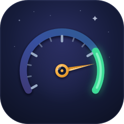
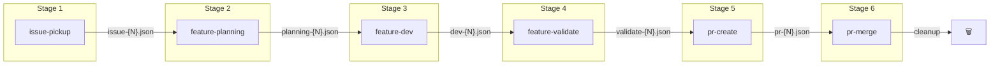

# Nightgauge

<!-- Public-launch fork rehearsal: this temporary change will not be merged. -->

[](LICENSE)
[](go.mod)



**AI-powered Issue-to-PR pipeline with enforced quality gates.**

Nightgauge transforms how teams build software by guiding AI agents through
a structured development workflow—from issue creation to merged pull request.
Every step enforces documentation-first practices, acceptance criteria
validation, and automated quality checks.

<!-- A real pipeline-run screenshot/GIF will be added after public launch. -->

## Open-source and local-first

Everything in this repository is Apache-2.0 licensed. The VS Code extension,
SDK, portable skills, Claude plugin, and Go binary run locally using model and
forge credentials you control. No Nightgauge account or hosted service is
required, cloud connectivity is disabled by default, and telemetry is opt-in.

Optional services may integrate through public contracts, but their private
implementations and commercial plans are outside this repository. See
[VISION.md](VISION.md) and [docs/PRODUCT_OVERVIEW.md](docs/PRODUCT_OVERVIEW.md).

## Prerequisites

Have these in place before installing — the pipeline orchestrates tools you
already use rather than replacing them:

| Requirement                                                               | Needed for                                                                                                 |
| ------------------------------------------------------------------------- | ---------------------------------------------------------------------------------------------------------- |
| **Claude Code** (or another supported adapter)                            | Stage execution — bring your own subscription/keys; nothing is proxied                                     |
| **git** + **gh CLI** (authenticated)                                      | Branching, PRs, issue operations                                                                           |
| **A GitHub repository with issues**                                       | The pipeline's unit of work                                                                                |
| **GitHub Projects v2 board** (+ `.nightgauge/config.yaml` pointing at it) | The autonomous scheduler and board-driven views — without a board you can still run single issues manually |
| **Node.js ≥ 24** (pinned in `.nvmrc`)                                     | VSCode extension and SDK builds                                                                            |

**Platform support:** macOS and Linux are supported and tested. Windows is
not currently supported — the Go binary cross-compiles, but the pipeline is
untested there; use WSL2.

## Install from Source

```bash
git clone https://github.com/nightgauge/nightgauge.git
cd nightgauge
go install ./cmd/nightgauge
```

Signed release binaries, checksums, and the Homebrew formula will be available
with the first public release. Until then, build from the reviewed source tree.
See [docs/GO_BINARY.md](docs/GO_BINARY.md) for the full install matrix and
details on each method.

## Quick Start

### VSCode Extension (Recommended)

The full Nightgauge experience with visual dashboard, project board
integration, batch processing, and one-click pipeline execution.

```bash
# Build the extension locally, then use
# Extensions → "…" → Install from VSIX:
cd packages/nightgauge-vscode && npm run package
```

> Not yet on the VS Code Marketplace — a Marketplace listing is planned as its
> own follow-up release.

**Features:**

- Visual pipeline status with real-time progress
- GitHub Project board integration (Ready/In Progress/In Review views)
- Batch pipeline execution for multiple issues
- Token usage tracking and cost analytics
- Configurable notifications and sounds

### Claude Code CLI (Alternative)

For terminal-based workflows, install the Nightgauge plugin:

```bash
# Add the marketplace
claude plugin marketplace add https://github.com/nightgauge/nightgauge.git

# Install the Nightgauge plugin
claude plugin install nightgauge@nightgauge-plugins

# Start the pipeline
/nightgauge:issue-pickup
```

### OpenAI Codex CLI (Beta Adapter)

Codex support is available through both slash commands and the unified stage
runner.

Install Codex assets (commands + skills):

```bash
./scripts/install-agent-skills.sh --codex-only
```

Slash commands are defined in `.codex/commands/` and invoked as `/<name>`:

```text
/nightgauge-issue-pickup 42
/nightgauge-feature-planning 42
/nightgauge-feature-dev 42
/nightgauge-feature-validate 42
/nightgauge-pr-create 42
/nightgauge-pr-merge 42
```

Run stages directly with the unified stage runner:

```bash
# Build the SDK CLI once (from repo root)
npm run -w @nightgauge/sdk build

# Run core pipeline stages — scripts/run-stage.sh <adapter> <stage> <issue>
scripts/run-stage.sh codex issue-pickup 42
scripts/run-stage.sh codex feature-planning 42
scripts/run-stage.sh codex feature-dev 42
scripts/run-stage.sh codex feature-validate 42
scripts/run-stage.sh codex pr-create 42
scripts/run-stage.sh codex pr-merge 42
```

Migration note:

- The per-tool wrapper scripts under `configs/codex/commands/*.sh` were removed.
  `scripts/run-stage.sh <adapter> <stage> <issue>` is the single
  supported entry point for non-Claude adapters.
- See `docs/MIGRATION.md` for the removal history and adapter mapping.

### Codex CLI Beta Scope

- All six pipeline stages are available via `scripts/run-stage.sh codex <stage> <issue>`
- Matching Codex slash commands are available via `.codex/commands/*.md`
- Queue/project-sync and some plugin-level automations remain Claude-first
- The Codex adapter depends on built SDK output:
  `npm run -w @nightgauge/sdk build`

### Adapter Switching Workflow (Claude <-> Codex)

Both paths use the same stage contract and context artifacts, so teams can
switch adapters mid-issue on the same branch.

1. Run a stage in Claude or Codex.
2. Confirm handoff files under `.nightgauge/pipeline/` and plans under
   `.nightgauge/plans/`.
3. Continue with the next stage in the other adapter.

Example:

```bash
# Start in Codex
scripts/run-stage.sh codex issue-pickup 42
scripts/run-stage.sh codex feature-planning 42

# Continue in Claude (same issue + branch)
/nightgauge:feature-dev
/nightgauge:pr-create
```

If a Codex stage fails, rebuild the SDK output and retry:

```bash
# Restore the SDK CLI runtime
npm run -w @nightgauge/sdk build
```

Then continue in Claude commands if needed and finish the pipeline.

### GitHub Copilot CLI (Experimental Adapter)

Copilot is available as an experimental agentic execution adapter via the VSCode
extension and SDK. It routes pipeline stages through the `copilot` CLI
subprocess, but it has not completed Nightgauge's live six-stage provider
verification matrix. Keep a proven Claude or Codex adapter available as a
fallback.

**Prerequisites:**

```bash
npm install -g @github/copilot-cli
gh auth login  # or set GH_TOKEN env var
```

**Configure in `.nightgauge/config.yaml`:**

```yaml
ui:
  core:
    adapter: copilot
copilot:
  model: "gpt-4o" # optional — uses CLI default if omitted
```

> **Cost model**: Copilot tracks premium requests (not per-token). Each stage
> invocation consumes one premium request (~$0.04 estimated cost). See
> [docs/CONFIGURATION.md](docs/CONFIGURATION.md#copilot-adapter-environment-variables)
> for all configuration options.

### LM Studio (Local Model Adapter)

LM Studio is supported as a chat-completion adapter for offline and zero-cost
evaluation, judging, and summarization. It does not provide the agentic tool loop
required to run pipeline stages or edit a repository. See
[docs/MULTI_BACKEND_SETUP.md](docs/MULTI_BACKEND_SETUP.md#lm-studio-local-model)
for setup instructions and
[docs/CONFIGURATION.md](docs/CONFIGURATION.md#lm-studio-adapter-environment-variables)
for configuration reference.

**Use LM Studio when:** running offline evaluations, privacy-sensitive
summarization, or cost-free experimentation. Use an agentic adapter for pipeline
execution.

### Parity Status (February 10, 2026)

| Capability Group                                                          | Status    | Notes                                                             |
| ------------------------------------------------------------------------- | --------- | ----------------------------------------------------------------- |
| Six core issue-to-PR stages (`issue-pickup` -> `pr-merge`)                | Supported | Available in Claude commands and the Codex adapter                |
| Utility accelerators (`test-gen`, `issue-create`, `doc-gen`)              | Beta      | Useful but not required for core stage completion                 |
| Queue/project-sync orchestration (`queue`, `project-sync`, backlog flows) | Deferred  | Claude-first automations; use manual GitHub updates in Codex path |

### Standalone Skills (Advanced)

Skills work with any AI tool supporting the
[Agent Skills](https://agentskills.io) specification:

| AI Tool            | Installation                                     |
| ------------------ | ------------------------------------------------ |
| **GitHub Copilot** | Copy `skills/nightgauge-*/` to `.github/skills/` |
| **OpenAI Codex**   | Copy to `~/.codex/skills/`                       |
| **Cursor IDE**     | Copy to `.cursor/skills/`                        |

---

## Adapters

Nightgauge includes **8 provider adapters** across three categories. Five have
agentic tool loops and can be selected for pipeline execution; three are
chat-completion-only and are limited to evaluation, judging, and summarization.

| Adapter            | Pipeline role                                | Release confidence                    |
| ------------------ | -------------------------------------------- | ------------------------------------- |
| Claude Headless    | Agentic pipeline execution                   | Recommended; primary tested path      |
| Claude SDK         | Agentic pipeline execution for SDK consumers | Advanced, optional integration        |
| Codex CLI          | Agentic pipeline execution                   | **Beta**; strong automated coverage   |
| Gemini CLI         | Agentic pipeline execution                   | **Experimental**; live matrix pending |
| GitHub Copilot CLI | Agentic pipeline execution                   | **Experimental**; live matrix pending |
| Gemini SDK         | Evaluation/judging/summarization only        | Chat-completion-only                  |
| Ollama             | Evaluation/judging/summarization only        | Chat-completion-only                  |
| LM Studio          | Evaluation/judging/summarization only        | Chat-completion-only                  |

The VS Code extension uses the separately installed Claude CLI for its Claude
adapter. It does not bundle Anthropic's Agent SDK. Direct Agent SDK mode is an
optional integration for `@nightgauge/sdk` consumers who install that peer
dependency themselves after reviewing Anthropic's terms.

Agentic adapters implement the shared six-stage contract and compatible context
files, so they can switch between stages on the same branch. Only Claude
Headless is the primary dogfooded path today. Codex is beta; Gemini CLI and
Copilot remain experimental until their live provider-matrix runs are recorded.
Chat-completion-only adapters are rejected at pipeline dispatch because they
cannot edit files, run shell commands, or call `gh`.

**[Adapter Selection Guide](docs/ADAPTER_GUIDE.md)** — Which adapter to choose,
setup instructions, env vars, and troubleshooting for each adapter.

**[Adapter Capability Matrix](docs/ADAPTER_MATRIX.md)** — Technical audit of
adapter capabilities with code-level verification.

---

## The Pipeline

```
┌─────────────┐   ┌──────────────────┐   ┌─────────────┐   ┌───────────────────┐   ┌───────────┐   ┌──────────┐
│ issue-pickup│ → │ feature-planning │ → │ feature-dev │ → │ feature-validate  │ → │ pr-create │ → │ pr-merge │
└─────────────┘   └──────────────────┘   └─────────────┘   └───────────────────┘   └───────────┘   └──────────┘
     ↓                    ↓                      ↓                   ↓                    ↓               ↓
 Claim issue        Read docs/            Implement per       Build & test         Pre-flight      Address
 Create branch      Design PLAN.md        approved plan       validation           checks          reviews
 Extract specs      Get approval                                                   Link issue      Merge
```

### Why This Matters

| Traditional AI Coding         | Nightgauge                            |
| ----------------------------- | ------------------------------------- |
| AI jumps straight to code     | AI reads documentation first          |
| Requirements lost in chat     | Requirements tracked in PLAN.md       |
| Quality varies by prompt      | Quality enforced at each step         |
| Context lost between sessions | Context preserved in plan files       |
| PRs lack proper linking       | PRs auto-link issues with "Closes #X" |

---

## Pipeline Stages

### Stage Invocations by Tool

Use the same six-stage workflow in every supported tool:

| Stage              | Claude Code                    | Codex CLI (Beta Adapter)                         | GitHub Copilot                                         | Cursor IDE                                             |
| ------------------ | ------------------------------ | ------------------------------------------------ | ------------------------------------------------------ | ------------------------------------------------------ |
| `issue-pickup`     | `/nightgauge:issue-pickup 42`  | `scripts/run-stage.sh codex issue-pickup 42`     | `Use skill nightgauge-issue-pickup for issue #42.`     | `Use skill nightgauge-issue-pickup for issue #42.`     |
| `feature-planning` | `/nightgauge:feature-planning` | `scripts/run-stage.sh codex feature-planning 42` | `Use skill nightgauge-feature-planning for issue #42.` | `Use skill nightgauge-feature-planning for issue #42.` |
| `feature-dev`      | `/nightgauge:feature-dev`      | `scripts/run-stage.sh codex feature-dev 42`      | `Use skill nightgauge-feature-dev for issue #42.`      | `Use skill nightgauge-feature-dev for issue #42.`      |
| `feature-validate` | `/nightgauge:feature-validate` | `scripts/run-stage.sh codex feature-validate 42` | `Use skill nightgauge-feature-validate for issue #42.` | `Use skill nightgauge-feature-validate for issue #42.` |
| `pr-create`        | `/nightgauge:pr-create`        | `scripts/run-stage.sh codex pr-create 42`        | `Use skill nightgauge-pr-create for issue #42.`        | `Use skill nightgauge-pr-create for issue #42.`        |
| `pr-merge`         | `/nightgauge:pr-merge`         | `scripts/run-stage.sh codex pr-merge 42`         | `Use skill nightgauge-pr-merge for issue #42.`         | `Use skill nightgauge-pr-merge for issue #42.`         |

Cross-reference:

- Adapter capability matrix: [docs/ADAPTER_MATRIX.md](docs/ADAPTER_MATRIX.md)
- Codex parity status:
  [docs/decisions/003-codex-adapter-feature-parity.md](docs/decisions/003-codex-adapter-feature-parity.md)
- Skills catalog: [skills/README.md](skills/README.md)
- Codex runtime details: [configs/codex/README.md](configs/codex/README.md)

### 1. Issue Pickup

**Claim a GitHub issue and set up your development environment.**

```bash
/nightgauge:issue-pickup        # Auto-select highest priority issue
/nightgauge:issue-pickup 42     # Pick up specific issue
```

What it does:

- Selects issue using 7-tier priority algorithm (or manual selection)
- Extracts requirements, acceptance criteria, and technical notes
- Creates properly-named branch (`feat/42-add-user-auth`)
- Assigns issue and updates status labels
- Sets Start/Target dates in project board (if `auto_dates: true`)

### 2. Feature Planning

**Design implementation by reading documentation first.**

```bash
/nightgauge:feature-planning
```

What it does:

- Reads `docs/` folder to understand existing patterns
- Analyzes codebase architecture
- Creates `.nightgauge/plans/<issue>-<title>.md` with:
  - Implementation phases
  - File change summary
  - Test strategy
  - Acceptance criteria checklist
- **Requires user approval before implementation**

### 3. Feature Development

**Implement features following the approved plan.**

```bash
/nightgauge:feature-dev
```

What it does:

- Follows PLAN.md phases exactly
- Runs parallel subagents for independent files
- Executes quality review before completion:
  - Code correctness check
  - Security vulnerability scan
  - Test coverage analysis
  - Documentation sync verification

### 4. Feature Validation

**Verify implementation with build, tests, and manual checklists.**

```bash
/nightgauge:feature-validate
/nightgauge:feature-validate --auto-pass  # Skip manual checklists (admin only)
```

What it does:

- **Phase 1**: Runs automated tests (unit, integration)
- **Phase 1.5**: Build verification (HARD GATE - cannot be bypassed)
- **Phase 2**: Generates manual test checklist from acceptance criteria
- **Phase 3**: User confirms manual testing complete

### 5. PR Create

**Create pull request with proper format and quality checks.**

```bash
/nightgauge:pr-create
/nightgauge:pr-create --draft    # Create as draft PR
```

What it does:

- Runs pre-flight validation (tests, no uncommitted changes)
- Generates PR description from commits and plan
- Links issue with "Closes #X"
- Requests appropriate reviewers

### 6. PR Merge

**Address review feedback and complete the pipeline.**

```bash
/nightgauge:pr-merge
/nightgauge:pr-merge --admin     # Bypass branch protection
```

What it does:

- Waits for CI checks to complete
- Parses and categorizes review comments
- Auto-fixes minor issues (typos, formatting)
- Asks about major issues before proceeding
- Squash merges and cleans up branches

---

## Quality Gates

The pipeline enforces quality at every step:

| Gate                        | Enforced By      | What It Checks                          |
| --------------------------- | ---------------- | --------------------------------------- |
| **Requirements captured**   | issue-pickup     | Extracts acceptance criteria from issue |
| **Docs read first**         | feature-planning | Reads docs/ before designing            |
| **Plan approved**           | feature-planning | User must approve PLAN.md               |
| **Implementation reviewed** | feature-dev      | 4 parallel review subagents             |
| **Build passes**            | feature-validate | Build verification (hard gate)          |
| **Tests pass**              | feature-validate | Unit and integration tests              |
| **Manual verification**     | feature-validate | Checklist from acceptance criteria      |
| **Criteria met**            | pr-create        | Checklist verification                  |
| **No plan drift**           | pr-create        | Compares implementation to plan         |

---

## Architecture

### Product Layers

```
┌─────────────────────────────────────────────────────────────────┐
│                    USER INTERFACES                               │
├─────────────────────────────────────────────────────────────────┤
│  VSCode Extension          │  CLI Adapters                      │
│  (packages/nightgauge-vscode) │  (claude-plugins + configs/codex) │
│  Primary UX                │  Alternative UX                    │
└─────────────────────────────────────────────────────────────────┘
                              │
                              ▼
┌─────────────────────────────────────────────────────────────────┐
│                    ORCHESTRATION LAYER                           │
├─────────────────────────────────────────────────────────────────┤
│  Nightgauge SDK (packages/nightgauge-sdk)                             │
│  - Pipeline state management                                    │
│  - Context file I/O                                             │
│  - Claude Agent SDK integration                                 │
└─────────────────────────────────────────────────────────────────┘
                              │
                              ▼
┌─────────────────────────────────────────────────────────────────┐
│                    INSTRUCTION LAYER                             │
├─────────────────────────────────────────────────────────────────┤
│  Skills (skills/nightgauge-*)                                      │
│  - Portable SKILL.md files                                      │
│  - Work with any AI tool                                        │
│  - Define "what" not "how"                                      │
└─────────────────────────────────────────────────────────────────┘
```

### Context-Isolated Pipeline

Each pipeline step runs as a fresh subagent with minimal context, passing
structured JSON handoff files instead of accumulated conversation history.



**Benefits:**

| Benefit         | Description                                                    |
| --------------- | -------------------------------------------------------------- |
| **Speed**       | Each step starts fresh—no parsing 100K+ of accumulated history |
| **Reliability** | Failed steps can be retried without re-running earlier phases  |
| **Quality**     | Focused context means better responses with less noise         |
| **Scalability** | Complex features don't hit token limits                        |
| **Debugging**   | JSON files are human-readable for troubleshooting              |

---

## Multi-Repository Workspaces

Nightgauge supports coordinated development across multiple repositories:

```yaml
# .vscode/nightgauge-workspace.yaml
workspace:
  name: "MyApp"

repositories:
  - name: frontend
    path: ./packages/frontend
    role: primary
  - name: backend
    path: ./packages/backend
    role: primary

routing:
  patterns:
    "area:frontend": frontend
    "area:backend": backend
```

**Features:**

- Repository-scoped pipelines (each repo has isolated context)
- Label-based routing (auto-assign issues to correct repo)
- Repository switcher (status bar quick pick)
- Cross-repo epics (track features spanning multiple repos)

See [docs/MULTI_REPO_WORKSPACE.md](docs/MULTI_REPO_WORKSPACE.md) for complete
documentation.

---

## Configuration

Nightgauge uses a **6-tier configuration system** with layered precedence.
The most common configuration file is `.nightgauge/config.yaml`:

```yaml
# .nightgauge/config.yaml
project:
  # GitHub Project number (from URL: /orgs/your-org/projects/10)
  number: 10
  # Owner is inferred from repo, but can be overridden
  # owner: your-org

  # Enable automatic date field population
  auto_dates: true
```

| Setting              | Default | Description                                   |
| -------------------- | ------- | --------------------------------------------- |
| `project.number`     | —       | GitHub Project number for board sync          |
| `project.owner`      | repo    | Project owner (org or user)                   |
| `project.auto_dates` | false   | Enable automatic Start/Target date population |

### Configuration Tiers

| Tier | File/Source                     | Purpose               |
| ---- | ------------------------------- | --------------------- |
| 1    | Built-in defaults               | Sensible defaults     |
| 2    | `~/.nightgauge/config.yaml`     | User-wide preferences |
| 3    | `.nightgauge/config.yaml`       | Project/team settings |
| 4    | `.nightgauge/config.local.yaml` | Developer overrides   |
| 5    | `NIGHTGAUGE_*` environment vars | CI/CD overrides       |
| 6    | CLI flags                       | One-time overrides    |

See [docs/CONFIGURATION.md](docs/CONFIGURATION.md) for complete configuration
reference and [docs/MIGRATION.md](docs/MIGRATION.md) for migrating from the
legacy config file. See also [docs/DEPRECATIONS.md](docs/DEPRECATIONS.md).

---

## Repository Structure

```
nightgauge/
├── packages/                      # Products
│   ├── nightgauge-vscode/           # VSCode extension (primary UX)
│   └── nightgauge-sdk/              # Programmatic SDK
├── skills/                        # Pipeline instruction layer
│   ├── nightgauge-issue-pickup/     # Stage 1: Claim issue
│   ├── nightgauge-feature-planning/ # Stage 2: Design
│   ├── nightgauge-feature-dev/      # Stage 3: Implement
│   ├── nightgauge-feature-validate/ # Stage 4: Validate
│   ├── nightgauge-pr-create/        # Stage 5: Create PR
│   ├── nightgauge-pr-merge/         # Stage 6: Merge
│   ├── smart-setup/              # Utility: Make repos AI-ready
│   └── update-docs/              # Utility: Documentation sync
├── claude-plugins/                # Claude Code integration
│   └── nightgauge/                  # /nightgauge:* commands
├── standards/                     # Coding and security standards
└── docs/                          # Framework documentation
```

---

## Additional Skills

Beyond the core pipeline, Nightgauge includes utility skills:

| Skill            | Purpose                                               |
| ---------------- | ----------------------------------------------------- |
| **smart-setup**  | Make any repository AI-ready with AGENTS.md and docs/ |
| **update-docs**  | Verify documentation matches current codebase         |
| **pr-preflight** | Run pre-submission validation checks                  |
| **issue-create** | Create well-structured issues with proper labels      |
| **test-gen**     | Generate tests for existing code                      |
| **doc-gen**      | Generate documentation from code                      |

---

## Philosophy

Nightgauge is built on these principles:

- **Documentation-first** — Read docs before writing code
- **Plan before implement** — Design with user approval
- **Quality gates, not suggestions** — Enforce standards at each step
- **Context isolation** — Fresh subagents with JSON handoffs
- **Portable skills** — Works across all major AI coding tools

---

## Documentation

- **[Nightgauge Guide](docs/NIGHTGAUGE_SDLC.md)** — Complete adoption
  guide
- [Adapter Selection Guide](docs/ADAPTER_GUIDE.md) — Choose, set up, and
  troubleshoot adapters
- [Architecture](docs/ARCHITECTURE.md) — System design and patterns
- [Configuration](docs/CONFIGURATION.md) — Full configuration reference
- [Multi-Repo Workspaces](docs/MULTI_REPO_WORKSPACE.md) — Multi-repository setup
- [Context Architecture](docs/CONTEXT_ARCHITECTURE.md) — Pipeline handoff
  schemas
- [Troubleshooting](docs/TROUBLESHOOTING.md) — Common issues and solutions

---

## Contributing

New contributors work from a **fork** — you do not need push access to the
canonical repo. See [CONTRIBUTING.md](CONTRIBUTING.md); start with the **Your
first contribution** fork workflow and **Prerequisites** at the top, then browse
[`good first issue`](https://github.com/nightgauge/nightgauge/issues?q=is%3Aissue+is%3Aopen+label%3A%22good+first+issue%22)
and
[`help wanted`](https://github.com/nightgauge/nightgauge/issues?q=is%3Aissue+is%3Aopen+label%3A%22help+wanted%22).

---

## Community and Support

- **Questions & getting started** →
  [GitHub Discussions](https://github.com/nightgauge/nightgauge/discussions)
- **Bugs & feature requests** →
  [open an issue](https://github.com/nightgauge/nightgauge/issues/new/choose)
- **Support policy & triage cadence** → [SUPPORT.md](SUPPORT.md)
- **Security vulnerabilities** → [SECURITY.md](SECURITY.md) (do not open a
  public issue)
- **Community expectations** → [Code of Conduct](CODE_OF_CONDUCT.md)

---

**Author:** nightgauge **License:** Apache-2.0
