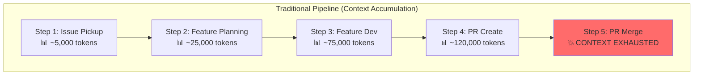
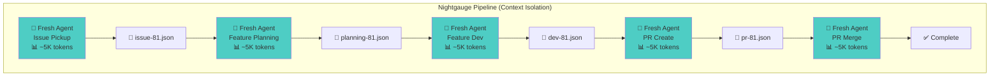
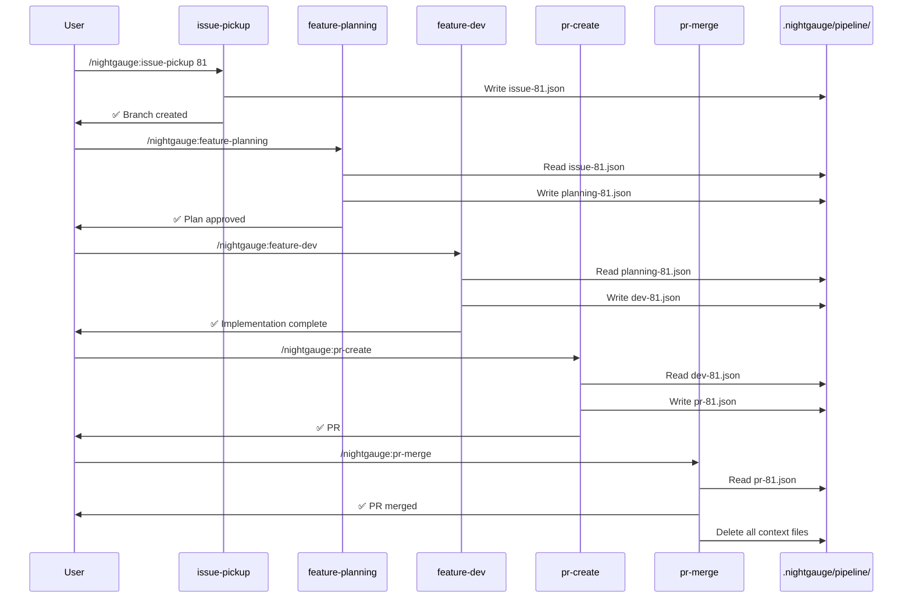
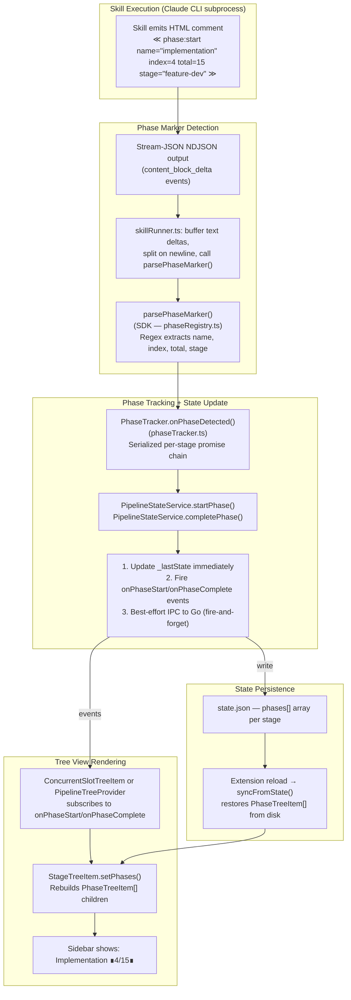
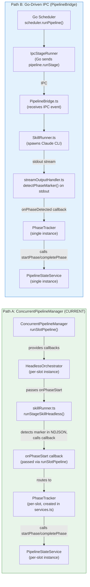
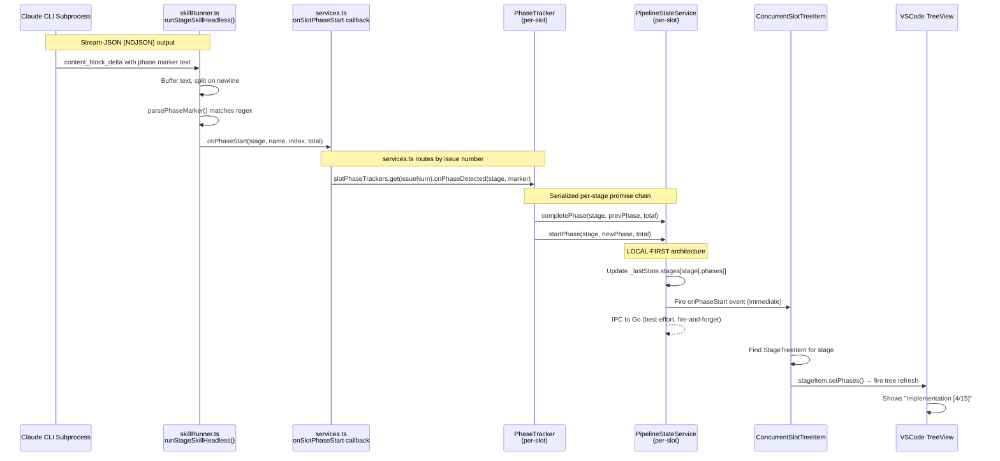
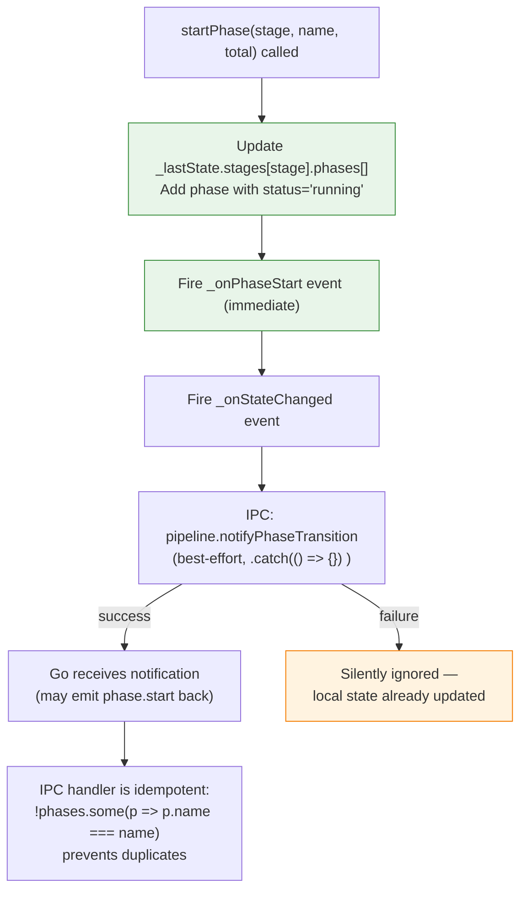

# Architecture

This document describes the architecture and design of the Nightgauge core
product (this repository). For cross-repository architecture showing how the
VSCode extension, cloud platform, Flutter mobile app, and Angular web dashboard
interact, see [ECOSYSTEM.md](ECOSYSTEM.md). For a complete product feature
description, see [PRODUCT_OVERVIEW.md](PRODUCT_OVERVIEW.md).

## Purpose

Nightgauge is an **AI-powered Issue-to-PR pipeline** that transforms
software development workflows. It provides:

1. **VSCode Extension** (Primary) — Visual pipeline orchestration with
   dashboard, project board integration, and real-time progress tracking
2. **SDK** — Programmatic access for CI/CD integration and custom tooling
3. **Claude Code CLI** (Alternative) — Terminal-based workflow via
   `/nightgauge:*` commands
4. **Portable Skills** (Advanced) — Instruction files that work across any AI
   tool supporting the Agent Skills specification

## Product Layers

```text
┌─────────────────────────────────────────────────────────────────┐
│                    USER INTERFACES                               │
├─────────────────────────────────────────────────────────────────┤
│  VSCode Extension          │  Claude Code CLI                   │
│  (packages/nightgauge-vscode) │  (claude-plugins/nightgauge)          │
│  Primary UX (thin UI)      │  Alternative UX                    │
└─────────────────────────────────────────────────────────────────┘
                              │
                              ▼
┌─────────────────────────────────────────────────────────────────┐
│                    DETERMINISTIC LAYER (Go Binary)               │
├─────────────────────────────────────────────────────────────────┤
│  nightgauge CLI (cmd/nightgauge)                       │
│  - GitHub GraphQL client (board, issues, PRs)                    │
│  - Hook implementations (workflow gate, stop verify, format)     │
│  - Intelligence (complexity, routing, health, teams)             │
│  - IPC server (JSON-over-stdio for VSCode)                       │
│  - Pipeline orchestration and scheduling                         │
└─────────────────────────────────────────────────────────────────┘
                              │
                              ▼
┌─────────────────────────────────────────────────────────────────┐
│                    INSTRUCTION LAYER                             │
├─────────────────────────────────────────────────────────────────┤
│  Skills (skills/nightgauge-*)                                      │
│  - Portable SKILL.md files                                      │
│  - Work with any AI tool                                        │
│  - Define "what" not "how"                                      │
└─────────────────────────────────────────────────────────────────┘
```

## Repository Structure

```text
nightgauge/
├── packages/                       # Products
│   ├── nightgauge-vscode/            # VSCode extension (primary UX)
│   │   ├── src/
│   │   │   ├── services/          # Pipeline orchestration, state management
│   │   │   ├── views/             # Tree views, dashboard, webviews
│   │   │   └── utils/             # Token parsing, notifications
│   │   └── package.json           # Extension manifest with commands/settings
│   └── nightgauge-sdk/               # Programmatic SDK
│       ├── src/
│       │   ├── pipeline/          # Pipeline execution engine
│       │   ├── context/           # Context file I/O
│       │   └── tracking/          # Token usage tracking
│       └── package.json
├── skills/                         # Pipeline instruction layer (portable)
│   ├── nightgauge-issue-pickup/      # Stage 1: Claim issue, create branch
│   ├── nightgauge-feature-planning/  # Stage 2: Read docs, design PLAN.md
│   ├── nightgauge-feature-dev/       # Stage 3: Implement per plan
│   ├── nightgauge-feature-validate/  # Stage 4: Build & test verification
│   ├── nightgauge-pr-create/         # Stage 5: Create PR with linking
│   ├── nightgauge-pr-merge/          # Stage 6: Address reviews, merge
│   ├── smart-setup/               # Utility: Make repos AI-ready
│   └── update-docs/               # Utility: Documentation sync
├── cmd/nightgauge/             # Go CLI binary entry point
├── internal/                       # Go packages (deterministic layer)
│   ├── github/                    # GitHub GraphQL client
│   ├── hooks/                     # Hook implementations (gate, stop, format, etc.)
│   ├── intelligence/              # Complexity, routing, health, teams, learning
│   ├── ipc/                       # JSON-over-stdio IPC server
│   ├── orchestrator/              # Pipeline scheduling and execution
│   ├── platform/                  # Platform API client
│   └── validation/                # Parallel shell/Go comparison testing
├── claude-plugins/                 # Claude Code integration
│   └── nightgauge/                   # /nightgauge:* slash commands
│       ├── skills/                # Skill defs = slash commands (generated from skills/)
│       ├── commands/              # model-routing-report only (self-contained utility)
│       └── hooks/                 # Thin shell wrappers (exec Go binary)
├── standards/                      # Universal coding standards
│   ├── code-standards.md
│   └── security.md
├── docs/                           # Framework documentation
│   ├── ARCHITECTURE.md            # This file
│   ├── CONTEXT_ARCHITECTURE.md    # Pipeline handoff schemas
│   └── CONFIGURATION.md           # Configuration reference
├── scripts/                        # Build and utility scripts
└── .claude-plugin/                 # Claude Code marketplace config
    └── marketplace.json
```

## Forge Layer

Source-hosting operations (issues, PRs, project boards, CI checks, labels,
rulesets) flow through a forge-agnostic interface package at
`internal/forge/`. Concrete adapters live in sibling packages
(`internal/github/`, `internal/gitlab/`) and satisfy the interface at
compile time. Callers depend on `forge.ForgeClient` rather than on a
concrete adapter — adding a new forge does not touch caller code.

The full design (motivation, interface layout, adapter contract,
lifecycle, sentinel errors, 76-method touch-point mapping table, GitLab
CE-vs-EE feature matrix, future-adapter checklist) is documented in
[FORGE_ABSTRACTION.md](FORGE_ABSTRACTION.md). Multi-forge workspace
configuration is documented in
[MULTI_REPO_WORKSPACE.md](MULTI_REPO_WORKSPACE.md#multi-forge-workspaces)
and [CONFIGURATION.md](CONFIGURATION.md#forge-configuration-schema_version-2).

The supporting architectural decisions are
[ADR-006 (interface package)](decisions/006-forge-abstraction.md),
[ADR-008 (skill-layer migration)](decisions/008-skill-forge-cli.md), and
[ADR-009 (workspace schema migration)](decisions/009-workspace-schema-migration.md).

## Design Decisions

### Skills as the Instruction Layer

Skills define **what** each pipeline stage does, while the SDK/extension handles
**how** to execute them. This separation enables:

- **Portability**: Skills work with Copilot, Codex, Cursor, or any Agent Skills
  compatible tool
- **Maintainability**: Update instructions without changing orchestration code
- **Testability**: Skills can be validated independently

### VSCode Extension as Primary UX

The extension provides the richest experience:

- Visual pipeline status and real-time progress
- GitHub Project board integration
- Token usage analytics and cost tracking
- Configurable notifications

Claude Code CLI remains valuable for terminal-centric workflows and CI/CD
integration.

### SDK for Programmatic Access

The SDK (`@nightgauge/sdk`) enables:

- Custom pipeline orchestration
- CI/CD integration
- Third-party tool development
- Headless execution in automated environments

### Execution Modes

The VSCode extension supports two execution modes for pipeline stages:

| Mode            | Use Case                           | Key Characteristics        |
| --------------- | ---------------------------------- | -------------------------- |
| **Headless**    | Automated pipelines                | Context isolation, -p flag |
| **Interactive** | Exploration, debugging, single-run | Open stdin, conversational |

**See [INTERACTIVE_MODE.md](./INTERACTIVE_MODE.md) for complete documentation**
including architecture diagrams, process lifecycles, and configuration.

After every stage skill reports success, the orchestrator runs a deterministic
**stage post-condition gate** (`StageGate`) before advancing. A failed gate
synthesizes a stage error and falls through to the existing retry/backtrack
engine — there is no separate code path for "skill claimed success but didn't
do the work" anymore. See [STAGE_GATES.md](./STAGE_GATES.md) for the framework
and the recipe for adding a new gate (Issue #3266).

On stage failure (whether from a non-zero exit or a failed gate), the
orchestrator consults a deterministic **FailureRecovery registry** before
spending tokens on model escalation. Six default actions cover the recurring
patterns where a `gh`/`git` shell-out can resolve the failure in place —
e.g. pr-merge skill exited 0 but the PR is still OPEN, or the PR fell
behind `origin/main`. On a recovered match the stage advances; on no match
the existing retry/escalation/terminal path runs unchanged. See
[AUTO_TRIAGE.md](./AUTO_TRIAGE.md) for the framework and the recipe for
adding a new recovery action (Issue #3268).

### Execution Adapters

Nightgauge supports multiple execution adapters for pipeline stages. Each
adapter connects to a different AI backend:

| Adapter           | Type | Auth Method                                          | Stream JSON | Token Tracking         | Interactive |
| ----------------- | ---- | ---------------------------------------------------- | ----------- | ---------------------- | ----------- |
| `claude-sdk`      | SDK  | `ANTHROPIC_API_KEY`                                  | Yes         | Yes                    | No          |
| `claude-headless` | CLI  | Claude login                                         | Yes         | Yes                    | Yes         |
| `codex`           | CLI  | Codex login                                          | Yes         | No                     | No          |
| `gemini`          | CLI  | Google Cloud auth (`gemini` CLI 0.29+)               | Yes         | Yes                    | No          |
| `gemini-sdk`      | SDK  | `GEMINI_API_KEY` / `GOOGLE_API_KEY`                  | No          | Yes                    | No          |
| `copilot`         | CLI  | `GH_TOKEN` / `GITHUB_TOKEN` / `COPILOT_GITHUB_TOKEN` | No          | Yes (premium requests) | No          |

The adapter is configured via `ui.core.adapter` in
`.nightgauge/config.yaml`. See
[CONFIGURATION.md](./CONFIGURATION.md#uicore) for settings and
[MULTI_BACKEND_SETUP.md](./MULTI_BACKEND_SETUP.md) for backend-specific setup
instructions.

**Key components:**

| Component           | Location                                    | Purpose                       |
| ------------------- | ------------------------------------------- | ----------------------------- |
| `ICliAdapter`       | `packages/nightgauge-sdk/src/cli/adapters/` | Adapter interface definition  |
| `AdapterRegistry`   | `packages/nightgauge-sdk/src/cli/adapters/` | Lazy singleton adapter lookup |
| `GeminiAdapter`     | `packages/nightgauge-sdk/src/cli/adapters/` | Gemini CLI adapter            |
| `GeminiSdkAdapter`  | `packages/nightgauge-sdk/src/cli/adapters/` | Gemini SDK (API key) adapter  |
| `CopilotCliAdapter` | `packages/nightgauge-sdk/src/cli/adapters/` | GitHub Copilot CLI adapter    |

### Configuration Architecture

Nightgauge uses a **6-tier configuration system** with a unified access
layer:

```text
┌─────────────────────────────────────────────────────────────────┐
│                    CONFIG ACCESS LAYER                           │
├─────────────────────────────────────────────────────────────────┤
│  ConfigBridge (packages/nightgauge-vscode/src/services/)           │
│  - Singleton service for unified config access                  │
│  - Merges 6 tiers: defaults < global < project < local < env    │
│  - Separates behavior config from UI config                     │
│  - Source annotations for debugging ("where did this come from?") │
└─────────────────────────────────────────────────────────────────┘
                              │
              ┌───────────────┴───────────────┐
              ▼                               ▼
┌──────────────────────────┐    ┌──────────────────────────┐
│   BEHAVIOR CONFIG        │    │   UI CONFIG              │
│   (.nightgauge/config.yaml) │    │   (VSCode settings)      │
├──────────────────────────┤    ├──────────────────────────┤
│  - pr.*                  │    │  - ui.notifications.*    │
│                          │    │  - ui.output_window.*    │
│  - pipeline.*            │    │  - ui.ready_items.*      │
│  - project.*             │    │  - ui.dashboard.*        │
│  Portable: CLI + SDK     │    │  VSCode-only             │
└──────────────────────────┘    └──────────────────────────┘
```

**Key design decisions:**

| Aspect                 | Decision                                           |
| ---------------------- | -------------------------------------------------- |
| Single source of truth | Zod schema in `src/config/schema.ts` defines shape |
| Behavior vs UI         | Separated to enable headless execution             |
| Source tracking        | Each value annotated with origin tier              |
| Validation             | Zod provides runtime validation with clear errors  |

**See [CONFIGURATION.md](./CONFIGURATION.md) for the complete configuration
reference**, including the 6-tier precedence chain, all config options, and
examples.

### Automatic Model Selection

Nightgauge includes a **deterministic, rule-based model selection system**
that chooses the optimal AI model (haiku/sonnet/opus) for each pipeline stage
based on issue complexity. This is not AI-powered — it uses fixed rules and
lookup tables for predictable, zero-token-cost decisions.

**Design Rationale:**

- Lightweight stages (issue-pickup, pr-create, pr-merge) don't need Opus
- Complex features benefit from more capable models during planning and dev
- Static per-stage mappings can't adapt to varying issue complexity
- The system follows the Deterministic vs Probabilistic architecture pattern

**5-Tier Resolution Chain:**

```text
┌─────────────────────────────────────────────────────────────────┐
│                    MODEL RESOLUTION CHAIN                        │
├─────────────────────────────────────────────────────────────────┤
│                                                                  │
│  1. Environment variable                     ← Highest priority │
│     NIGHTGAUGE_PIPELINE_STAGE_MODEL_*                       │
│         ↓ if not set                                             │
│  2. Config stage override                                        │
│     pipeline.stage_models.<stage>            ← Mode-aware        │
│         ↓ if undefined (automatic/hybrid)                        │
│  3. AutoModelSelector                                            │
│     complexity × stage → model matrix        ← Deterministic     │
│         ↓ if low confidence                                      │
│  4. Global default                                               │
│     pipeline.default_model                   ← Fallback          │
│         ↓ if not set                                             │
│  5. Hardcoded fallback: 'sonnet'             ← Safety net        │
│                                                                  │
└─────────────────────────────────────────────────────────────────┘
```

**Per-Stage Complexity-to-Model Matrix:**

AutoModelSelector categorizes stages and maps complexity to models:

| Complexity | Planning | Dev    | Validate | Lightweight |
| ---------- | -------- | ------ | -------- | ----------- |
| XS / S     | sonnet   | sonnet | sonnet   | haiku       |
| M          | opus     | opus   | opus     | haiku       |
| L / XL     | opus     | opus   | opus     | haiku       |

Stage categories: `planning` = feature-planning, `dev` = feature-dev, `validate`
= feature-validate, `lightweight` = issue-pickup, pr-create, pr-merge.

**Confidence Scoring and Fallback:**

The selector computes a confidence score (0.0–1.0) based on available signals:

| Signal Source             | Confidence |
| ------------------------- | ---------- |
| Pre-computed size         | 0.95       |
| Board Size field          | 0.90       |
| Priority board field only | 0.70       |
| Type label only           | 0.60       |
| No useful signals         | 0.40       |

When confidence falls below the configurable threshold (default 0.7), the
selected model is **upgraded one tier** (haiku→sonnet, sonnet→opus) to avoid
under-provisioning on uncertain inputs.

**ComplexityModel Integration:**

When a `.nightgauge/complexity-model.json` file exists, AutoModelSelector
applies regex pattern matching against issue text to adjust complexity up or
down before the matrix lookup. This provides project-specific tuning without
changing configuration.

**Key Components:**

| Component               | Location                                              | Responsibility                         |
| ----------------------- | ----------------------------------------------------- | -------------------------------------- |
| `AutoModelSelector`     | `packages/nightgauge-sdk/src/analysis/`               | Complexity analysis and selection      |
| `resolveModel()`        | `packages/nightgauge-vscode/src/utils/skillRunner.ts` | Full resolution chain                  |
| `enforceMinimumModel()` | `packages/nightgauge-vscode/src/utils/skillRunner.ts` | Per-stage model floor enforcement      |
| `ModelDecision`         | `packages/nightgauge-vscode/src/utils/skillRunner.ts` | Decision result with source annotation |

**See also:**

- [CONFIGURATION.md — model_routing](./CONFIGURATION.md#model_routing) for
  settings reference and migration guide
- [CONTEXT_ARCHITECTURE.md](./CONTEXT_ARCHITECTURE.md#model-selection-decision-flow)
  for how decisions flow through pipeline context

### Within-Stage Subagent Model Routing

In addition to stage-level model selection (which controls the top-level Claude
CLI process model via `--model`), Nightgauge supports **within-stage
subagent model routing** — controlling the model used by Task-spawned subagents
_within_ a pipeline stage.

**The Two-Level Architecture:**

```text
┌─────────────────────────────────────────────────────────────────┐
│  LEVEL 1: Stage-Level Model Selection                           │
│  Controls: The --model flag on the Claude CLI process           │
│  Mechanism: AutoModelSelector + 5-tier resolution chain         │
│  Scope: Entire pipeline stage runs on the selected model        │
│  See: "Automatic Model Selection" section above                 │
└─────────────────────────────────────────────────────────────────┘
                              │
                              │ within each stage
                              ▼
┌─────────────────────────────────────────────────────────────────┐
│  LEVEL 2: Within-Stage Subagent Model Routing                   │
│  Controls: The model parameter on Task tool invocations         │
│  Mechanism: Explicit instructions in SKILL.md files             │
│  Scope: Individual subagent spawns within a stage               │
│  Benefit: Cost optimization for parallel/heavyweight tasks      │
└─────────────────────────────────────────────────────────────────┘
```

**Why Two Levels:**

Stage-level model selection ensures the orchestrating agent has appropriate
capability for the overall stage complexity. However, when a stage spawns
parallel subagents (e.g., feature-dev creating multiple files simultaneously),
those subagents inherit the parent's expensive model by default. Within-stage
routing allows these subagents to use cheaper models when the task complexity
doesn't warrant the parent model.

**Subagent Classification:**

| Skill              | Task Usage                         | Classification | Subagent Model |
| ------------------ | ---------------------------------- | -------------- | -------------- |
| `feature-dev`      | Phase 3.3 parallel file creation   | Heavyweight    | `sonnet`       |
| `test-gen`         | Phase 4.2 parallel test generation | Heavyweight    | `sonnet`       |
| `update-docs`      | Phase 1 doc exploration            | Lightweight    | `haiku`        |
| `feature-validate` | Phase 1.5.3 Ralph Loop auto-fix    | Heavyweight    | `sonnet`       |
| `pr-merge`         | Phase 2.5 CI auto-fix retry        | Heavyweight    | `sonnet`       |

**Model Selection Rationale:**

- **Sonnet** for heavyweight subagent tasks (code generation, test generation,
  error fixing) — balances quality and cost, already proven for M-complexity
  dev-stage work
- **Haiku** for lightweight exploration tasks (file reading, searching,
  documentation analysis) — matches Claude Code's built-in Explore subagent
  model choice

**Implementation Approach:**

Within-stage model routing is **instruction-level**, not config-driven. Each
SKILL.md file contains explicit guidance telling the AI agent which model to
specify on Task tool invocations. This keeps the routing transparent and
auditable in the skill definitions themselves, without requiring SDK or
extension code changes.

**Relationship to Stage-Level Routing:**

These two levels are complementary and independent:

- Stage-level routing (#725) controls `--model` on the CLI process
- Within-stage routing (#726) controls `model` on Task subagent spawns
- A stage running on Opus can spawn subagents on Sonnet or Haiku
- A stage running on Sonnet can still spawn Haiku subagents for exploration

### Multi-Repository Workspace Support

Nightgauge supports coordinated development across multiple repositories
within a single VSCode workspace. This enables monorepo and multi-repo workflows
with:

- **Repository-scoped pipelines** — Each repo maintains isolated context files
- **Automatic routing** — Route issues to repositories based on labels
- **Repository switching** — Quick pick to switch active repository
- **Cross-repo epics** — Track features spanning multiple repositories

**Key components:**

| Component                 | Purpose                                           |
| ------------------------- | ------------------------------------------------- |
| `WorkspaceManager`        | Singleton service managing workspace state        |
| `RepositoryContextLoader` | Repository-scoped context paths for pipeline      |
| `Repository`              | Model with lazy-loaded configuration              |
| `RepositorySwitcher`      | Status bar indicator and quick pick for switching |

**See [MULTI_REPO_WORKSPACE.md](./MULTI_REPO_WORKSPACE.md) for complete
documentation**, including setup guides, architecture details, and
troubleshooting.

**Configuration reference:**
[CONFIGURATION.md#workspace-configuration](./CONFIGURATION.md#workspace-configuration)

## Documentation Architecture Philosophy

**This is a core principle that all plugins and skills must follow:**

### Single Source of Truth Pattern

When generating documentation for target repositories, always follow this
hierarchy:

```text
┌─────────────────────────────────────────────────────────────────┐
│  docs/ folder (AUTHORITATIVE)                                   │
│  ├── GIT_WORKFLOW.md ← Source of truth for git workflow         │
│  ├── CODE_STANDARDS.md ← Source of truth for coding standards   │
│  ├── ARCHITECTURE.md ← Source of truth for architecture         │
│  └── SECURITY_AND_ERROR_HANDLING.md ← Source of truth           │
└─────────────────────────────────────────────────────────────────┘
                              │
                              │ REFERENCES (not duplicates)
                              ▼
┌─────────────────────────────────────────────────────────────────┐
│  AI Configuration Files                                         │
│  ├── AGENTS.md → References docs/ with brief summaries          │
│  ├── CLAUDE.md → References docs/ with brief summaries          │
│  └── .cursor/rules/ → References docs/ files                    │
└─────────────────────────────────────────────────────────────────┘
```

### Why This Matters

1. **Human developers and AI agents share the same source of truth** - Both can
   see "what good looks like" in the same place
2. **No drift between documentation** - When docs/ is updated, AI configs
   automatically reflect the current state
3. **Easier maintenance** - Update once in docs/, not in multiple places
4. **Clear ownership** - docs/ folder is for humans AND AI; AI configs just
   provide context

### How to Implement

**DO**: Use the reference pattern in AI config files:

```markdown
## Git Workflow

**See [docs/GIT_WORKFLOW.md](docs/GIT_WORKFLOW.md) for complete workflow.**

Key points: Feature branches, conventional commits, PR required.
```

**DON'T**: Duplicate content from docs/ into AI config files:

```markdown
## Git Workflow (BAD - duplicates docs/GIT_WORKFLOW.md)

### Branch Naming

Use feature/, bugfix/, docs/ prefixes... [100+ lines duplicated from docs/]
```

### Generation Order

When creating files for a new repository:

1. **FIRST**: Create docs/ files (GIT_WORKFLOW.md, CODE_STANDARDS.md, etc.)
2. **THEN**: Create AGENTS.md/CLAUDE.md that **reference** the docs/ files
3. **NEVER**: Create AI configs first and docs later

This ensures the authoritative content exists before any references to it.

## Deterministic vs Probabilistic Architecture

This architectural principle guides all Nightgauge skill and hook
development, ensuring optimal accuracy, cost, and performance.

### The Principle

| Approach                          | Use For                                   | Examples                                                  | Benefits                                               |
| --------------------------------- | ----------------------------------------- | --------------------------------------------------------- | ------------------------------------------------------ |
| **Deterministic** (hooks/scripts) | Predictable, repeatable operations        | Label→field mapping, formatting, validation, project sync | Accuracy, predictability, lower cost, faster execution |
| **Probabilistic** (AI skills)     | Creative, interpretive, context-dependent | Code generation, requirement analysis, PR descriptions    | Flexibility, nuance, handling ambiguity                |

### Decision Framework

**Use Deterministic (hooks/scripts) when:**

- The operation has a fixed input→output mapping
- Accuracy and consistency are critical
- The same input should ALWAYS produce the same output
- Cost and latency matter (no LLM tokens consumed)
- The logic can be expressed as rules or lookups

**Use Probabilistic (AI skills) when:**

- The task requires understanding context or intent
- Creativity or judgment is needed
- The output format varies based on input complexity
- Human-like reasoning adds value
- The task involves natural language interpretation

### Why This Matters

1. **Cost Efficiency**: Deterministic operations consume zero LLM tokens
2. **Predictability**: Scripts always behave the same way
3. **Speed**: Shell scripts execute in milliseconds vs seconds for LLM calls
4. **Debuggability**: Deterministic code is easier to test and fix
5. **Prompt Slimness**: Skills stay focused on what AI does best

### Architecture Pattern

```text
┌─────────────────────────────────────────────────────────────────┐
│                    AI SKILL (Probabilistic)                      │
│  - Interprets requirements                                       │
│  - Generates code/content                                        │
│  - Makes judgment calls                                          │
└─────────────────────────────────────────────────────────────────┘
                              │
                              │ calls
                              ▼
┌─────────────────────────────────────────────────────────────────┐
│                    SCRIPTS (Deterministic)                       │
│  - Project board sync (add-to-project.sh)                       │
│  - Formatting (format-on-save.sh)                               │
│  - Validation (version-check.sh)                                │
│  - Label/field mapping                                          │
└─────────────────────────────────────────────────────────────────┘
                              │
                              │ triggered by
                              ▼
┌─────────────────────────────────────────────────────────────────┐
│                      HOOKS (Deterministic)                       │
│  - PostToolUse: Auto-format, version check                      │
│  - PreToolUse: Workflow gates                                   │
│  - SessionStart: Context injection                              │
└─────────────────────────────────────────────────────────────────┘
```

### Examples

| Operation                     | Type          | Rationale                                        |
| ----------------------------- | ------------- | ------------------------------------------------ |
| Set Priority field (P1/P2/P3) | Deterministic | Fixed mapping, no interpretation needed          |
| Generate PR description       | Probabilistic | Requires understanding changes and context       |
| Validate JSON syntax          | Deterministic | Binary pass/fail, no judgment                    |
| Write acceptance tests        | Probabilistic | Requires understanding requirements and patterns |
| Add issue to project          | Deterministic | API calls with field lookups                     |
| Plan feature approach         | Probabilistic | Requires exploring codebase and making decisions |

This pattern aligns with the Single Source of Truth philosophy: `docs/` files
are authoritative, CLAUDE.md references them, and skills stay slim by delegating
deterministic work to scripts.

### Workflow Engine (multi-agent orchestration)

Sitting inside the SDK between the deterministic and probabilistic layers is the
provider-neutral **workflow engine** — the home of the Capability-Routed
WorkflowRun spine. It is deterministic infrastructure (planning the
`WorkflowSpec`, owning the canonical `WorkflowEvent` node tree, enforcing hard
process/concurrency ceilings, budget, quota gating, and a durable journal for
cross-process resume) that **orchestrates** probabilistic subagents: it fans out
agents, adversarially verifies "done" claims with judge agents, and routes a
stage to a Claude native-workflow offload or the portable `SdkFanoutRunner` floor
(Codex / Gemini / Copilot / LM Studio / Ollama) with graceful downgrade. The
engine — not any one CLI adapter — owns orchestration. It is off by default and
opt-in per stage via `orchestration:` skill frontmatter. See
[docs/WORKFLOW_ORCHESTRATION.md](WORKFLOW_ORCHESTRATION.md) for the full design
and [docs/security/WORKFLOW_FANOUT_SECURITY.md](security/WORKFLOW_FANOUT_SECURITY.md)
for the fan-out security review.

## Workflow Automation Architecture

Workflow automations execute deterministic actions when issues transition between
pipeline statuses. The system is entirely shell-based with zero LLM token
overhead.

### Automation Flow

```
Project Board Status Change
         │
         ▼
automation-trigger.sh
  ├─ Reads .nightgauge/config.yaml
  ├─ Matches trigger conditions
  ├─ Expands template variables
  └─ Calls automation-dispatch.sh
         │
         ▼
automation-dispatch.sh
  ├─ Routes by action type
  ├─ Executes handler script
  └─ Logs to audit file (JSONL)
         │
    ┌────┴────────────────────┐
    │                         │
    ▼                         ▼
Handler Scripts          AutomationService.ts
(post-slack.sh,          (VSCode extension)
 assign-reviewers.sh,    ├─ Watches log file
 add-label.sh,           ├─ Emits onLogEntry
 remove-label.sh,        └─ Shows notifications
 notify.sh,
 run-script.sh)
```

### Key Components

| Component          | Location                          | Role                            |
| ------------------ | --------------------------------- | ------------------------------- |
| Trigger detection  | `scripts/automation-trigger.sh`   | Match status → triggers         |
| Action dispatch    | `scripts/automation-dispatch.sh`  | Route and log action execution  |
| Handler scripts    | `scripts/handlers/*.sh`           | Execute individual action types |
| VSCode integration | `AutomationService.ts`            | UI notifications and log viewer |
| Configuration      | `.nightgauge/config.yaml`         | Trigger definitions             |
| Audit log          | `.nightgauge/logs/automation.log` | JSONL execution history         |

### Configuration

See [docs/AUTOMATIONS.md](AUTOMATIONS.md) for the full configuration reference,
action types, template variables, and troubleshooting guide.

## Context-Isolated Pipeline Architecture

The Nightgauge pipeline uses a **context-isolated execution model** where
each pipeline step runs as a fresh subagent with minimal context. This
architecture prevents token exhaustion during complex feature development by
passing structured JSON handoff files instead of accumulated conversation
history.

> **Visual Diagrams**: See [ARCHITECTURE_DIAGRAMS.md](ARCHITECTURE_DIAGRAMS.md)
> for Mermaid diagrams showing pipeline stage flow, state management, and
> deterministic/probabilistic separation.

### The Problem: Context Accumulation

Traditional AI agent pipelines suffer from context accumulation:



Each step inherits the full conversation history from all previous steps. By the
time we reach PR merge, the context contains:

- All issue analysis
- All planning decisions and exploration
- All code implementation details
- All test output and debugging
- All PR creation logic

This leads to:

- **Slower responses** (parsing 100K+ tokens per request)
- **Degraded quality** (important details buried in noise)
- **Context exhaustion** (hitting model limits on complex features)
- **Wasted tokens** (paying for irrelevant history)

### The Solution: Context Isolation

Nightgauge solves this with context isolation:



Each step:

1. **Starts fresh** — Only loads the skill instructions and context file
2. **Reads minimal context** — Structured JSON with only what's needed
3. **Writes handoff** — Outputs a context file for the next step
4. **Clears on completion** — After merge, all context files are removed

### Architecture Benefits

| Benefit                  | Traditional                    | Context Isolation                    |
| ------------------------ | ------------------------------ | ------------------------------------ |
| **Token usage per step** | Cumulative (grows each step)   | Constant (~5K tokens)                |
| **Response latency**     | Increases with history         | Consistent                           |
| **Error recovery**       | Re-run entire pipeline         | Re-run single step                   |
| **Debugging**            | Search through conversation    | Read JSON file                       |
| **Maximum complexity**   | Limited by context window      | Unlimited (each step is independent) |
| **Cost**                 | High (repeat tokens each step) | Low (minimal tokens)                 |

### Context File Flow



### Input/Output Contracts

Each skill defines explicit contracts:

#### Issue Pickup → Feature Planning

```json
{
  "schema_version": "1.0",
  "issue_number": 81,
  "title": "Add user authentication",
  "branch": "feat/81-add-user-auth",
  "labels": ["type:feature"],
  "board_fields": { "priority": "P1", "size": "M" },
  "requirements": {
    "acceptance_criteria": ["Users can log in with email/password"],
    "technical_notes": "Use bcrypt for password hashing"
  }
}
```

#### Feature Planning → Feature Dev

```json
{
  "schema_version": "1.0",
  "issue_number": 81,
  "plan_file": ".nightgauge/plans/81-add-user-auth.md",
  "patterns_identified": ["Repository pattern", "JWT middleware"],
  "files_to_create": ["src/auth/AuthService.ts"],
  "files_to_modify": ["src/routes/index.ts"]
}
```

#### Feature Dev → PR Create

```json
{
  "schema_version": "1.0",
  "issue_number": 81,
  "branch": "feat/81-add-user-auth",
  "implementation_summary": "Added JWT-based authentication",
  "files_changed": ["src/auth/AuthService.ts", "src/routes/index.ts"],
  "tests_status": "passing"
}
```

#### PR Create → PR Merge

```json
{
  "schema_version": "1.0",
  "issue_number": 81,
  "pr_number": 123,
  "pr_url": "https://github.com/org/repo/pull/123",
  "merge_strategy": "squash"
}
```

### Error Handling

If a skill cannot find its required context file, it fails with a clear error:

```
┌─────────────────────────────────────────────────────────────────┐
│  ERROR: Missing Context File                                     │
└─────────────────────────────────────────────────────────────────┘

Expected: .nightgauge/pipeline/issue-81.json
Created by: /nightgauge-issue-pickup

This skill requires the context file from the previous pipeline step.
Please run /nightgauge-issue-pickup first, or check if the issue number
matches your current branch.
```

This design ensures:

- **Clear error messages** — User knows exactly what's missing
- **No silent failures** — Skills don't guess or use stale data
- **Pipeline integrity** — Each step verifies its prerequisites

### Cleanup

After successful merge, `pr-merge` removes all context files:

```bash
rm -f .nightgauge/pipeline/issue-${ISSUE_NUMBER}.json
rm -f .nightgauge/pipeline/planning-${ISSUE_NUMBER}.json
rm -f .nightgauge/pipeline/dev-${ISSUE_NUMBER}.json
rm -f .nightgauge/pipeline/pr-${ISSUE_NUMBER}.json
rm -f .nightgauge/plans/${ISSUE_NUMBER}-*.md
```

This keeps the repository clean while preserving all implementation details in
git history.

### Pipeline Status Synchronization

Each pipeline skill updates the GitHub Project board Status field to reflect the
current stage of development. This is implemented using deterministic shell
scripts that map labels to project field values.

```
┌─────────────────────────────────────────────────────────────────────────────┐
│                     PROJECT BOARD STATUS FLOW                                │
├─────────────────────────────────────────────────────────────────────────────┤
│                                                                              │
│  /issue-pickup    ─────────────────────►  Ready → In progress               │
│         │                                                                    │
│         ▼                                                                    │
│  /feature-planning  ───────────────────►  In progress (verified)            │
│         │                                                                    │
│         ▼                                                                    │
│  /feature-dev    ──────────────────────►  In progress (idempotent)          │
│         │                                                                    │
│         ▼                                                                    │
│  /feature-validate ──────────────────────►  In progress (validation)        │
│         │                                                                    │
│         ▼                                                                    │
│  /pr-create      ──────────────────────►  In review                         │
│         │                                                                    │
│         ▼                                                                    │
│  /pr-merge       ──────────────────────►  Done + cleanup                    │
│                                                                              │
└─────────────────────────────────────────────────────────────────────────────┘
```

**Implementation:**

The GitHub Project board **Status field is the single source of truth** for
issue status. The pipeline updates the Status field directly via GraphQL at
stage boundaries — no `status:*` labels are written or read.

GitHub Projects v2 built-in workflows handle common transitions automatically:

- **Auto-add**: Issues/PRs matching repo filters are added to the project
- **Item closed → Done**: Built-in workflow sets Status to "Done"
- **PR merged → Done**: Built-in workflow sets Status to "Done"
- **Item reopened → Ready**: Built-in workflow resets Status

For pipeline-specific transitions (e.g., "In progress", "In review"), the
`HeadlessOrchestrator` calls `sync-project-status.sh` which writes directly to
the project field via `gh project item-edit`.

**Project Status Values:**

| Status      | Set By                                 |
| ----------- | -------------------------------------- |
| Ready       | Built-in workflow (reopened) or manual |
| In progress | Pipeline (issue-pickup, feature-dev)   |
| In review   | Pipeline (pr-create)                   |
| Done        | Built-in workflow (closed/merged)      |
| Backlog     | Manual board management                |

**Note:** Priority and Size are set directly as project board fields via GraphQL
at issue creation (by `create-sub-issue.sh` or the issue-create workflow).
`add-to-project.sh` adds issues to the board but does not map labels to
Priority/Size fields. Labels remain for classification (`type:*`, `component:*`)
— board fields are the source of truth for project management (priority, size,
status).

**Why Deterministic Scripts:**

- **Reliability**: Scripts always behave the same way
- **Cost Efficiency**: No LLM tokens consumed for status updates
- **Debuggability**: Easy to test and verify
- **Idempotent**: Safe to call multiple times (e.g., feature-dev after planning)

### Schema Versioning

All context files include `schema_version: "1.0"` to support future evolution:

```json
{
  "schema_version": "1.0", // Required in all context files
  "issue_number": 81
  // ... rest of schema
}
```

When the schema evolves, skills can:

1. Check the version before parsing
2. Migrate old formats to new
3. Provide clear upgrade messages

For complete schema definitions, see
[CONTEXT_ARCHITECTURE.md](CONTEXT_ARCHITECTURE.md).

### Self-Correcting Pipeline

Stage agents (`feature-dev`, `feature-validate`) can emit structured feedback
signals to the orchestrator, enabling automatic recovery from plan errors, scope
gaps, and model capability mismatches without human intervention.

Two recovery paths exist:

- **Backtrack** — The orchestrator rewinds to an upstream stage (typically
  `feature-planning`) so the plan can be revised with knowledge of the failure.
  Governed by `pipeline.max_backtracks` (default: 1) and an oscillation guard
  that prevents the same `from→to` edge from executing twice.

- **Model Escalation** — The orchestrator retries the same stage with a more
  capable model (`haiku → sonnet → opus`). Governed by
  `model_routing.max_escalations_per_stage` (default: 1). Does not consume
  backtrack quota.

A third path, **Feedback Learning**, fires alongside backtrack evaluation:
`COMPLEXITY_UNDERESTIMATED` signals update the complexity model immediately via
`FeedbackLearningService`, so future issues of the same type are routed to
larger size labels without waiting for post-merge outcome recording.

**See also:** [docs/FEEDBACK_LOOPS.md](FEEDBACK_LOOPS.md) — canonical signal
reference, guard semantics, configuration options, and when NOT to emit signals.

### Adaptive Policy Layer

The Adaptive Policy Layer is a macro-level feedback system that operates
**post-pipeline** — after each run completes — forming a closed control loop
over the pipeline's own configuration. Where the Self-Correcting Pipeline
handles within-run failures, the Adaptive Policy Layer handles systemic
behavioral trends across many runs.

Five subsystems compose the Adaptive Policy Layer:

1. **Auto-tune** — `AdaptivePolicyEngine` converts `HealthAnalysisResult` and
   `ModelRoutingAnalysis` into typed `PolicyDecision[]` objects (model threshold
   adjustments, budget changes, routing overrides) with confidence scoring and
   magnitude guardrails.
2. **Auto-Rollback** — `AutoRollbackEngine` monitors health score history and
   automatically reverts auto-tune changes that degrade health by ≥ 10 points
   within a 5-run evaluation window.
3. **Health-Gated Policies** — `HealthActionService` assigns a policy tier
   (`none / warning / critical / emergency`) from the current health score and
   produces per-run `PipelinePolicyOverrides` (retry budget, model escalation,
   auto-routing paused) applied by `HeadlessOrchestrator`.
4. **Experiment Evaluation** — `ExperimentEvaluator` concludes A/B experiments
   automatically when both groups reach the `observation_window` threshold;
   graduated experiments are logged as health findings for operator action.

```
┌────────────────────────────────────────────────────────────┐
│             ADAPTIVE POLICY CONTROL LOOP                    │
│                                                            │
│  Pipeline Run ──▶ PostPipelineAnalyzer                     │
│                          │                                  │
│              ┌───────────┼──────────────┐                  │
│              ▼           ▼              ▼                   │
│     AdaptivePolicy  AutoRollback  ExperimentEvaluator      │
│      Engine (SDK)   Engine (SDK)                            │
│         (library exports — not wired in extension runtime)  │
│                                                            │
│        HealthActionService (pre-run, next pipeline)         │
│              │                                              │
│              ▼                                              │
│        PipelinePolicyOverrides ──▶ HeadlessOrchestrator    │
│                                                            │
└────────────────────────────────────────────────────────────┘
```

All adaptive subsystems are **non-critical**: individual failures log warnings
but never prevent the pipeline from completing. This ensures the
pipeline learning system cannot itself break the pipeline it is improving.

**Orchestration**: `PostPipelineAnalyzer.analyze()` in
`packages/nightgauge-vscode/src/services/PostPipelineAnalyzer.ts`

**See also:** [docs/ADAPTIVE_PIPELINE.md](ADAPTIVE_PIPELINE.md) — complete
reference for all subsystems, guardrail constants, health tier thresholds, data
storage, configuration, and troubleshooting.

## Token Tracking Architecture

Token usage is tracked at multiple levels throughout the Nightgauge
pipeline, enabling cost analysis, efficiency optimization, and historical
trending.

> **Visual Diagrams**: See
> [ARCHITECTURE_DIAGRAMS.md#token-counting-data-flow](ARCHITECTURE_DIAGRAMS.md#3-token-counting-data-flow)
> for the token counting data flow diagram.

### Tracking Levels

| Level          | Scope                                 | Persistence              |
| -------------- | ------------------------------------- | ------------------------ |
| **Per-Stage**  | Input, output, cache tokens per stage | `state.json`             |
| **Per-Run**    | Accumulated across all stages         | `state.json`             |
| **Session**    | Aggregated within VSCode session      | VSCode workspace storage |
| **Historical** | Last 50 runs with full breakdown      | VSCode workspace storage |

### Key Components

| Component              | Responsibility                                      | Location                                          |
| ---------------------- | --------------------------------------------------- | ------------------------------------------------- |
| `PipelineStateService` | Authoritative state owner, persists to `state.json` | `packages/nightgauge-vscode/src/services/`        |
| `DashboardState`       | ROI calculations, historical aggregation            | `packages/nightgauge-vscode/src/views/dashboard/` |
| `TokenParser`          | Extracts usage from Claude CLI stream-json output   | `packages/nightgauge-vscode/src/utils/`           |
| `TokenTracker`         | Per-stage in-memory tracking during execution       | `packages/nightgauge-sdk/src/tracking/`           |

### Data Flow

```text
Claude CLI (stream-json)
    ↓
TokenParser.parseStreamJsonLine()
    ↓
TokenAccumulator (sums across messages)
    ↓
PipelineStateService.updateTokens()
    ↓
state.json (atomic write)
    ↓
onStateChanged event
    ↓
Dashboard / TreeProvider / OutputWindow (UI updates)
```

### Token Fields Tracked

```json
{
  "tokens": {
    "total_input": 15234,
    "total_output": 8912,
    "total_cache_read": 2100,
    "total_cache_creation": 5000,
    "estimated_cost_usd": 0.12,
    "per_stage": {
      "feature-planning": {
        "input": 5000,
        "output": 3000,
        "cache_read": 1000,
        "cache_creation": 2000,
        "cost_usd": 0.05
      }
    }
  }
}
```

### Dashboard Analytics

The VSCode extension provides:

- **Real-time token display**: Updated as each stage executes
- **Session vs All-time toggle**: Filter metrics by current session or all
  history
- **Efficiency metrics**: Tokens per minute, cost per minute, cache hit rate
- **Historical trending**: Compare token usage across pipeline runs

See
[ARCHITECTURE_DIAGRAMS.md#state-management-architecture](ARCHITECTURE_DIAGRAMS.md#2-state-management-architecture)
for the state management diagram showing how components subscribe to state
changes.

## Output Window Persistence

The Output Window keeps pipeline output visible across restarts using three
layers, each with a distinct lifetime and purpose (Issues #1352, #2814, #2818):

1. **In-memory buffers** (`OutputWindowState.entries`, `perSlotBuffers`,
   `slotInfos`) — the authoritative live state while the extension host is
   running. All UI rendering reads from here.
2. **Workspace memento** (`vscode.Memento`, scheduled via
   `OutputWindowState.scheduleSave`) — snapshots in-memory state so closing and
   reopening the panel within the same VSCode session is instant and
   disk-free.
3. **On-disk session logs** (`.nightgauge/logs/{YYYY-MM-DD}_{issue}_session.log`)
   written by `LogFileWriter` — survive extension-host crashes and VSCode
   reloads that wipe both memory and memento.

### Rehydration Flow (Issue #2818)

On the first panel open after a VSCode reload, the Output Window rebuilds
archived tabs from disk so prior-run output remains accessible:

```text
OutputWindow.show() / setLogConfig()
    ↓
maybeRehydrateFromLogs()  // guarded by hasRehydrated + config switch
    ↓
LogFileWriter.listLogs(workspaceRoot, logConfig)     // descriptors, newest first
    ↓
for each descriptor:                                 // per log file
    skip if state.findSlotIndexByIssue() is running  // dedup vs live slots
    skip if another archived slot exists
    entries ← LogFileWriter.readLog(filePath)
    slotIndex ← state.getNextSlotIndex()
    state.registerArchivedSlot(slotIndex, issue, title)
    for each entry: state.addEntry(..., { slotIndex, skipDiskWrite: true })
    ↓
updatePanel()                                         // re-render tab bar + panels
```

Archived tabs are visually distinguished with an "Archived" chip in the
`OutputWindowHtml` tab bar; all their stages are initialized to `complete` and
`archived: true` on the `SlotInfo`. A subsequent `registerSlotInfo()` call for
a live run with the same slot index transparently replaces the archived copy,
ensuring fresh output is never overwritten by historical data.

The feature is gated by `ui.output_window.rehydrate_from_logs` (default
`true`) so users can opt out if disk log enumeration is undesired. Rehydration
respects the same `max_age_days` and `max_count` retention limits already
applied to `pipeline.logs`, so archived tabs never outnumber the log files on
disk.

## Phase Tracking Architecture

Nightgauge tracks granular progress within each pipeline stage through a
structured phase system. Skills emit HTML comment markers as they execute; the
VSCode extension parses these markers in real-time and reflects progress in the
sidebar tree view.

> **Why this section is detailed:** The phase tracking system spans 10+ files
> across TypeScript and Go, with two distinct execution paths that wire
> callbacks differently. Past bugs (silent "running..." with no phase names)
> were caused by undocumented dependencies between these layers. The diagrams
> below are the authoritative reference for tracing phase data flow.

### End-to-End Flow Overview



### Two Execution Paths (Critical Distinction)

All pipeline runs — even single-issue — go through `ConcurrentPipelineManager`.
However, the phase detection and callback wiring differs between the two
execution architectures:



**Path A** is the active path for all VSCode pipeline runs today.
**Path B** is used when Go drives execution via IPC (CLI mode / future).

### Callback Wiring Detail (services.ts)

The most fragile part of the system is the callback wiring in
`packages/nightgauge-vscode/src/bootstrap/services.ts`. This is where
phase detection connects to the tree view, and where bugs hide:



### Phase Marker Detection in Stream-JSON

Skills output stream-json (NDJSON) where text content arrives inside
`content_block_delta` messages. The phase marker is embedded in the text:

```
{"type":"content_block_delta","delta":{"type":"text_delta","text":"<!-- phase:start name=\"implementation\" index=4 total=15 stage=\"feature-dev\" -->\n"}}
```

**Detection in skillRunner.ts** (lines ~1707-1738):

1. Buffer incoming `text_delta` content
2. Split buffer on `\n` boundaries
3. Call `parsePhaseMarker(line)` on each complete line
4. If match → invoke `callbacks.onPhaseStart(stage, name, index, total)`

**Important**: The `onSlotOutput` callback in `services.ts` also tries
`parsePhaseMarker(data)` on raw stdout chunks, but this **cannot match** because
the raw data is JSON-encoded (quotes are escaped as `\"`). The
`onSlotPhaseStart` callback from `runStageSkillHeadless` is the only working
detection path for concurrent runs.

### Phase Marker Format

Each phase begins with an HTML comment marker on its own line:

```
<!-- phase:start name="{phase-name}" index={N} total={T} stage="{stage}" -->
```

| Field   | Description                                          |
| ------- | ---------------------------------------------------- |
| `name`  | Kebab-case phase identifier (stable across versions) |
| `index` | 0-based position within the stage                    |
| `total` | Total phase count for this stage                     |
| `stage` | Pipeline stage identifier (e.g., `feature-dev`)      |

**Example** (from `feature-dev`):

```
<!-- phase:start name="implementation" index=4 total=13 stage="feature-dev" -->
```

The marker is parsed by `parsePhaseMarker()` in
`packages/nightgauge-sdk/src/events/phaseRegistry.ts` using the regex:

```typescript
/<!-- phase:start name="([a-z][a-z0-9-]*)" index=(\d+) total=(\d+) stage="([a-z][a-z0-9-]*)" -->/;
```

`formatPhaseMarker(stage, phaseName)` generates the canonical marker string from
the registry — skills use this to ensure markers stay in sync with
`PHASE_REGISTRY`.

---

### Phase Registry Structure

`PHASE_REGISTRY` in `packages/nightgauge-sdk/src/events/phaseRegistry.ts`
is the canonical source of truth for all phase definitions:

```typescript
const PHASE_REGISTRY: Record<ExecutionStage, StagePhaseDefinition[]>;

interface StagePhaseDefinition {
  name: string; // Stable kebab-case identifier
  index: number; // 0-based position within the stage
}
```

`ExecutionStage` covers the six execution stages — it excludes `pipeline-start`
and `pipeline-finish` which are bookend events with no skill files.

**All 64 phases across 6 stages:**

| Stage              | Count | Phases (in order)                                                                                                                                                                                                                                                                                                            |
| ------------------ | ----- | ---------------------------------------------------------------------------------------------------------------------------------------------------------------------------------------------------------------------------------------------------------------------------------------------------------------------------- |
| `issue-pickup`     | 9     | `validate-environment`, `issue-selection`, `signal-stage-start`, `issue-analysis`, `read-git-workflow`, `branch-creation`, `environment-setup`, `output-summary`, `write-context`                                                                                                                                            |
| `feature-planning` | 7     | `feedback-context-check`, `load-context`, `assess-complexity`, `documentation-analysis`, `produce-plan`, `write-planning-context`, `complete-stage`                                                                                                                                                                          |
| `feature-dev`      | 14    | `validate-environment`, `read-planning-context`, `feedback-context-check`, `plan-verification`, `standards-loading`, `implementation`, `testing`, `quality-review`, `self-correction`, `feedback-signal-evaluation`, `commit`, `push-commits`, `write-dev-context`, `output-summary`                                         |
| `feature-validate` | 14    | `validate-environment`, `read-dev-context`, `ac-completion-check`, `detect-testing-environment`, `ptc-detection`, `build-verification`, `parallel-quality-checks`, `dead-code-detection`, `baseline-comparison`, `run-tests`, `generate-checklist`, `feedback-signal-evaluation`, `write-validate-context`, `output-summary` |
| `pr-create`        | 5     | `load-context`, `preflight-checks`, `build-pr-payload`, `create-pr`, `write-context`                                                                                                                                                                                                                                         |
| `pr-merge`         | 10    | `read-pr-context`, `validate-environment`, `ci-gate`, `auto-fix-retry`, `fetch-reviews`, `categorize-issues`, `address-feedback`, `merge`, `post-merge-cleanup`, `output-summary`                                                                                                                                            |

Helper functions:

- `getPhaseTotal(stage)` — returns total phase count for a stage
- `getPhaseIndex(stage, phaseName)` — returns 0-based index of a named phase

**Versioning note**: Phase names and counts are stable identifiers. Adding,
removing, or renaming phases requires a skill version bump so downstream
consumers (orchestrators, analytics) can detect the schema change.

---

### PhaseTracker (phaseTracker.ts)

`createPhaseTracker(stateService)` bridges skill output to
`PipelineStateService`. One instance is created per concurrent slot.

**Internal state:**

| Map           | Key   | Value           | Purpose                                               |
| ------------- | ----- | --------------- | ----------------------------------------------------- |
| `activePhase` | stage | phase name      | Last started (possibly still running) phase           |
| `pending`     | stage | `Promise<void>` | Serializes state mutations per stage to prevent races |

**API:**

- `onPhaseDetected(stage, marker)` — completes the previously active phase,
  starts the new one. Operations are enqueued on the per-stage `pending` chain
  so concurrent calls cannot interleave.
- `completeStagePhases(stage)` — marks the last active phase complete, then
  auto-skips any registry phases not already recorded (see auto-skip below).
- `completeAllStages()` — calls `completeStagePhases` for every stage that has
  tracked activity.

**Auto-skip (Issue #1232):** On stage completion, `completeStagePhases` calls
`skipPhase()` unconditionally for every phase in `PHASE_REGISTRY[stage]`.
`skipPhase` is idempotent — it returns early if the phase already exists with
any status (complete, running, or skipped). This closes gaps where a phase
marker was emitted but `startPhase` failed to persist it to state.json.

---

### PipelineStateService — Local-First Architecture

`PipelineStateService.startPhase()` and `completePhase()` follow a
**local-first** pattern:



**Why local-first?** The previous architecture only fired UI events when the IPC
round-trip to Go succeeded. If Go's IPC handler failed (no active runtime, IPC
timeout, etc.), the events were fired in the `catch` block as a fallback. But
when IPC succeeded, the code relied on Go echoing `phase.start` back — a
round-trip that silently failed, causing the "running..." bug where phase names
never appeared. The local-first fix (2026-03-13) ensures the UI always updates
immediately, with IPC as an optional sync mechanism.

---

### Live Events vs State-Sync Display Paths

Phase progress reaches the dashboard tree view through two separate paths:

| Path            | When Used                   | Mechanism                                                                                                                             |
| --------------- | --------------------------- | ------------------------------------------------------------------------------------------------------------------------------------- |
| **Live events** | Stage actively running      | `PipelineStateService` emits `onPhaseStart` / `onPhaseComplete` events → tree item calls `StageTreeItem.setPhases()` in real-time     |
| **State-sync**  | Extension reload / recovery | `PipelineStateService.getState()` reads `state.json` → `syncFromState()` loads `stageState.phases[]` into `StageTreeItem.setPhases()` |

Both paths converge on `StageTreeItem.setPhases()`, so the tree renders
identically whether phases arrive live or are restored from disk.

**Tree subscription differs by mode:**

| Mode           | Subscriber               | Where wired                                  |
| -------------- | ------------------------ | -------------------------------------------- |
| Concurrent     | `ConcurrentSlotTreeItem` | Per-slot event subscriptions (lines 108-146) |
| Non-concurrent | `PipelineTreeProvider`   | `setStateService()` subscriptions            |

In concurrent mode, `PipelineTreeProvider`'s phase handlers are skipped
(`if (this.concurrentSlots.size > 0) return`) — the slot tree items handle it.

---

### StageTreeItem and PhaseTreeItem

**`StageTreeItem.setPhases(phases, currentPhase?, totalPhases?)`**
(`packages/nightgauge-vscode/src/views/items/StageTreeItem.ts`)

Rebuilds the `PhaseTreeItem[]` child array from a `StagePhase[]` snapshot. The
`totalPhases` parameter ensures the correct count is displayed from the first
marker, before all phases have been emitted.

When a stage is running with phases, the stage item expands automatically
(`TreeItemCollapsibleState.Expanded`). When complete or failed with phases, it
collapses (`Collapsed`).

The description field renders contextually:

- **Running**: `"Phase Label [N/M]"` — current phase name and progress fraction
- **Complete**: `"N/M phases | $cost | XK tokens"`
- **Interactive mode**: `"tokens: N/A"` (no token data available)

**Critical**: `formatDescription()` (line 217) shows phase progress **only when
`this.currentPhaseName && this.totalPhaseCount > 0`**. If neither is set, it
falls back to `"running..."`. This is why the UI showed "running..." when phase
events weren't firing — the data never reached `setPhases()`.

**`PhaseTreeItem`**
(`packages/nightgauge-vscode/src/views/items/PhaseTreeItem.ts`)

Non-expandable tree item representing one phase. `PhaseStatus` values and their
sidebar icons:

| Status     | Codicon           | Color                |
| ---------- | ----------------- | -------------------- |
| `pending`  | `circle-outline`  | default              |
| `running`  | `sync~spin`       | default              |
| `complete` | `check`           | `testing.iconPassed` |
| `skipped`  | `debug-step-over` | `disabledForeground` |
| `failed`   | `error`           | `testing.iconFailed` |

Phase names are converted from kebab-case to Title Case for display via
`toTitleCase()` (e.g., `load-context` → `Load Context`).

---

### Phase State Persistence

Phases persist in `state.json` under `stages[stage].phases[]`:

```json
{
  "stages": {
    "feature-dev": {
      "phases": [
        {
          "name": "read-planning-context",
          "status": "complete",
          "total_phases": 13
        },
        { "name": "implementation", "status": "running", "total_phases": 13 }
      ]
    }
  }
}
```

This enables full recovery after extension reload — the tree view restores all
phase children with correct status icons from the persisted snapshot.

---

### File Reference Map

All files involved in the phase tracking system, for quick navigation:

| File                                                                   | Role                                                           |
| ---------------------------------------------------------------------- | -------------------------------------------------------------- |
| `packages/nightgauge-sdk/src/events/phaseRegistry.ts`                  | `PHASE_REGISTRY`, `parsePhaseMarker()`, `formatPhaseMarker()`  |
| `packages/nightgauge-vscode/src/utils/phaseTracker.ts`                 | `createPhaseTracker()` — bridges markers to state service      |
| `packages/nightgauge-vscode/src/utils/skillRunner.ts`                  | Detects markers in stream-JSON NDJSON (~line 1707)             |
| `packages/nightgauge-vscode/src/utils/streamOutputHandler.ts`          | Alternative detection via stdout (Go-driven path)              |
| `packages/nightgauge-vscode/src/services/PipelineStateService.ts`      | `startPhase()`, `completePhase()`, `skipPhase()`, events       |
| `packages/nightgauge-vscode/src/bootstrap/services.ts`                 | Callback wiring — `onSlotPhaseStart`, per-slot trackers        |
| `packages/nightgauge-vscode/src/services/ConcurrentPipelineManager.ts` | `runSlotPipeline()` provides callbacks to HeadlessOrchestrator |
| `packages/nightgauge-vscode/src/services/HeadlessOrchestrator.ts`      | `runStage()` passes `onPhaseStart` to skillRunner              |
| `packages/nightgauge-vscode/src/views/items/StageTreeItem.ts`          | `setPhases()`, `formatDescription()` — renders phase progress  |
| `packages/nightgauge-vscode/src/views/items/ConcurrentSlotTreeItem.ts` | Per-slot phase event subscriptions                             |
| `packages/nightgauge-vscode/src/views/PipelineTreeProvider.ts`         | Non-concurrent phase event subscriptions                       |
| `packages/nightgauge-vscode/src/views/items/PhaseTreeItem.ts`          | Individual phase tree item rendering                           |
| `internal/ipc/server.go`                                               | `pipeline.notifyPhaseTransition` handler (Go side)             |
| `internal/execution/phase_parser.go`                                   | Go-side phase marker regex (for Go-driven path)                |

### Known Pitfalls

1. **IPC round-trip is unreliable for UI updates** — `startPhase`/`completePhase`
   must always update local state first. IPC is for Go-side bookkeeping only.
2. **`onSlotOutput` cannot detect phase markers** — raw stdout is JSON-encoded,
   so `parsePhaseMarker()` on raw chunks won't match escaped quotes. Only the
   parsed `content_block_delta` text in skillRunner works.
3. **Phase totals from markers can drift** — PhaseTracker always uses
   `PHASE_REGISTRY` length as the authoritative total, falling back to marker
   total only when no registry entry exists.
4. **Concurrent mode skips PipelineTreeProvider handlers** — phase events are
   handled by `ConcurrentSlotTreeItem` instead. Adding phase logic to
   `PipelineTreeProvider` won't work for concurrent runs.

## Pipeline Lifecycle

Beyond executing pipeline stages in sequence, Nightgauge manages the full
lifecycle of a pipeline run — including recovery after crashes, graceful
cancellation, phase-level timeout detection, and pre-condition validation before
each stage begins.

### Bookend Stages

Every pipeline run begins and ends with deterministic bookend stages that
contain zero AI execution. These stages wrap the six execution stages and are
responsible for initialization and finalization.

```text
pipeline-start → issue-pickup → feature-planning → feature-dev →
feature-validate → pr-create → pr-merge → pipeline-finish
```

| Bookend           | Responsibility                                                                                |
| ----------------- | --------------------------------------------------------------------------------------------- |
| `pipeline-start`  | Initialize pipeline state, reset token counters, fire `onStageStart`                          |
| `pipeline-finish` | Aggregate metrics, record execution history (JSONL), run alert checks, clean up context files |

**Execution order matters for `pipeline-finish`**: outcome recording and history
write happen _before_ context file cleanup so the files are still readable when
metrics are captured.

**Deferrable stages**: `pr-merge` and `pipeline-finish` can be deferred when
`deferMerge=true` — they are not failures, just awaiting manual review before
proceeding.

**Key component**: `HeadlessOrchestrator.runPipeline()` is the single
authoritative execution path for all pipeline runs. Both bookend stages and all
six execution stages flow through this method.

---

### Task Type Stage Profiles

The default six-stage pipeline applies to most issues, but the scheduler routes
based on issue labels. Three profiles exist today:

| Task type      | Detection                  | Stage sequence                                                                                                  |
| -------------- | -------------------------- | --------------------------------------------------------------------------------------------------------------- |
| **Default**    | (any non-routed label)     | issue-pickup → feature-planning → feature-dev → feature-validate → pr-create → pr-merge                         |
| **Dependabot** | `IsDependabotIssue` labels | issue-pickup → feature-validate → pr-create → pr-merge (skips planning + dev)                                   |
| **Spike**      | `type:spike` label         | issue-pickup → feature-planning → feature-dev → feature-validate → pr-create → pr-merge → **spike-materialize** |

#### Spike Profile

For `type:spike` issues, the scheduler appends a `spike-materialize` stage
after `pr-merge`. This stage runs `nightgauge spike materialize <N>`
which:

1. Locates the artifact at `docs/spikes/<N>-*.md`.
2. Parses the fenced `yaml recommendations` block per
   [docs/SPIKE_CONTRACT.md](SPIKE_CONTRACT.md).
3. Creates one issue per `adopt` (Status=Ready) and `defer` (Status=Backlog)
   recommendation, linked as sub-issues of the spike with `blockedBy` chains.
4. Idempotent re-runs are safe — each created issue carries a marker
   `<!-- spike-recommendation: id=<id> spike=#<N> -->` that the materializer
   reads before deciding to create or skip.

`feature-validate` runs `materialize --dry-run` as a contract gate so a spike
PR cannot reach `pr-merge` without a valid recommendations block. Historical
spike artifacts predating the contract (#1065, #1665, #1666, #1669, #2053) are
grandfathered — only post-merge runs trigger the new stage.

---

### Pre-Condition Validation

Before each stage launches its skill subprocess, `HeadlessOrchestrator`
validates that the required context file from the previous stage is present,
parseable, and schema-valid.

**Stage prerequisites chain:**

| Stage               | Requires           | Context Type |
| ------------------- | ------------------ | ------------ |
| `feature-planning`  | `issue-pickup`     | `issue`      |
| `feature-dev`       | `feature-planning` | `planning`   |
| `feature-validate`  | `feature-dev`      | `dev`        |
| `pr-create`         | `feature-dev`      | `dev`        |
| `pr-merge`          | `pr-create`        | `pr`         |
| `spike-materialize` | `pr-create`        | `pr`         |

Stages not listed (issue-pickup, bookends) have no prerequisites.

**Validation steps (in order):**

1. Prerequisite context file exists on disk
2. File parses as valid JSON
3. JSON passes Zod schema validation against the expected stage output schema
4. If the prerequisite stage was skipped via routing, the validator walks
   backward through the chain to find the nearest non-skipped ancestor

Any validation failure blocks stage execution with a descriptive error. This is
implemented in `PipelineStateService.validateStagePreconditions()`.

---

### Pipeline State and Transitions

All pipeline state is persisted to `.nightgauge/pipeline/state.json` via
atomic writes in `PipelineStateService`. This single file is the source of truth
for recovery, UI rendering, and analytics.

**Per-stage status values:**

| Status     | Meaning                                           |
| ---------- | ------------------------------------------------- |
| `pending`  | Not yet started                                   |
| `running`  | Currently executing                               |
| `complete` | Finished successfully                             |
| `failed`   | Encountered an error                              |
| `skipped`  | Bypassed via issue routing (e.g., docs-only path) |
| `deferred` | Awaiting manual action (e.g., pr-merge deferred)  |

**Pipeline outcome types** (set on `pipeline-finish`):

| Outcome            | Meaning                                          |
| ------------------ | ------------------------------------------------ |
| `productive`       | Normal completion — code was written             |
| `verify-and-close` | Issue was already addressed — just needs closing |
| `already-resolved` | Duplicate or already fixed                       |
| `budget-ceiling`   | Stopped due to token/cost budget                 |
| `cancelled`        | User manually stopped the pipeline               |

**State transition diagram:**

```text
                     ┌─────────────────────────────────────────────────────┐
                     │                  PIPELINE RUN                        │
                     └──────────────────────┬──────────────────────────────┘
                                            │
                                            ▼
                              ┌─────────────────────────┐
                              │     pipeline-start       │
                              │  (initialize, reset)     │
                              └─────────────┬───────────┘
                                            │
                          ┌─────────────────▼─────────────────┐
                          │         Stage Execution Loop        │
                          │                                     │
                          │  pending ──► running ──► complete  │
                          │                  │                  │
                          │                  ├──► failed        │
                          │                  ├──► skipped       │
                          │                  └──► deferred      │
                          │                                     │
                          │  (repeat for each stage)            │
                          └─────────────────┬─────────────────┘
                                            │
                              ┌─────────────▼───────────┐
                              │     pipeline-finish      │
                              │  (metrics, history,      │
                              │   alert checks, cleanup) │
                              └─────────────────────────┘

          ┌───────────────────── at any point ─────────────────────────┐
          │  User cancels  →  abortController.abort() + kill process   │
          │  Extension crashes  →  state.json persists for recovery     │
          │  Phase timeout  →  PhaseTimeoutManager fires event          │
          └────────────────────────────────────────────────────────────┘
```

---

### Auto-Resume After Reload or Crash

When the VSCode extension reactivates (reload, restart, crash recovery), it
detects any interrupted pipeline and offers to resume it.

**Detection and crash recovery:**

1. `PipelineStateService.recoverFromCrash()` is called on activation
2. Any stage marked `running` for longer than 1 hour is transitioned to `failed`
   (crash recovery timeout = 1 hour)
3. If the pipeline was paused (`paused: true`) before the restart, the state is
   preserved as-is — no crash recovery is applied
4. `getInterruptedPipelineInfo()` walks `PIPELINE_STAGES` to find:
   - `lastCompletedStage`: last stage that reached `complete`
   - `interruptedStage`: stage that was `running` when interrupted
   - `nextResumeStage`: first stage to run on resume

**State transformation for resume:**

| Current status | After resume prep | Rationale                           |
| -------------- | ----------------- | ----------------------------------- |
| `running`      | `pending`         | Allow retry of interrupted stage    |
| `failed`       | `pending`         | Allow retry of failed stage         |
| `complete`     | `complete`        | Preserved — don't re-run            |
| `skipped`      | `skipped`         | Preserved — routing was intentional |
| `deferred`     | `deferred`        | Preserved — awaiting manual action  |

**Cross-session recovery**: Recovery runs are tagged with `is_recovery: true` in
execution history (JSONL) so they can be distinguished in analytics.

**Key component**: `PipelineStateService.getInterruptedPipelineInfo()` and
`recoverFromCrash()` in
`packages/nightgauge-vscode/src/services/PipelineStateService.ts`.

---

### Cancel and Graceful Cancellation

Users can cancel a running pipeline at any time via the Stop button in the
sidebar tree view or the `nightgauge.stopPipeline` command.

**Cancellation steps:**

1. `HeadlessOrchestrator.stop()` is called:
   - `abortController.abort()` signals the running stage to stop
   - `killAllActiveProcesses()` terminates any orphaned skill subprocesses
2. `stopPipeline` command sets `outcome_type: 'cancelled'` in `state.json`
3. `resetGitHubStatus()` reverts the GitHub Project board Status field back to
   "Ready" (non-blocking — failures are logged but don't prevent UI cleanup)

**After cancellation**, the state file is preserved. The user can resume or
restart the pipeline using the Resume flow.

**Key components**: `HeadlessOrchestrator.stop()` /
`packages/nightgauge-vscode/src/commands/stopPipeline.ts`

---

### Phase Timeouts and Stage-Level Retry

`PhaseTimeoutManager` (introduced in #1187) adds deterministic timeout
monitoring for each phase within a running stage. It is fully independent of the
AI agent — it uses timers, counters, and config lookups with no LLM involvement.

**Two independent timers per phase:**

| Timer           | Fires when                                  | Event emitted    |
| --------------- | ------------------------------------------- | ---------------- |
| Hard timeout    | Wall-clock time exceeds phase-type limit    | `onPhaseTimeout` |
| Stale detection | No output activity for `stale_detection_ms` | `onPhaseStale`   |

**Default timeout configuration:**

| Phase type       | Default limit | Example phases                         |
| ---------------- | ------------- | -------------------------------------- |
| `context`        | 2 minutes     | load-context, read-planning-context    |
| `context_write`  | 3 minutes     | write-dev-context, write-context       |
| `testing`        | 8 minutes     | testing, build-verification, run-tests |
| `implementation` | 10 minutes    | implementation, produce-plan           |

Stale detection default: **5 minutes** of no output. Max auto-retries: **2** per
phase.

**Phase classification**: Phase names are matched against keyword patterns to
determine their type (e.g., phases containing `implement` → `implementation`,
`test` → `testing`, `write` → `context_write`). Unknown phases fall back to
`implementation` (10-minute limit, conservative).

**Timeout handling in `HeadlessOrchestrator`:**

- `onPhaseStale`: logs warning; if `auto_retry_count < max_auto_retries`, kills
  the subprocess and re-runs the stage with `SKIP_TO_PHASE` set to the stale
  phase name
- `onPhaseTimeout`: kills subprocess immediately, marks phase and stage as
  failed, notifies user via warning message

**Activity resets**: `skillRunner.ts` calls `ptm.resetActivityTimer()` on every
stdout/stderr output event to prevent false stale alerts during legitimate long
operations.

**SKIP_TO_PHASE protocol**: Skills detect this environment variable at the start
of each phase. If set, all phases up to and including the named phase are
skipped, and execution resumes from the next phase. This enables
retry-from-failed-phase without re-running completed work.

**Key component**: `PhaseTimeoutManager` in
`packages/nightgauge-vscode/src/utils/PhaseTimeoutManager.ts`.
Configuration via `pipeline.phase_timeouts` — see
[CONFIGURATION.md](./CONFIGURATION.md) for all settings.

---

## Skill Architecture

### SKILL.md Structure

Skills follow the [Agent Skills specification](https://agentskills.io) and
contain:

1. **Frontmatter** - Metadata (name, version, allowed-tools)
2. **Description** - What the skill does
3. **Invocation** - How to use with each AI tool
4. **Workflow** - Step-by-step execution phases
5. **Context Requirements** - Input/output JSON schemas

### Skill Types

| Type                | Purpose                                  | Examples                            |
| ------------------- | ---------------------------------------- | ----------------------------------- |
| **Pipeline Stage**  | Core pipeline workflow step              | issue-pickup, feature-dev, pr-merge |
| **Utility**         | Standalone tools                         | smart-setup, update-docs, test-gen  |
| **Auto-activating** | Triggered by file patterns (Claude only) | Linting suggestions, pattern hints  |

### Skills Catalog

#### Pipeline Core (Issue-to-PR)

These skills execute in sequence as the main development pipeline:

| Skill                         | Description                                                           |
| ----------------------------- | --------------------------------------------------------------------- |
| `nightgauge-issue-create`     | Create well-structured GitHub issues with SDLC metadata               |
| `nightgauge-issue-pickup`     | Claim issue, extract requirements, create feature branch              |
| `nightgauge-feature-planning` | Documentation-first planning — read docs/ before code, create PLAN.md |
| `nightgauge-feature-dev`      | Implement features following approved plan and documented standards   |
| `nightgauge-feature-validate` | Validate with integration/E2E tests and manual checklists             |
| `nightgauge-doc-gen`          | Auto-generate docs for public APIs, detect signature changes          |
| `nightgauge-test-gen`         | Generate comprehensive test suites with coverage analysis             |
| `nightgauge-pr-create`        | Create PR with proper format, issue linking, and review requests      |
| `nightgauge-pr-merge`         | Wait for reviews, address feedback, merge, and clean up               |

#### Development Utilities

Standalone tools for codebase assessment and modernization:

| Skill                         | Description                                                                              |
| ----------------------------- | ---------------------------------------------------------------------------------------- |
| `nightgauge-health-check`     | Codebase health assessment across 6 dimensions (deps, tests, quality, docs, build, debt) |
| `nightgauge-security-audit`   | Security-focused assessment — OWASP, secrets, crypto, input validation                   |
| `nightgauge-test-scaffold`    | Characterization test generator for pre-refactoring safety nets                          |
| `nightgauge-dep-modernize`    | Dependency update engine with compatibility analysis and staged rollout                  |
| `nightgauge-modernize-plan`   | Phased modernization roadmap from assessment outputs                                     |
| `nightgauge-refactor-rewrite` | Refactor vs rewrite decision analysis across 8 dimensions                                |

#### Project Management

Tools for backlog hygiene, project board sync, and configuration:

| Skill                      | Description                                                                  |
| -------------------------- | ---------------------------------------------------------------------------- |
| `nightgauge-backlog-groom` | Backlog triage — stale issues, duplicates, priority validation, dependencies |
| `nightgauge-project-sync`  | Bulk-sync issues to GitHub Project boards with field mappings                |
| `nightgauge-config-show`   | Display effective configuration with source annotations                      |

#### Quality & Observability

Pipeline health monitoring and retrospective analysis:

| Skill                        | Description                                                           |
| ---------------------------- | --------------------------------------------------------------------- |
| `nightgauge-pipeline-audit`  | Pipeline execution history analysis — tokens, cost, stage performance |
| `nightgauge-pipeline-health` | Comprehensive health analysis across 7 dimensions with trend tracking |
| `nightgauge-retro`           | Failure analysis with root cause categorization and recommendations   |

#### Universal (Cross-Project)

Portable skills that work on any repository:

| Skill          | Description                                                        |
| -------------- | ------------------------------------------------------------------ |
| `smart-setup`  | Make any repository AI-ready with AGENTS.md, CLAUDE.md, and docs   |
| `update-docs`  | Verify and update documentation — detect drift and inconsistencies |
| `pr-preflight` | Pre-flight PR validation — links, syntax, secrets, versioning      |

## Epic Handling

Epics (issues with `type:epic` label) are tracking issues that organize related
sub-issues. They represent a body of work spanning multiple actionable issues,
not a single task.

### Detection and Prevention

**Pipeline Pre-Check (Primary Gate)**: `HeadlessOrchestrator.runPipeline()`
performs a deterministic epic check BEFORE any stage runs — including
`pipeline-start`. This is the authoritative gate that prevents all AI token
waste:

1. `isEpicIssue(issueNumber)` — checks `type:epic` label via `gh` CLI
2. If epic detected, `handleEpicIssue()` runs:
   - Parses issue body for sub-issue references (`#123`, `GH-123`)
   - Checks each sub-issue's state via `gh issue view`
   - If all closed → auto-closes the epic, syncs project board
   - If open sub-issues remain → returns with list of what's outstanding
3. Zero AI tokens consumed in either case

**Why body parsing, not `subIssues` API**: The `gh --json subIssues` field is
not available in all `gh` CLI versions. The pre-check parses body text
references instead, matching `check-epic-completion.sh`'s approach.

**Issue Pickup Skill (Secondary Gate)**: The `issue-pickup` skill also:

- **Excludes epics from auto-selection**: All 7 tiers of the auto-selection
  algorithm filter out `type:epic` labels
- **Blocks direct pickup**: If a user explicitly picks up an epic by number
  (e.g., `/nightgauge:issue-pickup 295`), the skill detects the label and
  suggests sub-issues instead

**Rationale**: Epics don't have implementation—their sub-issues do. Creating a
branch for an epic is meaningless, and PRs should link to specific actionable
work, not tracking issues.

> **Architectural Invariant**: The pre-check in `runPipeline()` is the single
> authoritative gate. All pipelines flow through `runPipeline()`. Never add a
> second pipeline execution path — this caused multiple bugs where fixes applied
> to one path but not the other.

### Automatic Epic Completion

Epics are auto-closed when all sub-issues are complete. This happens via two
independent triggers:

**Trigger 1 — Epic Pickup**: When a user picks up an epic directly,
`handleEpicIssue()` in `runPipeline()` checks all sub-issues. If all are closed,
it auto-closes the epic immediately (zero tokens).

**Trigger 2 — After PR Merge**: The `pr-merge` skill (Step 7.2.5) runs
`check-epic-completion.sh` after closing a sub-issue:

```
┌─────────────────────────────────────────────────────────────────┐
│                    EPIC COMPLETION FLOW                          │
├─────────────────────────────────────────────────────────────────┤
│                                                                  │
│  1. Issue #101 merged → pr-merge closes it                      │
│  2. check-epic-completion.sh runs                               │
│  3. Finds Epic #50 references issue #101                        │
│  4. Checks all sub-issues: #101, #102, #103                     │
│  5. All closed? → Close Epic #50                                │
│  6. Project board Status → "Done" (built-in workflow on close)  │
│                                                                  │
└─────────────────────────────────────────────────────────────────┘
```

**Both implementations** are deterministic (not AI):

- **Fixed logic**: "all sub-issues closed → close epic"
- **Zero LLM tokens**: Predictable script/code execution
- **Body text parsing**: Extract `#123` / `GH-123` references from epic body
- **Circular ref prevention**: Skip sub-issues that are themselves epics

### Epic References

Epics can reference sub-issues using any of these patterns in the issue body:

- `#123` - Direct issue reference
- `GH-123` - GitHub-style reference
- `closes #123`, `fixes #123`, `resolves #123` - Closing keywords

The script extracts all numeric references and verifies their state via GitHub
API.

### Configuration

Epic handling is automatic with no configuration required. Works out-of-the-box
when:

- Issues use the `type:epic` label
- Epic body contains issue references
- Project board is configured in `.nightgauge/config.yaml` (for status
  sync)

## Platform Integration Architecture

The extension communicates with the Nightgauge Platform through the Go
binary. The unified integration path is:

```text
Extension (TypeScript) → IPC (JSON-over-stdio) → Go Binary → OpenAPI Client → Platform (tRPC/Hono)
```

**Old path (removed):** The extension previously planned to use a TypeScript
HTTP client (`@nightgauge/shared-types` tRPC client) to call the platform
directly. This path was replaced by routing all platform calls through the Go
binary.

### Integration Flow

```text
┌─────────────────────────────────────────────────────────────────┐
│              Platform (Cloud, TypeScript)                        │
│                                                                  │
│  tRPC/Hono server · License validation · Skill serving          │
│  Analytics · Billing · Team management                          │
│                                                                  │
│  API contract: OpenAPI 3.1 spec (source of truth)               │
│  Auth: Bearer license key + machine fingerprint                 │
└─────────────────┬───────────────────────────────────────────────┘
                  │ HTTPS + OpenAPI generated Go client
┌─────────────────▼───────────────────────────────────────────────┐
│              Go Binary (internal/platform/)                      │
│                                                                  │
│  platform.Client — wraps generated OpenAPI client               │
│  LicenseService  — validates + caches license (24h TTL)         │
│  SkillService    — fetches + caches platform skills             │
│  AnalyticsService — ingests execution events (fire-and-forget)  │
│  TeamService     — team member + analytics queries              │
│  BillingService  — billing portal session creation             │
│                                                                  │
│  Connectivity modes: online → degraded → offline                │
│  Offline fallback: cached license (7-day grace) → community tier│
└─────────────────┬───────────────────────────────────────────────┘
                  │ IPC methods (JSON-over-stdio)
┌─────────────────▼───────────────────────────────────────────────┐
│              VSCode Extension (TypeScript)                       │
│                                                                  │
│  IPC method: platform.status          → connectivity mode       │
│  IPC method: platform.license         → license features        │
│  IPC method: platform.validateLicense → validate key + machine  │
│  IPC method: platform.resolveSkill    → fetch skill content     │
│  IPC method: platform.submitAnalytics → ingest event            │
│  IPC method: platform.getUsageSummary → usage dashboard data    │
│  IPC method: platform.getTeamMembers  → team roster             │
│  IPC method: platform.createPortalSession → billing redirect    │
│  IPC method: platform.healthCheck     → platform connectivity   │
└─────────────────────────────────────────────────────────────────┘
```

### IPC Methods — Platform Namespace

| Method                         | Description                                 | Offline Behavior           |
| ------------------------------ | ------------------------------------------- | -------------------------- |
| `platform.status`              | Connectivity mode (online/degraded/offline) | Returns current mode       |
| `platform.license`             | Current license features                    | Returns community features |
| `platform.validateLicense`     | Validate license key + bind machine         | Returns offline fallback   |
| `platform.resolveSkill`        | Fetch skill content for a stage             | Returns bundled free tier  |
| `platform.submitAnalytics`     | Ingest a pipeline event (fire-and-forget)   | Queued locally             |
| `platform.getUsageSummary`     | Usage dashboard metrics                     | Returns cached/empty       |
| `platform.getTeamMembers`      | Team member list                            | Returns cached/empty       |
| `platform.createPortalSession` | Create billing portal redirect URL          | Unavailable offline        |
| `platform.healthCheck`         | Platform API health status                  | Returns offline            |

### Platform Config Consumed by Go Binary

The Go binary reads `platform.*` configuration from
`.nightgauge/config.yaml` (via the 6-tier config system). Key settings:

| Config Key                       | Go Binary Role                                 |
| -------------------------------- | ---------------------------------------------- |
| `platform.api_url`               | Base URL for the generated OpenAPI client      |
| `platform.enabled`               | Master kill switch — disables all platform IPC |
| `platform.connection_timeout_ms` | Timeout for each platform API call             |

The extension does **not** hold a platform client. All platform calls are
proxied through the Go binary via IPC. See
[CONFIGURATION.md](./CONFIGURATION.md#platform-configuration) for the full
schema and [GO_ARCHITECTURE.md](./GO_ARCHITECTURE.md) for the Go module design.

## Work Item Provider Abstraction

The Ready view and repository sidebar use a pluggable `IWorkItemProvider`
interface instead of depending directly on `ProjectBoardService`. This enables
board-only, repo-only, and composite (board + repo) discovery modes without
changing consumer code.

### IWorkItemProvider Interface

Defined in
`packages/nightgauge-vscode/src/services/types/WorkItemProvider.ts`:

```typescript
interface IWorkItemProvider {
  onDidChangeTreeData: Event<void>;
  onItemsUpdated: Event<void>;
  getIssuesByStatus(status: string, sortBy?, sortDirection?): Promise<WorkItem[]>;
  getReadyIssues(sortBy?): Promise<WorkItem[]>;
  getAllItems(): Promise<WorkItem[]>;
  getItemsByStatusFromCache(status, sortBy?, sortDirection?): WorkItem[];
  getEpicMetadataFromCache(extraIssues?): Map<number, EpicMeta>;
  getAggregatedStatusCounts(): Promise<Record<string, number>>;
  prefetchAllItems(options?): Promise<void>;
  clearCache(): void;
  invalidateAndRefresh(): void;
}
```

### Implementations

| Class                    | Source                            | Description                                                                       |
| ------------------------ | --------------------------------- | --------------------------------------------------------------------------------- |
| `ProjectBoardService`    | `services/ProjectBoardService.ts` | Board-only discovery via GitHub Projects GraphQL API                              |
| `GitHubIssuesAdapter`    | `services/adapters/`              | Repo-only discovery via `IpcClient.issueList()`; infers priority/size from labels |
| `CompositeAdapter`       | `services/adapters/`              | Merges board + repo sources; board data wins for shared issues, repo fills gaps   |
| `ReadyIssueTreeProvider` | `views/ReadyIssueTreeProvider.ts` | Thin delegation wrapper that decouples consumers from specific backend            |

### Discovery Mode Configuration

`work_item_source.mode` in `.nightgauge/config.yaml` controls which
provider `createWorkItemProvider()` (in `bootstrap/services.ts`) instantiates:

| Mode        | Provider created      | Use case                              |
| ----------- | --------------------- | ------------------------------------- |
| `board`     | `ProjectBoardService` | Board-only (default)                  |
| `github`    | `GitHubIssuesAdapter` | Repo-only (no project board required) |
| `composite` | `CompositeAdapter`    | Board + repo, deduped, board wins     |

### Fallback Metadata Inference

`GitHubIssuesAdapter` infers priority and size from GitHub labels when no board
metadata is available:

- `priority:critical` → `P0`, `priority:high` → `P1`, `priority:medium` →
  `P2`, `priority:low` → `P3`, no match → `P2`
- `size:xs/s/m/l/xl` → `XS/S/M/L/XL`, no match → `M`

This ensures repo-only issues always have sensible defaults in the Ready view.

### Work Item Status Inference

<!-- graduated-from: .nightgauge/knowledge/features/2570-status-inference/decisions.md#adr-001 -->

Status resolution is centralized in `inferWorkItemStatus()`
(`packages/nightgauge-vscode/src/utils/statusInference.ts`). Every
provider that surfaces work items routes through this helper so status is
deterministic across repo-only, board-only, and composite modes. The chain has
four ordered steps — the first that matches wins:

1. **Pipeline execution state** — if a pipeline is actively running against
   the issue, status is `In progress` regardless of what the board says. This
   keeps the UI accurate while board sync lags.
2. **Board status pass-through** — if `WorkItem.status` is present and maps to
   a valid `ProjectBoardStatus`, return it unchanged.
3. **Status-label fallback** — `status:ready`, `status:in-progress`, etc., on
   legacy issues without board metadata map to the corresponding status.
   Retained for repos that pre-date the project-board-first workflow.
4. **Default readiness rules** — `CLOSED → Done`, `open + blockedBy has
OPEN → Backlog`, `open + unblocked → Ready`.

Pipeline state beats board status because active work must never appear in the
Ready queue. Label fallback is below board status so migration to board-first
repos is a no-op for callers. The unblocked-open default is intentional —
sparse inventories show up as Ready rather than vanishing.

### ReadyIssueTreeProvider — Delegation Layer

`ReadyIssueTreeProvider` wraps any `IWorkItemProvider` and forwards all method
calls unchanged. It exists as a named architectural boundary: consumers
(e.g., `RepositoriesTreeProvider`) hold a `ReadyIssueTreeProvider`, which can
be backed by any provider without consumer changes.

Per-repo services in `bootstrap/services.ts` are created via:

```typescript
new ReadyIssueTreeProvider(createWorkItemProvider(config, repo.path));
```

This respects the configured `work_item_source.mode` for every repository in
multi-workspace scenarios.

## Extension Points

### Adding a New Pipeline Stage

1. Create `skills/nightgauge-<stage-name>/SKILL.md`
2. Define input/output JSON schemas in the skill
3. Add stage to SDK pipeline configuration
4. Update VSCode extension tree view
5. Document in `docs/CONTEXT_ARCHITECTURE.md`

### Adding a Utility Skill

1. Create `skills/<skill-name>/SKILL.md`
2. Add Claude Code wrapper in `claude-plugins/nightgauge/commands/`
3. Register in `.claude-plugin/marketplace.json`
4. Update skills/README.md catalog

### Adding VSCode Extension Features

1. Add command in `packages/nightgauge-vscode/package.json`
2. Implement handler in `src/extension.ts`
3. Add UI components (tree view, webview, etc.)
4. Update configuration schema if needed

### Adding SDK Capabilities

1. Add module in `packages/nightgauge-sdk/src/`
2. Export from `packages/nightgauge-sdk/src/index.ts`
3. Add tests in `packages/nightgauge-sdk/src/__tests__/`
4. Document in SDK README

## Author

nightgauge
