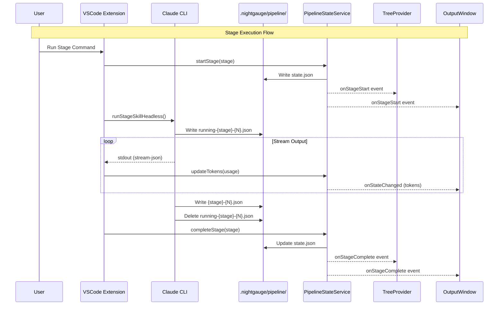
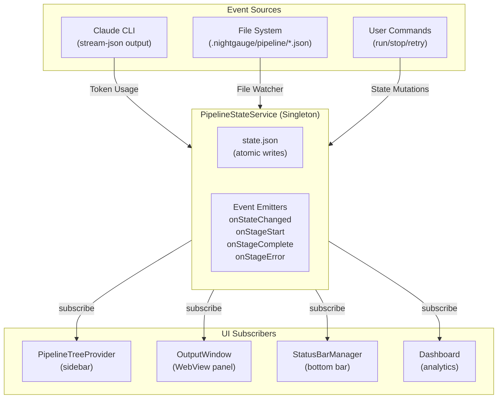
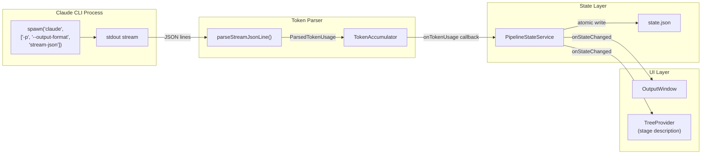
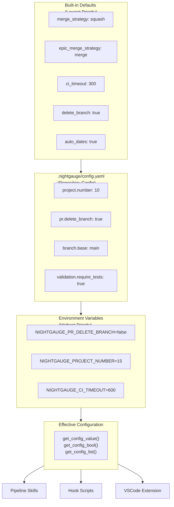
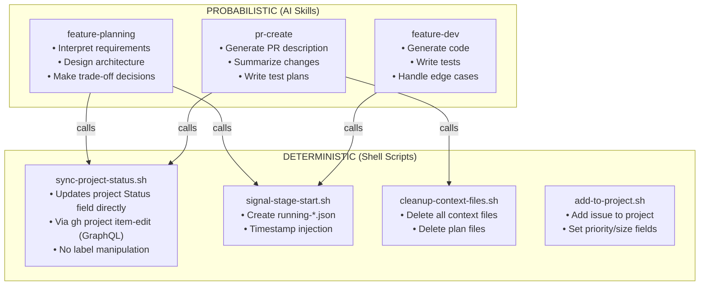
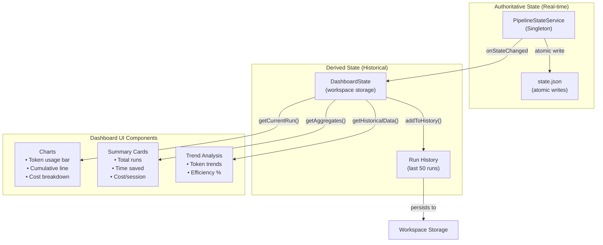

# Nightgauge Architecture Diagrams

This document provides visual representations of the Nightgauge pipeline
and VSCode extension architecture using Mermaid diagrams.

## Table of Contents

1. [Pipeline Stage Flow](#1-pipeline-stage-flow)
2. [State Management Architecture](#2-state-management-architecture)
3. [Token Counting Data Flow](#3-token-counting-data-flow)
4. [Configuration Cascade](#4-configuration-cascade)
5. [Deterministic vs Probabilistic Separation](#5-deterministic-vs-probabilistic-separation)
6. [Dashboard Data Flow](#6-dashboard-data-flow)

---

## 1. Pipeline Stage Flow

This diagram shows how pipeline stages execute with context file handoffs
between stages and UI state updates.



### Context File Lifecycle

```
.nightgauge/
├── pipeline/
│   ├── issue-{N}.json            # Output of issue-pickup
│   ├── planning-{N}.json         # Output of feature-planning
│   ├── dev-{N}.json              # Output of feature-dev
│   ├── validate-{N}.json         # Output of feature-validate (optional)
│   ├── pr-{N}.json               # Output of pr-create
│   ├── running-{stage}-{N}.json  # Transient: indicates stage is running
│   └── state.json                # Unified state (PipelineStateService)
└── plans/
    └── {N}-{description}.md      # Plan file from feature-planning
```

---

## 2. State Management Architecture

This diagram shows the unified state management pattern where
PipelineStateService is the single source of truth and UI components subscribe
to state changes.



### Key Principles

1. **Single Source of Truth**: `PipelineStateService` owns all pipeline state
2. **Event-Driven Updates**: UI components subscribe to events, don't poll
3. **Atomic Writes**: State file uses temp+rename pattern for consistency
4. **Crash Recovery**: Detects orphaned "running" stages after VS Code restart

---

## 3. Token Counting Data Flow

This diagram shows how token usage flows from Claude CLI output through parsing
to state management and UI display.



### Token Usage Flow

1. **CLI Output**: Claude CLI emits `stream-json` with `type: 'result'` messages
   containing usage data
2. **Parsing**: `tokenParser.ts` extracts `input_tokens`, `output_tokens`,
   `cache_read_input_tokens`, `cache_creation_input_tokens`, and
   `total_cost_usd`
3. **Accumulation**: `TokenAccumulator` sums tokens across multiple result
   messages
4. **State Update**: `PipelineStateService.updateTokens()` accumulates to total
5. **UI Display**: OutputWindow and TreeProvider subscribe and display formatted
   tokens

### Token Format Examples

```typescript
// Sidebar display
"1.5K tokens | $0.0023";

// OutputWindow header
"Input: 1,234 | Output: 567 | Cache: 890 | Cost: $0.0023";
```

---

## 4. Configuration Cascade

This diagram shows how configuration values are resolved from multiple sources
with a clear priority order.



### Configuration Sections

| Section      | Purpose                          | Example Keys                         |
| ------------ | -------------------------------- | ------------------------------------ |
| `project`    | GitHub Project board integration | `number`, `owner`, `auto_dates`      |
| `pr`         | Pull request settings            | `merge_strategy`, `delete_branch`    |
| `branch`     | Branch naming and protection     | `base`, `protected`, `prefixes`      |
| `issue`      | Issue creation defaults          | `auto_assign`, `default_labels`      |
| `pipeline`   | CI/build settings                | `ci_timeout`, `auto_fix`, `skip`     |
| `commands`   | Command overrides                | `test`, `lint`, `build`              |
| `validation` | PR quality gates                 | `require_tests`, `max_files_changed` |

### Environment Variable Naming

```
Config file key       →  Environment variable
────────────────────────────────────────────
pr.delete_branch      →  NIGHTGAUGE_PR_DELETE_BRANCH
project.number        →  NIGHTGAUGE_PROJECT_NUMBER
pipeline.ci_timeout   →  NIGHTGAUGE_PIPELINE_CI_TIMEOUT
```

---

## 5. Deterministic vs Probabilistic Separation

This diagram shows the architectural separation between deterministic operations
(shell scripts) and probabilistic operations (AI skills).



### Decision Framework

| Use Deterministic When                  | Use Probabilistic When                 |
| --------------------------------------- | -------------------------------------- |
| Fixed input → output mapping            | Creative/interpretive work needed      |
| Same input ALWAYS produces same output  | Context understanding required         |
| Accuracy and consistency are critical   | Judgment or trade-offs involved        |
| Cost and latency matter (no LLM tokens) | Natural language interpretation needed |
| Logic can be expressed as rules         | Output format varies with complexity   |

### Deterministic Operations Matrix

| Operation                   | Type          | Script                     | Called By               |
| --------------------------- | ------------- | -------------------------- | ----------------------- |
| Stage start signal          | Deterministic | `signal-stage-start.sh`    | All skills              |
| Stage complete signal       | Deterministic | `signal-stage-complete.sh` | All skills              |
| Project Status field update | Deterministic | `sync-project-status.sh`   | issue-pickup, pr-create |
| Add issue to project        | Deterministic | `add-to-project.sh`        | issue-create            |
| Context file cleanup        | Deterministic | `cleanup-context-files.sh` | pr-merge                |
| Code generation             | Probabilistic | SKILL.md instructions      | feature-dev             |
| PR description generation   | Probabilistic | SKILL.md instructions      | pr-create               |
| Requirements analysis       | Probabilistic | SKILL.md instructions      | feature-planning        |

### Benefits of Separation

1. **Cost Efficiency**: Deterministic operations consume zero LLM tokens
2. **Predictability**: Scripts always behave the same way
3. **Speed**: Shell scripts execute in milliseconds vs seconds for LLM calls
4. **Debuggability**: Deterministic code is easier to test and fix
5. **Reliability**: No LLM hallucination risk for critical operations

---

## 6. Dashboard Data Flow

This diagram shows how the dashboard aggregates data from the authoritative
PipelineStateService and maintains its own historical state.



### Data Ownership Principles

| Data Source             | Owner                | Update Frequency  | Persistence       |
| ----------------------- | -------------------- | ----------------- | ----------------- |
| Current pipeline state  | PipelineStateService | Real-time         | state.json        |
| Current run token usage | PipelineStateService | Per-stage         | state.json        |
| Run history             | DashboardState       | On run complete   | Workspace storage |
| Session aggregates      | DashboardState       | On demand         | In-memory         |
| Time savings config     | VS Code settings     | User-configurable | VS Code settings  |

### Subscription Pattern

```typescript
// Dashboard subscribes to authoritative state
pipelineStateService.onStateChanged((state) => {
  if (state) {
    dashboardState.syncFromPipelineState(state);
    dashboard.updatePanel();
  }
});

// Dashboard also subscribes to individual events for granular updates
pipelineStateService.onStageStart(({ stage }) => {
  dashboardState.setStageRunning(stage);
});

pipelineStateService.onStageComplete(({ stage }) => {
  dashboardState.setStageComplete(stage);
});
```

This ensures the dashboard always reflects the authoritative state while
maintaining its own historical analysis capabilities.

---

## Related Documentation

- [ARCHITECTURE.md](ARCHITECTURE.md) - Overall repository architecture
- [CONTEXT_ARCHITECTURE.md](CONTEXT_ARCHITECTURE.md) - Context file schemas
- [GIT_WORKFLOW.md](GIT_WORKFLOW.md) - Git workflow and branch strategy

## Author

nightgauge
