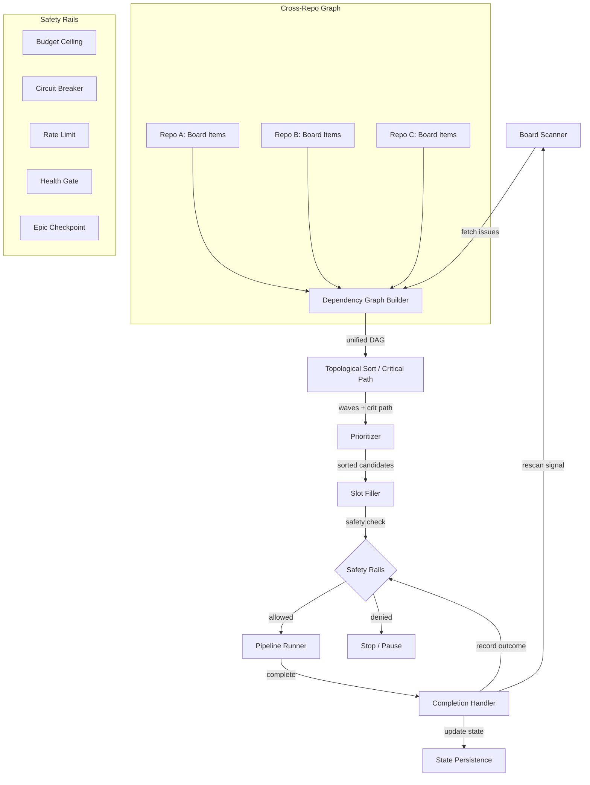

# Autonomous Cross-Repo Orchestrator

> Run everything. Walk away. The pipeline intelligently prioritizes,
> parallelizes, and sequences work across all repositories.

## Overview

The autonomous orchestrator enables a single command to execute ALL open issues
across ALL workspace repos — respecting dependencies, maximizing concurrency,
and maintaining safety rails. It builds a cross-repo dependency graph, computes
the critical path, fills pipeline slots with the highest-value items, and
cascades unblocks across repositories when items complete.

## Quick Start

### CLI

```bash
# Preview what would run (no execution)
nightgauge autonomous run --dry-run

# Start autonomous mode with defaults from config.yaml
nightgauge autonomous run

# Start with explicit options
nightgauge autonomous run --interval 30s --budget 500000 --max-concurrent 3

# Check status (human-readable)
nightgauge autonomous status

# Check status (machine-readable)
nightgauge autonomous status --json

# Stop the scheduler
nightgauge autonomous stop
```

### VSCode Extension

- **Command Palette**: `Nightgauge: Autonomous: Run`
- **Status bar** shows running/paused/complete state
- **Autonomous: Dry Run** previews the execution plan without starting pipelines
- **Autonomous: Pause / Resume** pauses scanning while keeping state
- **Autonomous: Stop** stops the scheduler and prints a summary

## Getting Started: Hands-Free Issue Processing

1. **Enable autonomous mode** in `.nightgauge/config.yaml`:
   ```yaml
   autonomous:
     refinement_enabled: true
     auto_actionable: true # auto-promote refined issues to Ready
   ```
2. **Create an issue** using any template (or blank) — no specific format
   required
3. **Add the `auto-process` label** (or check "Immediately actionable" in the
   template and add the label manually)
4. **Watch it get refined, implemented, and deployed:**
   - The refinement scan picks it up, rewrites it with structured criteria
   - The dispatch scan picks up the refined issue and runs the full pipeline
   - Implementation, testing, and PR creation happen automatically
5. **(Optional)** Set `auto_actionable: true` for fully hands-off operation —
   refined issues skip Backlog and go straight to Ready

## How It Works

### 1. Dependency Graph

The orchestrator scans all configured repository project boards and builds a
unified Directed Acyclic Graph (DAG) of issues:

- Fetches all open issues from each repo's GitHub project board
- Reads `blockedBy` relationships from the GraphQL board data (intra-repo)
- Parses issue bodies for cross-repo references (inter-repo)
- Computes topological execution waves via Kahn's algorithm
- Finds the critical path (longest weighted path through the DAG)

The graph is rebuilt on every scan cycle to reflect the latest state.

### Epic-Level Blocking

By default, a sub-issue is considered blocked if its parent epic has an open
`blockedBy` relationship — even if the sub-issue itself has no individual blocker.
This prevents accidental out-of-order execution when epics are wired with
`blockedBy` dependencies but their sub-issues are individually unblocked.

**Example**: If epic E3 has `blockedBy` E1, all sub-issues of E3 are gated until
E1 is closed or its board status reflects completed work ("In review", "Done").

**Config** (opt-out): Set `autonomous.disable_epic_blockedby_cascade: true` in
`.nightgauge/config.yaml` to revert to individual-issue-only blocking.

**Dangling epic gates**: When cascade is disabled, the scheduler logs a warning
when an epic has an open `blockedBy` but one or more of its sub-issues is
individually schedulable. This appears in log output and `autonomous run
--dry-run` output as:

```
autonomous: WARNING dangling epic gate: epic owner/repo#20 has open blockedBy but sub-issues are schedulable: [owner/repo#21]
```

**`--repos` candidate restriction**: The `--repos` flag (and
`autonomous.enabled_repos` config key) restricts which nodes are _dispatched_,
not which repos are used to build the dependency graph. Cross-repo blocking edges
from out-of-scope repos still gate in-scope candidates — only candidates from
non-listed repos are filtered out.

### 2. Board Status Gating

Before priority sorting, the scheduler filters candidates by their **project
board Status** field. This prevents the race condition where an issue is
dispatched during the 30-second window between creation and dependency setup.

| Board Status  | Dispatched?                                                |
| ------------- | ---------------------------------------------------------- |
| **Ready**     | Always — primary dispatch pool                             |
| **Backlog**   | Only when `pickup_backlog: true` AND no Ready items remain |
| In progress   | Never — already being worked on                            |
| In review     | Never — pipeline already completed                         |
| Done          | Never — already completed                                  |
| _(no status)_ | Never — not yet triaged onto the board                     |

**Recommended workflow**: Create issues → set Status to "Backlog" → configure
all `blockedBy` relationships → promote to "Ready". The scheduler cannot
dispatch issues until they reach "Ready" status.

### 3. Priority Ordering

Candidates passing the board status gate are sorted using a 6-factor priority:

0. **Board status** — Ready items always sort before Backlog items
1. **Critical path** — items on the critical path are always scheduled first,
   because they determine the minimum total execution time
2. **Focus alignment** — when a focus lens is active, issues whose labels or
   title match the lens keywords receive a boost of up to +20 points. See
   [Focus Mode Integration](#focus-mode-integration) below.
3. **Priority label** — P0 > P1 > P2 > P3. Higher priority means more urgent
4. **Size (smaller first)** — XS, S, M, L, XL. Smaller items complete faster,
   unblocking downstream work sooner
5. **Unblock count** — items that unblock the most downstream dependents are
   preferred, maximizing parallelism in subsequent cycles

Tie-breaker: lower issue number (older issues first).

### Focus Mode Integration

The autonomous scheduler reads `.nightgauge/focus.yaml` at the start of
each `prioritize()` cycle and applies keyword-based boosts to focus-aligned
issues.

**Alignment scoring:**

- **+2** per issue label that contains a lens keyword (case-insensitive)
- **+1** per lens keyword found in the issue title
- Score is **capped at 20** to prevent domination

**Key behaviors:**

- Critical-path items always sort above focus-aligned items regardless of boost
- `general` lens (default) produces zero boost — ordering falls back to pure
  priority/size
- Missing `focus.yaml` is treated as `general` (fully backward-compatible)

**Example:** with `quality` focus active (keywords: test, coverage, lint, ...),
a P1 issue labeled `coverage` and titled "Add test coverage" scores +3 boost
and may sort above a P0 issue with no focus alignment.

To set a focus lens:

```bash
nightgauge focus set security   # prioritize security-related issues
nightgauge focus clear          # return to balanced ordering
```

See [docs/FOCUS_MODE.md](FOCUS_MODE.md) for the full focus mode reference.

### 3. Slot Filling

The scheduler maintains N concurrent pipeline slots (default: 3). On each scan
cycle:

1. Count available slots (`max_concurrent - running_count`)
2. Take the top N candidates from any repo (cross-repo by design)
3. Safety-check each candidate before dispatch
4. Enqueue into the existing pipeline scheduler
5. Track in the running set

### 4. Unblock Cascade

When a pipeline completes (success or failure):

1. The completion handler records the outcome
2. A rescan signal is sent immediately (no waiting for the next tick)
3. The graph is rebuilt, reflecting the newly closed issue
4. Previously blocked items in ANY repo become candidates
5. The slot filler dispatches newly unblocked items

This means completing an issue in `acme-platform` can immediately
trigger work on a dependent issue in `acme-mobile`.

### 5. Refinement Scan

A parallel goroutine runs alongside the dispatch ticker to automatically refine
unrefined issues before they enter the pipeline. This ensures issues have proper
acceptance criteria, labels, and sizing before dispatch.

**How it works:**

1. On each refinement tick (default: 60s), the scanner queries all configured
   repos for open issues that lack the `pipeline:refined` label
2. Issues already running through refinement, on cooldown, or already in a
   pipeline slot are skipped
3. Qualifying issues are dispatched to the `nightgauge-issue-refine` skill
   via the execution manager (CLI mode) or IPC callback (VSCode mode)
4. On success: `pipeline:refined` label is added, `auto-process` label is
   removed (if present), and the issue is moved to Ready status on the board
5. On failure: the issue enters a cooldown period (default: 5 minutes) and is
   retried in the next cycle after cooldown expires

**Concurrency control:**

- A channel-based semaphore limits concurrent refinements (default: 1, max: 3)
- Semaphore acquisition is non-blocking — if all slots are full, remaining
  candidates wait for the next cycle
- Refinement has its own rate limiter (default: 10/hour) separate from the
  dispatch rate limiter

**Configuration:**

```yaml
# .nightgauge/config.yaml
autonomous:
  refinement_enabled: true # Enable/disable refinement scan
  refinement_interval: 60s # How often to scan for unrefined issues
  refinement_max_concurrent: 1 # Concurrent refinement slots (1-3)
```

**Safety:** Refinement failures do NOT increment the dispatch circuit breaker.
The refinement subsystem has its own independent failure tracking per issue and
its own rate limiter via `SafetyRails.CheckBeforeRefine()`.

#### Issue Refinement Workflow

The refinement scan and the dispatch scan work together to create a fully
automated pipeline from raw issue to merged PR:

```
Raw Issue (any format)
  │
  ▼
Refinement Scan detects missing `pipeline:refined` label
  │
  ▼
`nightgauge-issue-refine` skill rewrites the issue:
  - Adds structured Summary, Acceptance Criteria, Technical Notes
  - Assigns type/priority/size labels based on codebase analysis
  - Adds `pipeline:refined` label
  - Removes `auto-process` label (if present)
  │
  ▼
Issue moved to Ready (if `auto_actionable: true`) or Backlog (default)
  │
  ▼
Dispatch Scan picks up Ready issues → full pipeline execution
```

**Label semantics:**

| Label              | Meaning                                                       |
| ------------------ | ------------------------------------------------------------- |
| `auto-process`     | Opt-in signal: "refine this issue and process it immediately" |
| `pipeline:refined` | Completion marker: "this issue has been refined by the AI"    |

The `auto-process` label is the **trigger** — add it to any issue to request
automatic refinement. The `pipeline:refined` label is the **result** — it
prevents the refinement scan from re-processing an already-refined issue.

**Opting in from issue templates:** All issue templates include a "Pipeline
Options" section with an "Immediately actionable" checkbox. When checked, add
the `auto-process` label manually (the checkbox is informational — the label is
the actual trigger).

**Configuration options:**

| Config Key                             | Default | Description                                                                 |
| -------------------------------------- | ------- | --------------------------------------------------------------------------- |
| `autonomous.refinement_enabled`        | `true`  | Master switch for the refinement scan                                       |
| `autonomous.refinement_interval`       | `60s`   | Time between refinement scans (min: 30s)                                    |
| `autonomous.refinement_max_concurrent` | `1`     | Max concurrent refinement operations (1–3)                                  |
| `autonomous.auto_actionable`           | `false` | Move refined issues directly to Ready (`true`) or hold in Backlog (`false`) |

See [CONFIGURATION.md](CONFIGURATION.md#autonomous-scheduler-configuration) for
full details on each option.

### 6. Safety Rails

Five safety rails protect against runaway execution:

| Rail                | Default                | Trigger                                                 | Effect                                    |
| ------------------- | ---------------------- | ------------------------------------------------------- | ----------------------------------------- |
| **Budget Ceiling**  | 500,000 tokens         | Total tokens spent exceeds ceiling                      | Scheduler stops with `budget_exhausted`   |
| **Circuit Breaker** | 3 consecutive failures | N consecutive pipeline failures                         | Scheduler stops with `safety_tripped`     |
| **Rate Limit**      | 20/hour                | Pipeline starts exceed threshold in sliding hour window | New enqueues blocked until window resets  |
| **Epic Checkpoint** | Enabled                | All sub-issues of an epic complete                      | Scheduler pauses for human review         |
| **Health Gate**     | Score >= 30            | Pipeline health score drops below threshold             | New enqueues blocked until score improves |

All rails are checked before each enqueue. Check priority order: budget >
circuit breaker > rate limit > health gate > epic checkpoint. See
[Safety Rails Reference](#safety-rails-reference) for configuration details.

### 6. State Persistence

The scheduler writes its full state to
`.nightgauge/autonomous/state.json` after every cycle. This enables:

- **Crash recovery**: restart picks up where it left off (running items are
  marked as stopped, completed/failed history is preserved)
- **External monitoring**: other tools can read the state file
- **Stop signal**: the `autonomous stop` command writes to the state file;
  the running scheduler picks it up on the next cycle

On restart, `running` and `paused` states are loaded as `stopped` (requiring
explicit `autonomous run` to restart). Terminal states (`complete`,
`budget_exhausted`, `safety_tripped`) are preserved as-is.

## Configuration

Configuration can be set via CLI flags or `config.yaml`:

```yaml
# .nightgauge/config.yaml
autonomous:
  scan_interval: 30s # How often to re-scan boards
  max_concurrent: 3 # Pipeline slots across all repos
  budget_ceiling: 500000 # Global token budget (0 = unlimited)
  dry_run: false # Preview mode
  enabled_repos: # Optional allowlist — scan only these repos.
    - acme-platform # Short names expand against the configured owner.
    - acme/mobile # Or use fully-qualified names.
  safety_rails:
    budget_ceiling: 500000 # Token limit (overrides top-level)
    circuit_breaker_max: 3 # Consecutive failures before trip
    rate_limit_per_hour: 20 # Max pipeline starts per hour
    epic_checkpoint: true # Pause between epics for review
    health_gate_min: 30 # Minimum health score (0-100)
```

### Scoping to specific repos (enabled_repos)

Each scan cycle queries every configured repo via GitHub GraphQL, then
follows up with per-issue `blockedBy`/`blocking` queries. In a workspace with
four repos the combined budget burn can exhaust the 5,000/hour GraphQL quota
in under an hour even when no pipelines are dispatching.

**`autonomous.enabled_repos`** restricts scanning to a subset:

- Empty/unset → scan all configured workspace repos (default).
- Non-empty → scan only the listed repos, cutting GraphQL usage
  proportionally.
- Values may be short names (`acme-platform`) or fully-qualified
  (`acme/platform`). Short names are expanded using the
  configured owner. Matching is case-insensitive.
- Takes effect at scheduler start (CLI: on `autonomous run`; VS Code: on
  Start/Resume). Changing the value on a running scheduler requires a stop
  and restart.

**VS Code UI:**

- **Inline checkbox on each repo** in the Repositories view — uncheck a
  repo to remove it from the autonomous scan set. The extension writes to
  `enabled_repos` and offers to restart autonomous mode if it's running.
  Unchecking all repos is treated as a reset to "scan all" rather than
  "scan nothing" (the scheduler silently going dark would rarely be
  intentional).
- **`Autonomous: Select Repos`** command — opens a multi-select QuickPick
  with the same effect. Useful when the sidebar isn't visible.
- **`Repositories: Pause Auto-Refresh`** toolbar button — pauses
  IPC-driven and per-repo-service refreshes of the Repositories view
  without pausing autonomous itself. Workspace/config changes and the
  explicit Refresh button still fire. Use this to conserve GitHub API
  quota during focused work sessions; click again (`Resume Auto-Refresh`)
  to re-enable live updates.

**Precedence with workspace filtering:** the VS Code extension intersects
`enabled_repos` with the set of workspace folders. When the intersection is
empty (user selected a repo that isn't open in the current workspace), the
explicit `enabled_repos` allowlist wins — their stated intent overrides
workspace membership so nothing silently scans everything.

CLI flags override config.yaml values. The `--budget`, `--interval`,
`--max-concurrent`, and `--dry-run` flags map directly to their config.yaml
equivalents.

## Cross-Repo Dependency Detection

The graph builder detects dependencies from three sources:

### GitHub Native (intra-repo)

Uses the `blockedBy` GraphQL field on issues. These are created via the GitHub
UI or the `addBlockedBy` GraphQL mutation.

```graphql
blockedBy(first: 10) {
  nodes { number, state, repository { nameWithOwner } }
}
```

### Body Text (cross-repo)

Regex patterns in issue bodies:

```
Blocked by platform #535
Blocked by acme/acme-api#100
Depends on: flutter #127, angular #152
Depends on acme-mobile #127
```

Short names (`platform`, `flutter`, `angular`, `core`) are resolved via a
built-in alias map.

### Structured Section

A dedicated section in the issue body with status indicators:

```markdown
## Cross-Repo Dependencies

- ✅ platform #535 — API endpoint verified
- ❌ flutter #127 — not yet implemented
- ⚠️ angular #152 — partial implementation
```

The checkmark (`✅`) indicates the dependency has been verified as satisfied.

### Spike Routing for Cross-Repo Epics

When a cross-repo epic decomposition contains a spike-shaped architectural
decision, the `nightgauge-issue-create` skill routes through one of
three paths defined in
[docs/SPIKE_CONTRACT.md](SPIKE_CONTRACT.md#choosing-between-path-a-b-and-c):
**Path A** (same-repo materialization), **Path C — Spike-with-implementation**
(the preferred default for cross-repo), or **Path B** (concurrent siblings,
opt-in).

For cross-repo epics the orchestrator expects **Path C** by default. Under
Path C there is no standalone `type:spike` issue; the first dependent
ticket commits an ADR (`docs/decisions/{NNN}-{slug}.md`) inside its own PR,
and subsequent dependents block on that first ticket via native `blockedBy`.
This eliminates the single-point-of-failure failure mode where a
human-only spike issue stalls every dependent in the epic — see the
[#328 worked example](SPIKE_CONTRACT.md#path-c-worked-example) for the
historical incident this default exists to prevent.

The orchestrator does not need to special-case Path C: it reads native
`blockedBy` relationships through the same GraphQL field used for any other
intra-repo or cross-repo dependency. The graph builder treats the
ADR-bearing first ticket as a normal blocker for the rest of the epic.

## CLI Reference

| Command                             | Description                            |
| ----------------------------------- | -------------------------------------- |
| `autonomous run`                    | Start the scheduler loop               |
| `autonomous run --dry-run`          | Preview without executing              |
| `autonomous run --budget N`         | Set token budget ceiling               |
| `autonomous run --interval 30s`     | Set scan interval                      |
| `autonomous run --max-concurrent N` | Set pipeline slot count                |
| `autonomous run --repos a,b,c`      | Specify repos (comma-separated)        |
| `autonomous run --owner ORG`        | Set GitHub org/owner                   |
| `autonomous run --project N`        | Set project board number               |
| `autonomous run --json`             | Output final status as JSON            |
| `autonomous status`                 | Show current state (human-readable)    |
| `autonomous status --json`          | Machine-readable output                |
| `autonomous stop`                   | Signal the scheduler to stop           |
| `autonomous stuck-epics`            | List epics detected as stalled (#4073) |
| `autonomous stuck-epics --json`     | Machine-readable stalled-epic list     |
| `graph build`                       | Build and display the dependency graph |
| `graph build --json`                | Machine-readable graph output          |
| `graph build --repos a,b,c`         | Specify repos for graph                |

## VSCode Commands

| Command               | Description                      |
| --------------------- | -------------------------------- |
| `Autonomous: Run`     | Start with confirmation dialog   |
| `Autonomous: Dry Run` | Preview what would execute       |
| `Autonomous: Pause`   | Pause scanning (state preserved) |
| `Autonomous: Resume`  | Resume from pause                |
| `Autonomous: Stop`    | Stop and show summary            |
| `Autonomous: Status`  | Show full status report          |

## Stuck-Epic Detection (No Silent Stalls) — #4073

An epic with open sub-issues, **zero eligible (unblocked) work**, and **no active
run** looks identical to a finished epic: the scheduler simply goes idle. Before
this watchdog, an epic whose merge silently failed could sit open and idle
forever — the runaway-defense conflated "no activity" with "done".

On every **idle cycle** (no candidates and no running pipelines) the scheduler
scans the dependency graph for epics in this state and surfaces them instead of
treating them as complete. An epic is flagged **stalled** when it is OPEN with at
least one open sub-issue and **none** of its open sub-issues is:

- **eligible** — Ready (or Backlog when `pickup_backlog` is on) _and_ unblocked
  (every `blockedBy` dependency closed), or
- **running** — currently in a pipeline run, or
- **actively recovering** — a pending retry/backoff is scheduled, an in-review
  recovery or conflict restart is in flight, or the most recent run (read from
  the history JSONL) was a `conflict-recovery-loop` / `branch-out-of-date`
  recovery within the last 30 minutes.

The alert names each blocking sub-issue and **why** it is stuck — an open blocker
(`blocked by #143`), a silently-failed run (`in progress with no active run — last
run: validation error`, read from history), or an un-promoted backlog item.

### Surfacing

- **Discord** — when `NIGHTGAUGE_STUCK_EPIC_WEBHOOK` (or the configured env
  var) is set, one embed is posted per newly-stalled epic, de-duplicated per the
  re-alert cooldown so a persistent stall is not re-spammed every idle cycle.
- **CLI** — `nightgauge autonomous stuck-epics [--json]` lists the epics
  flagged on the most recent idle scan (read from persisted state).
- **VSCode / IPC** — the `autonomous.stuckEpics` IPC method returns the live
  snapshot.

### Configuration

```yaml
# .nightgauge/config.yaml
autonomous:
  stuck_epic_detection:
    enabled: true # default: true
    discord_webhook_env: NIGHTGAUGE_STUCK_EPIC_WEBHOOK # env var holding the URL
    re_alert_after: 6h # cooldown before re-alerting the same epic
```

The webhook **URL is read from the environment**, never stored in `config.yaml`.
Detection still surfaces via state and the CLI when no webhook is configured.

## Safety Rails Reference

### Budget Ceiling

- **Config**: `safety_rails.budget_ceiling` (default: 500,000)
- **Trigger**: `tokens_used + estimate > ceiling`
- **Effect**: Scheduler transitions to `budget_exhausted` status
- **Disable**: Set to `0` for unlimited
- **Note**: Budget counter is NOT reset by `Reset()` — it is a hard limit

### Circuit Breaker

- **Config**: `safety_rails.circuit_breaker_max` (default: 3)
- **Trigger**: N consecutive pipeline failures (success resets counter)
- **Effect**: Scheduler transitions to `safety_tripped` status
- **Disable**: Set to `0`
- **Recovery**: A single successful completion resets the consecutive failure
  counter

### Rate Limit

- **Config**: `safety_rails.rate_limit_per_hour` (default: 20)
- **Trigger**: Pipeline starts in the current sliding hour window exceed limit
- **Effect**: New enqueues blocked until window resets (1 hour from first start)
- **Disable**: Set to `0`

### Epic Checkpoint

- **Config**: `safety_rails.epic_checkpoint` (default: `true`)
- **Trigger**: All sub-issues of an epic complete
- **Effect**: Scheduler pauses (`pausedForCheckpoint`) until human resumes
- **Resume**: Call `ResumeCheckpoint()` or restart the scheduler
- **Disable**: Set to `false`

### Health Gate

- **Config**: `safety_rails.health_gate_min` (default: 30)
- **Trigger**: Latest health score drops below threshold
- **Effect**: New enqueues blocked until score improves
- **Disable**: Set to `0`
- **Note**: If no health score has been recorded yet (score = 0), the gate does
  NOT block

### Discipline Gate (#4100)

- **Config**: `autonomous.discipline_gate` — `enabled` (default `true`),
  `min_score` (default `30`), `mode` (`block` | `warn`, default `block`)
- **Trigger**: At `autonomous run` startup, the per-repo **verification-readiness
  score** (`nightgauge discipline-score`: real test suite, runnable test
  command, CI workflows, process docs, issue templates — 0–100) is below
  `min_score`
- **Effect**: `block` refuses the autonomous run (AI amplifies a weak engineering
  culture as readily as a strong one — an under-prepared repo is where the gates
  over-trust themselves); `warn` logs and proceeds
- **Why 30**: conservative — a repo with **either** a real test suite **or** CI
  clears it; only repos with neither are gated. Skipped on `--dry-run`.
- **Distinct from the Health Gate**: this is a _repo-readiness_ signal computed
  from the working tree, not the runtime pipeline health score.

## Troubleshooting

### Autonomous mode not starting

- **"--owner is required"**: Set `owner` in `.nightgauge/config.yaml` or
  pass `--owner`
- **"--project is required"**: Set `project_number` in config.yaml or pass
  `--project`
- **"no repos found"**: Pass `--repos` or ensure sibling directories have
  `.nightgauge/` config
- **"already running"**: Another instance is active. Run `autonomous stop`
  first

### Items not being picked up

- Issue may be blocked by an open dependency — check with `graph build`
- Issue may have `type:epic` label (epics are tracked, not dispatched)
- Issue may already be in the running or completed set — check
  `autonomous status`
- All pipeline slots may be full — wait for a completion or increase
  `--max-concurrent`

### Cross-repo dependencies not detected

- Verify the repo alias is in the alias map (e.g., `platform` maps to
  `acme/platform`)
- Check body text format: `Blocked by <repo> #<number>` or
  `Depends on <repo> #<number>`
- For structured sections, use the exact header `## Cross-Repo Dependencies`
- Run `graph build --json` to see all detected edges and their sources

### Safety rail triggered unexpectedly

- Run `autonomous status --json` and inspect the `safety` field
- **Budget**: check `tokensUsed` vs `tokensCeiling`
- **Circuit breaker**: check `consecutiveFailures` — a single success resets it
- **Rate limit**: check `pipelineStartsThisHour` — resets after 1 hour
- **Health gate**: check `lastHealthScore` — run a health check to update
- **Checkpoint**: check `pausedForCheckpoint` — resume manually

### State file corrupted

- Delete `.nightgauge/autonomous/state.json` and restart
- The scheduler initializes fresh state when no file exists
- Previously completed/failed history will be lost

## Architecture



### Component Summary

| Component            | Source                                       | Responsibility                                          |
| -------------------- | -------------------------------------------- | ------------------------------------------------------- |
| Dependency Graph     | `internal/depgraph/`                         | Build cross-repo DAG, compute waves and critical path   |
| Body Parser          | `internal/depgraph/parser.go`                | Extract cross-repo references from issue bodies         |
| Topo Sort            | `internal/depgraph/topo.go`                  | Kahn's algorithm for waves, DP for critical path        |
| Autonomous Scheduler | `internal/orchestrator/autonomous.go`        | Main loop: scan, prioritize, fill, cascade              |
| Safety Rails         | `internal/orchestrator/safety_rails.go`      | Budget, circuit breaker, rate limit, health, checkpoint |
| Wave Orchestrator    | `internal/orchestrator/wave_orchestrator.go` | Epic-level parallel subagent execution                  |
| CLI Commands         | `cmd/nightgauge/main.go`                     | `autonomous run/status/stop`, `graph build`             |

For deep architectural details, see [ARCHITECTURE.md](ARCHITECTURE.md).
