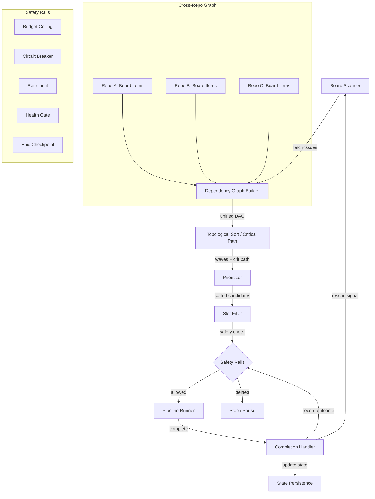

# Autonomous Cross-Repo Orchestrator

> Run everything. Walk away. The pipeline intelligently prioritizes,
> parallelizes, and sequences work across all repositories.

## Overview

The autonomous orchestrator enables a single command to execute ALL open issues
across ALL workspace repos — respecting dependencies, maximizing concurrency,
and maintaining safety rails. It builds a cross-repo dependency graph, computes
the critical path, fills pipeline slots with the highest-value items, and
cascades unblocks across repositories when items complete.

## Quick Start

### CLI

```bash
# Preview what would run (no execution)
nightgauge autonomous run --dry-run

# Start autonomous mode with defaults from config.yaml
nightgauge autonomous run

# Start with explicit options
nightgauge autonomous run --interval 30s --budget 500000 --max-concurrent 3

# Check status (human-readable)
nightgauge autonomous status

# Check status (machine-readable)
nightgauge autonomous status --json

# Clear a halt / pause and resume dispatching
nightgauge autonomous resume

# Stop the scheduler
nightgauge autonomous stop
```

### VSCode Extension

- **Command Palette**: `Nightgauge: Autonomous: Run`
- **Status bar** shows running/paused/complete state
- **Autonomous: Dry Run** previews the execution plan without starting pipelines
- **Autonomous: Pause / Resume** pauses scanning while keeping state
- **Autonomous: Stop** stops the scheduler and prints a summary

## Getting Started: Hands-Free Issue Processing

1. **Enable autonomous mode** in `.nightgauge/config.yaml`:
   ```yaml
   autonomous:
     refinement_enabled: true
     auto_actionable: true # auto-promote refined issues to Ready
   ```
2. **Create an issue** using any template (or blank) — no specific format
   required
3. **Add the `auto-process` label** (or check "Immediately actionable" in the
   template and add the label manually)
4. **Watch it get refined, implemented, and deployed:**
   - The refinement scan picks it up, rewrites it with structured criteria
   - The dispatch scan picks up the refined issue and runs the full pipeline
   - Implementation, testing, and PR creation happen automatically
5. **(Optional)** Set `auto_actionable: true` for fully hands-off operation —
   refined issues skip Backlog and go straight to Ready

## How It Works

### 1. Dependency Graph

The orchestrator scans all configured repository project boards and builds a
unified Directed Acyclic Graph (DAG) of issues:

- Fetches all open issues from each repo's GitHub project board
- Reads `blockedBy` relationships from the GraphQL board data (intra-repo)
- Parses issue bodies for cross-repo references (inter-repo)
- Computes topological execution waves via Kahn's algorithm
- Finds the critical path (longest weighted path through the DAG)

The graph is rebuilt on every scan cycle to reflect the latest state.

### Epic-Level Blocking

By default, a sub-issue is considered blocked if its parent epic has an open
`blockedBy` relationship — even if the sub-issue itself has no individual blocker.
This prevents accidental out-of-order execution when epics are wired with
`blockedBy` dependencies but their sub-issues are individually unblocked.

**Example**: If epic E3 has `blockedBy` E1, all sub-issues of E3 are gated until
E1 is closed or its board status reflects completed work ("In review", "Done").

**Config** (opt-out): Set `autonomous.disable_epic_blockedby_cascade: true` in
`.nightgauge/config.yaml` to revert to individual-issue-only blocking.

**Dangling epic gates**: When cascade is disabled, the scheduler logs a warning
when an epic has an open `blockedBy` but one or more of its sub-issues is
individually schedulable. This appears in log output and `autonomous run
--dry-run` output as:

```
autonomous: WARNING dangling epic gate: epic owner/repo#20 has open blockedBy but sub-issues are schedulable: [owner/repo#21]
```

**`--repos` candidate restriction**: The `--repos` flag (and
`autonomous.enabled_repos` config key) restricts which nodes are _dispatched_,
not which repos are used to build the dependency graph. Cross-repo blocking edges
from out-of-scope repos still gate in-scope candidates — only candidates from
non-listed repos are filtered out.

### 2. Board Status Gating

Before priority sorting, the scheduler filters candidates by their **project
board Status** field. This prevents the race condition where an issue is
dispatched during the 30-second window between creation and dependency setup.

| Board Status  | Dispatched?                                                |
| ------------- | ---------------------------------------------------------- |
| **Ready**     | Always — primary dispatch pool                             |
| **Backlog**   | Only when `pickup_backlog: true` AND no Ready items remain |
| In progress   | Never — already being worked on                            |
| In review     | Never — pipeline already completed                         |
| Done          | Never — already completed                                  |
| _(no status)_ | Never — not yet triaged onto the board                     |

**Recommended workflow**: Create issues → set Status to "Backlog" → configure
all `blockedBy` relationships → promote to "Ready". The scheduler cannot
dispatch issues until they reach "Ready" status.

### 3. Priority Ordering

Candidates passing the board status gate are sorted using a 6-factor priority:

0. **Board status** — Ready items always sort before Backlog items
1. **Critical path** — items on the critical path are always scheduled first,
   because they determine the minimum total execution time
2. **Focus alignment** — when a focus lens is active, issues whose labels or
   title match the lens keywords receive a boost of up to +20 points. See
   [Focus Mode Integration](#focus-mode-integration) below.
3. **Priority label** — P0 > P1 > P2 > P3. Higher priority means more urgent
4. **Size (smaller first)** — XS, S, M, L, XL. Smaller items complete faster,
   unblocking downstream work sooner
5. **Unblock count** — items that unblock the most downstream dependents are
   preferred, maximizing parallelism in subsequent cycles

Tie-breaker: lower issue number (older issues first).

### Focus Mode Integration

The autonomous scheduler reads `.nightgauge/focus.yaml` at the start of
each `prioritize()` cycle and applies keyword-based boosts to focus-aligned
issues.

**Alignment scoring:**

- **+2** per issue label that contains a lens keyword (case-insensitive)
- **+1** per lens keyword found in the issue title
- Score is **capped at 20** to prevent domination

**Key behaviors:**

- Critical-path items always sort above focus-aligned items regardless of boost
- `general` lens (default) produces zero boost — ordering falls back to pure
  priority/size
- Missing `focus.yaml` is treated as `general` (fully backward-compatible)

**Example:** with `quality` focus active (keywords: test, coverage, lint, ...),
a P1 issue labeled `coverage` and titled "Add test coverage" scores +3 boost
and may sort above a P0 issue with no focus alignment.

To set a focus lens:

```bash
nightgauge focus set security   # prioritize security-related issues
nightgauge focus clear          # return to balanced ordering
```

See [docs/FOCUS_MODE.md](FOCUS_MODE.md) for the full focus mode reference.

### 3. Slot Filling

The scheduler maintains N concurrent pipeline slots (default: 3). On each scan
cycle:

1. Count available slots (`max_concurrent - running_count`)
2. Take the top N candidates from any repo (cross-repo by design)
3. Safety-check each candidate before dispatch
4. Enqueue into the existing pipeline scheduler
5. Track in the running set

### 4. Unblock Cascade

When a pipeline completes (success or failure):

1. The completion handler records the outcome
2. A rescan signal is sent immediately (no waiting for the next tick)
3. The graph is rebuilt, reflecting the newly closed issue
4. Previously blocked items in ANY repo become candidates
5. The slot filler dispatches newly unblocked items

This means completing an issue in `acme-platform` can immediately
trigger work on a dependent issue in `acme-mobile`.

### 5. Refinement Scan

A parallel goroutine runs alongside the dispatch ticker to automatically refine
unrefined issues before they enter the pipeline. This ensures issues have proper
acceptance criteria, labels, and sizing before dispatch.

**How it works:**

0. Before listing anything, each repo is preflighted against the required-label
   registry (`github.RequiredLabels`). A repo missing any of them is **skipped**
   with an Action Center card, because refinement there cannot record its own
   completion and would re-select the same issues forever (#993). Fix with
   `nightgauge label ensure --owner O --repo R`.
1. On each refinement tick (default: 60s), the scanner queries all configured
   repos for open issues that lack the `pipeline:refined` label
2. Issues already running through refinement, on cooldown, or already in a
   pipeline slot are skipped
3. Qualifying issues are dispatched to the `nightgauge-issue-refine` skill
   via the execution manager (CLI mode) or IPC callback (VSCode mode)
4. On success: `pipeline:refined` label is added, `auto-process` label is
   removed (if present), and the issue is moved to Ready status on the board
5. On failure — including a failure to ADD the `pipeline:refined` label, which
   was previously logged and dropped — the run is recorded in
   `state.RefinementFailed` with its reason, the per-issue consecutive-failure
   counter is incremented, and the issue enters a cooldown (default: 5 minutes)
6. After **3 consecutive failures** the candidate loop stops re-selecting that
   issue and raises an Action Center card. The cooldown bounds how OFTEN an
   issue is retried; this bounds how MANY times. Without it a deterministic
   failure retried at the rail's cap indefinitely (#993)

**Concurrency control:**

- A channel-based semaphore limits concurrent refinements (default: 1, max: 3).
  It is **workspace-global**: one channel shared by every configured repo, not
  a per-repo budget.
- Two gates enforce it (#488). At the **top of each repo's scan**, an exhausted
  semaphore ends the cycle's scanning entirely — later repos are not listed at
  all, so a saturated workspace spends no GitHub API quota refusing. Inside a
  repo, a **refused candidate acquisition** logs once and ends that repo's
  dispatching for the cycle.
- Consequence: a slot freed mid-cycle can still be won by a later repo, but only
  if the exhaustion check passed when that repo was scanned. When the semaphore
  is saturated at scan time, remaining repos wait for the next cycle (at most
  one `refinement_interval` of delay). Repo order therefore decides ties every
  cycle; rotating that order is tracked as separate follow-up work.
- The cap bounds **in-flight dispatches**, not completed refinements. In
  IPC/VSCode mode the slot is released at handoff — `refineIssue` returns
  shortly after `onRefinementDispatch` hands the issue to the extension — so the
  practical ceiling is roughly `refinement_max_concurrent` issues handed off per
  `refinement_interval`, regardless of how long the extension then takes.
  Holding the slot until the extension reports completion is a separate design
  question, tracked as follow-up work.
- Refinement has its own rate limiter (default: 10/hour) separate from the
  dispatch rate limiter. A refused candidate is not counted against it — only an
  acquired slot records a refinement start.

**Configuration:**

```yaml
# .nightgauge/config.yaml
autonomous:
  refinement_enabled: true # Enable/disable refinement scan
  refinement_interval: 60s # How often to scan for unrefined issues
  refinement_max_concurrent: 1 # Concurrent refinement slots (1-3)
```

**Safety:** Refinement failures do NOT increment the dispatch circuit breaker.
The refinement subsystem has its own independent failure tracking per issue and
its own rate limiter via `SafetyRails.CheckBeforeRefine()`.

#### Issue Refinement Workflow

The refinement scan and the dispatch scan work together to create a fully
automated pipeline from raw issue to merged PR:

```
Raw Issue (any format)
  │
  ▼
Refinement Scan detects missing `pipeline:refined` label
  │
  ▼
`nightgauge-issue-refine` skill rewrites the issue:
  - Adds structured Summary, Acceptance Criteria, Technical Notes
  - Assigns type/priority/size labels based on codebase analysis
  - Adds `pipeline:refined` label
  - Removes `auto-process` label (if present)
  │
  ▼
Issue moved to Ready (if `auto_actionable: true`) or Backlog (default)
  │
  ▼
Dispatch Scan picks up Ready issues → full pipeline execution
```

**Label semantics:**

| Label              | Meaning                                                       |
| ------------------ | ------------------------------------------------------------- |
| `auto-process`     | Opt-in signal: "refine this issue and process it immediately" |
| `pipeline:refined` | Completion marker: "this issue has been refined by the AI"    |

**Both labels must EXIST in the repository.** They are not created on demand —
run `nightgauge label ensure` (see
[docs/GO_BINARY.md](GO_BINARY.md#repository-label-operations)). The refinement
preflight refuses to run against a repo that is missing them.

The `auto-process` label is the **trigger** — add it to any issue to request
automatic refinement. The `pipeline:refined` label is the **result** — it
prevents the refinement scan from re-processing an already-refined issue.

**Opting in from issue templates:** All issue templates include a "Pipeline
Options" section with an "Immediately actionable" checkbox. When checked, add
the `auto-process` label manually (the checkbox is informational — the label is
the actual trigger).

**Configuration options:**

| Config Key                             | Default | Description                                                                 |
| -------------------------------------- | ------- | --------------------------------------------------------------------------- |
| `autonomous.refinement_enabled`        | `true`  | Master switch for the refinement scan                                       |
| `autonomous.refinement_interval`       | `60s`   | Time between refinement scans (min: 30s)                                    |
| `autonomous.refinement_max_concurrent` | `1`     | Max concurrent refinement operations (1–3)                                  |
| `autonomous.auto_actionable`           | `false` | Move refined issues directly to Ready (`true`) or hold in Backlog (`false`) |

See [CONFIGURATION.md](CONFIGURATION.md#autonomous-scheduler-configuration) for
full details on each option.

### Scan Cadence (Rate-Aware) — #172

The active scan cadence (default base: 30s) determines how often the
scheduler re-scans boards and rebuilds the dependency graph. A fixed cadence,
multiplied by per-cycle GraphQL cost, can exceed the GitHub GraphQL hourly
budget on a busy multi-repo workspace — measured at ~101 points/min (~6,065/hr
against a 5,000/hr budget) on a 6-repo workspace with one issue in flight.
When that happens, `hasDispatchHeadroom()` routinely defers dispatch with a
`"github-rate-limit-headroom"` rejection until the hourly window resets —
invisible in every place an operator would normally look (no failed run, no
error, board looks correct).

Rate-aware cadence closes this gap by deriving the effective scan interval
from three already-available, zero-extra-cost inputs, all sourced from the
shared GitHub rate-limit tracker (populated from `X-RateLimit-*` response
headers — no new GraphQL calls are introduced):

1. **Remaining quota and time-to-reset** — `gitHubQuotaSnapshot()`.
2. **Measured per-cycle GraphQL cost** — an EWMA (`AvgCycleGraphQLCost`,
   smoothing factor `graphQLCostEWMAAlpha = 0.3`) updated by diffing
   `remaining` immediately before and after each cycle
   (`runCycleWithCostTracking`). A window reset mid-cycle (remaining
   increases) is detected and discarded rather than corrupting the average.
3. **`dispatchHeadroomFloor()`** — the same margin the hard per-dispatch gate
   already protects, reused here as the floor input so pacing and the gate
   agree on what "safe" means.

`scanCadence()` calls the pure function `rateAwareCadence(base, remaining,
limit, resetAt, avgCost, floor, ceiling)`, which **fails open to `base`**
whenever the inputs are missing or stale (cold start, long idle gap, `avgCost
<= 0`, `remaining <= 0`, or `resetAt` not in the future) — a missing/stale
quota signal never makes cadence worse than the fixed-cadence behavior it
replaces. When headroom is projected to run out before the window resets, the
interval stretches, clamped to `MaxScanInterval` (default 10 minutes — an
independent ceiling from `IdleScanInterval`'s 5-minute default, since
rate-aware slowdown and idle backoff are different reasons to wait). Any
candidate appearance, dispatch, or rescan still snaps cadence back to base
immediately via the existing rescan-trigger path, so responsiveness is
unaffected whenever there is real work and real headroom. Rate-aware
stretching and idle-backoff stretching compose via "the longer interval
wins" — a workspace that is both idle and rate-pressured backs off to
whichever interval is larger.

**Config knobs**: `RateAwareCadence` (default `true`) and `MaxScanInterval`
(default `10m`) are `AutonomousConfig` fields with safe code-level defaults
(`DefaultAutonomousConfig()`); they are not yet exposed as `config.yaml` keys
— follow up as a separate issue if operator-level tuning is wanted.

#### Rate-Limit Pressure Signal (`RateLimitPressureActive`)

A `"github-rate-limit-headroom"` dispatch rejection is a scheduler-level
event — no pipeline run happens, so it has no natural anomaly surface (the
per-run `gates/anomaly.go` mechanism attaches to
`V2StageDetail.Anomalies` on individual runs, and there is no run here — see
ADR-002 in the issue's knowledge base). Instead, the scheduler tracks a
rolling window of the last `rateLimitPressureWindow` (20) cycles and sets
`RateLimitPressureActive = true` once rejections occur in at least
`rateLimitPressureThreshold` (25%) of them, clearing it once the window is
clean again. Only the true→false / false→true transition is logged (at
`WARN`), not every cycle, so it reads as an event rather than noise.

`RateLimitPressureActive` and `AvgCycleGraphQLCost` /
`LastCycleGraphQLCost` are surfaced alongside the existing
`LastRejectionReasons` wherever autonomous state is already exposed
(`nightgauge autonomous status --json`, `.nightgauge/autonomous/state.json`),
so an operator or a dashboard can treat sustained rate-limit pressure as an
anomaly rather than a routine, invisible occurrence.

### 6. Safety Rails

Five safety rails protect against runaway execution:

| Rail                  | Default                   | Trigger                                                 | Effect                                                                               |
| --------------------- | ------------------------- | ------------------------------------------------------- | ------------------------------------------------------------------------------------ |
| **Budget Ceiling**    | 500,000 tokens            | Total tokens spent exceeds ceiling                      | Scheduler stops with `budget_exhausted`                                              |
| **Circuit Breaker**   | 3 consecutive failures    | N consecutive pipeline failures                         | Scheduler stops with `safety_tripped`                                                |
| **Rate Limit**        | 20/hour                   | Pipeline starts exceed threshold in sliding hour window | New enqueues blocked until window resets                                             |
| **Epic Checkpoint**   | Enabled                   | All sub-issues of an epic complete                      | Scheduler pauses for human review                                                    |
| **Health Gate**       | Score >= 30               | Pipeline health score drops below threshold             | New enqueues blocked until score improves                                            |
| **Author Trust Gate** | OWNER/MEMBER/COLLABORATOR | Issue author is not in the trusted association set      | Skipped at refinement, promotion, and dispatch; `review_required` card raised (#270) |

All rails are checked before each enqueue. Check priority order: budget >
circuit breaker > rate limit > health gate > epic checkpoint > author trust.
See [Safety Rails Reference](#safety-rails-reference) for configuration
details.

### 6. State Persistence

The scheduler writes its full state to
`.nightgauge/autonomous/state.json` after every cycle. This enables:

- **Crash recovery**: restart picks up where it left off (running items are
  marked as stopped, completed/failed history is preserved)
- **External monitoring**: other tools can read the state file
- **Stop signal**: the `autonomous stop` command writes to the state file;
  the running scheduler picks it up on the next cycle

On restart, `running` and `paused` states are loaded as `stopped` (requiring
explicit `autonomous run` to restart). Two things survive that downgrade:
terminal states (`complete`, `budget_exhausted`, `safety_tripped`), which are
preserved as-is, and a **latched machine halt**, which is restored to the
status it belongs to. This reconcile is **persisted to disk immediately** when
it happens, not deferred to the next scan cycle — a process that crashes again
before completing its first cycle must not leave `state.json` claiming
`"status": "running"` indefinitely (Issue #274).

#### The machine-halt latch (Issue #405)

When the scheduler halts the fleet _on its own_ — a terminal stage failure
(`haltQueueOnSlotFailure`), a safety-rail trip, a cascading-failure trip — it
raises a blocking card and waits for a person. That fact is recorded as its own
persisted field, `machineHalt: { tag, status }`, **not** inferred from
`status`:

```json
"status": "paused",
"pauseTriggeredBy": "haltQueueOnSlotFailure",
"machineHalt": { "tag": "haltQueueOnSlotFailure", "status": "paused" }
```

It has to be a separate field because every exit path overwrites `status`:
`SIGTERM` (a VS Code reload, a `serve` shutdown) persists `cancelled`, `Stop()`
persists `stopped`. A status-keyed halt therefore evaporated on any ordinary
end of a session, and the standing card retracted on the next cycle with
nobody having triaged anything. On load, `machineHalt.status` is restored over
whatever the exit wrote; `Run()` does the same, so the loop comes up
alive-but-halted and dispatches nothing.

**Operator rule — Start is not Resume.** `autonomous run`, the Start button,
and the IPC `autonomous.start` method all bring the backend **up** and come
back **halted** when a latch is in force (the returned status says so, and the
CLI prints the halt reason). Only a resume clears it:

- the **Resume** action in VS Code,
- the **Retry** / **Retry with escalation** options on the card,
- `nightgauge autonomous resume` (IPC to a running daemon; otherwise it clears
  the latch in the state file and leaves `status: stopped`).

A halted fleet also skips the startup Backlog→Ready promotion scan — promotion
is a board write announcing dispatchable work, and a halted fleet dispatches
nothing.

**The lifecycle methods return an observed state, not an assumed one (#494).**
`autonomous.start`, `autonomous.resume`, `autonomous.resumeRepo` and
`autonomous.stop` all signal the scheduler and then have to answer with a
status. They used to sleep a flat 50ms first and sample whatever was there.
That is a guess, not synchronization: `Stop()` only signals `stopCh`, which the
dispatch loop drains **between cycles**, so a stop pressed while a cycle was in
flight returned `running` — the extension was told the fleet was still up at
the exact moment it had asked it to come down.

Each handler now blocks on `AutonomousScheduler.WaitForRunning(want, timeout)`,
which is woken by the `running` transition itself (every write to that flag
goes through a single writer that closes a broadcast channel). The wait is
bounded at two seconds so a wedged scheduler cannot hang an IPC request — and
when the deadline expires the handler still reports the state the scheduler is
**actually** in, and logs that it did. A timed-out wait never upgrades to the
state the caller asked for.

Two additional fields support detecting a stalled scheduler:

- **`pid`** — the OS process ID of the scheduler that last wrote the file
  while `status` was `"running"`. Set at the start of every `Run()`.
- **`restartedFromRunning`** — `true` when the load-time reconcile fired, i.e.
  the state file still said `running`/`paused` and so nobody called
  `Stop()`/`complete()`; `false` for a clean, deliberate stop. This is what
  makes "we recovered from an ungraceful exit" distinguishable from "an
  operator or the scheduler itself stopped it" — both look identical as bare
  `"status": "stopped"` otherwise. `Run()` clears it back to `false` on the
  next explicit start. It is independent of the halt latch: _how_ the process
  died and _why_ the fleet is halted are different facts, so a graceful
  shutdown of a halted fleet leaves this `false` and the halt still in force.

`nightgauge autonomous status` uses `pid` to detect a **stalled** scheduler:
if the on-disk status is `running` or `paused` but the recorded `pid` is
unset or no longer alive (checked via a liveness signal), the CLI reports
`Autonomous Mode: Stalled (pid <N> is not running)` instead of trusting the
stale on-disk status. This is the safety net for the window between an
ungraceful exit and any restart attempt, before a `loadState()` reconcile has
had a chance to run. The `--json` output carries the same check as a
`"stalled": true/false` field so scripting can detect it without a duplicate
PID check — the human and JSON output paths share one liveness-check helper.

## Configuration

Configuration can be set via CLI flags or `config.yaml`:

```yaml
# .nightgauge/config.yaml
autonomous:
  scan_interval: 30s # How often to re-scan boards
  max_concurrent: 3 # Pipeline slots across all repos
  budget_ceiling: 500000 # Global token budget (0 = unlimited)
  dry_run: false # Preview mode
  enabled_repos: # Optional allowlist — scan only these repos.
    - acme-platform # Short names expand against the configured owner.
    - acme/mobile # Or use fully-qualified names.
  allow_self_repo: false # Self-repo dispatch guard override (#292) — see below.
  safety_rails:
    budget_ceiling: 500000 # Token limit (overrides top-level)
    circuit_breaker_max: 3 # Consecutive failures before trip
    rate_limit_per_hour: 20 # Max pipeline starts per hour
    epic_checkpoint: true # Pause between epics for review
    health_gate_min: 30 # Minimum health score (0-100)
```

### One config builder for both entry points (#1445)

Two entry points attach an autonomous scheduler: the `serve` daemon (behind the
workspace scheduler lease) and `nightgauge autonomous run`. Both get their
`AutonomousConfig` from a single builder, `buildAutonomousConfig` in
`cmd/nightgauge/autonomous_config.go`.

That is a correctness requirement, not tidiness. The two used to assemble the
struct by hand, independently, and drifted: `auto_actionable`,
`trusted_author_associations`, `disable_epic_blockedby_cascade` and the three
`refinement_*` keys were read only on the `run` path and silently ignored under
`serve` — the primary long-running daemon — while `serve` alone got the
documented adaptive-cadence and graph-cache defaults. Neither half warned; the
scheduler simply behaved as if the keys were absent.

Every `autonomous:` key is therefore read in exactly one place. The five values
`autonomous run` owns — `--interval`, `--max-concurrent`, `--budget`,
`--dry-run`, `--allow-self-repo` — are passed to the builder as explicit
overrides, because those flags have already fallen back to `config.yaml` where
the flag was absent; passing them as pointers keeps a deliberate `--budget 0`
from being re-filled from the file. `serve` has no such flags and passes none,
so the file decides everything.

A source-level guard test asserts that any function constructing an
`orchestrator.AutonomousScheduler` also calls the builder, so a third entry
point cannot quietly grow a fourth copy of the field list.

### Self-repo dispatch guard (allow_self_repo, #292)

Autonomous **refuses to dispatch an issue belonging to the repository that
built the running binary**. That is a fixed-point hazard: a stage editing the
execution machinery can be destroyed by the unfixed version of itself — #289
lost a completed implementation exactly this way (the running binary's
`ResetPipeline()` hard-reset the worktree of the stage implementing the guard
against hard resets), and a fix does not take effect until rebuild + reload,
so the pipeline would keep running the broken version while repeatedly trying
to fix it.

- **Identity** derives from the running binary's own origin: the executable's
  enclosing git repo's `origin` remote, falling back to the module path for
  binaries installed outside a checkout. It is _not_ the workspace's default
  repo — the extension may be launched from anywhere.
- **The refusal is visible, never a silent skip**: each refused issue raises
  exactly one standing `fyi` Action Center card (`self-repo-refusal`
  producer) saying the issue must be worked interactively; the card retracts
  itself when the issue closes or leaves the board. The scan cycle also
  counts refusals under the `self-repo-refused` rejection reason.
- **Escape hatch**: set `autonomous.allow_self_repo: true` (machine tier,
  `~/.nightgauge/config.yaml`) or pass `--allow-self-repo` to
  `nightgauge autonomous run` when the hazard is deliberately accepted.
- When self-identity cannot be resolved at all, the guard disables itself
  rather than refusing blindly.

### Scoping to specific repos (enabled_repos)

Each scan cycle queries every configured repo via GitHub GraphQL, then
follows up with per-issue `blockedBy`/`blocking` queries. In a workspace with
four repos the combined budget burn can exhaust the 5,000/hour GraphQL quota
in under an hour even when no pipelines are dispatching.

**`autonomous.enabled_repos`** restricts scanning to a subset:

- Empty/unset → scan all configured workspace repos (default).
- Non-empty → scan only the listed repos, cutting GraphQL usage
  proportionally.
- Values may be short names (`acme-platform`) or fully-qualified
  (`acme/platform`). Short names are expanded using the
  configured owner. Matching is case-insensitive.
- Takes effect at scheduler start (CLI: on `autonomous run`; VS Code: on
  Start/Resume). Changing the value on a running scheduler requires a stop
  and restart.

**VS Code UI:**

- **Inline checkbox on each repo** in the Repositories view — uncheck a
  repo to remove it from the autonomous scan set. The extension writes to
  `enabled_repos` and offers to restart autonomous mode if it's running.
  Unchecking all repos is treated as a reset to "scan all" rather than
  "scan nothing" (the scheduler silently going dark would rarely be
  intentional).
- **`Autonomous: Select Repos`** command — opens a multi-select QuickPick
  with the same effect. Useful when the sidebar isn't visible.
- **`Repositories: Pause Auto-Refresh`** toolbar button — pauses
  IPC-driven and per-repo-service refreshes of the Repositories view
  without pausing autonomous itself. Workspace/config changes and the
  explicit Refresh button still fire. Use this to conserve GitHub API
  quota during focused work sessions; click again (`Resume Auto-Refresh`)
  to re-enable live updates.

**Precedence with workspace filtering:** the VS Code extension intersects
`enabled_repos` with the set of workspace folders. When the intersection is
empty (user selected a repo that isn't open in the current workspace), the
explicit `enabled_repos` allowlist wins — their stated intent overrides
workspace membership so nothing silently scans everything.

CLI flags override config.yaml values. The `--budget`, `--interval`,
`--max-concurrent`, and `--dry-run` flags map directly to their config.yaml
equivalents.

## Cross-Repo Dependency Detection

The graph builder detects dependencies from three sources:

### GitHub Native (intra-repo)

Uses the `blockedBy` GraphQL field on issues. These are created via the GitHub
UI or the `addBlockedBy` GraphQL mutation.

```graphql
blockedBy(first: 10) {
  nodes { number, state, repository { nameWithOwner } }
}
```

### Body Text (cross-repo)

Regex patterns in issue bodies:

```
Blocked by platform #535
Blocked by acme/acme-api#100
Depends on: flutter #127, angular #152
Depends on acme-mobile #127
```

Short names (`platform`, `flutter`, `angular`, `core`) are resolved via a
built-in alias map.

### Structured Section

A dedicated section in the issue body with status indicators:

```markdown
## Cross-Repo Dependencies

- ✅ platform #535 — API endpoint verified
- ❌ flutter #127 — not yet implemented
- ⚠️ angular #152 — partial implementation
- ⏸️ acme/store #209 — deferred, out of scope for this epic
```

#### Which markers gate dispatch

**The status marker is not decoration — it changes whether the entry becomes a
scheduler edge.** Entries in this section are parsed into real dependency
edges, and an open blocker stops the issue (and, via the epic cascade below,
every sub-issue of an epic that carries it) from dispatching.

| Marker                         | Becomes an edge? | Meaning                                                                                                                                                                                                                                    |
| ------------------------------ | ---------------- | ------------------------------------------------------------------------------------------------------------------------------------------------------------------------------------------------------------------------------------------ |
| `✅`                           | **Yes**          | Verified as satisfied (sets `Verified`); still an edge until the issue closes.                                                                                                                                                             |
| `❌`                           | **Yes**          | Known-unsatisfied dependency.                                                                                                                                                                                                              |
| `⚠️`                           | **Yes**          | "Watch this" — a real dependency with caveats, deliberately still gating.                                                                                                                                                                  |
| `⏸️`                           | **No**           | Deferred / recorded for context. Documentation, not a dependency. Unconditional — see precedence below.                                                                                                                                    |
| `deferred` / `not-gating` text | **No\***         | Same as `⏸️`, for authors writing prose instead of a marker. **\*Except** on a line that also declares `Blocked by …` / `Depends on …` — see precedence below.                                                                             |
| _(no marker)_                  | **Yes**          | A plain, unmarked entry reads as a real blocker to a human author, so it gates by default ([#132](https://github.com/nightgauge/nightgauge/issues/132)). Not `Verified` (no `✅`). Use `⏸️` or a `deferred`/`not-gating` token to opt out. |

**Rollout note ([#132](https://github.com/nightgauge/nightgauge/issues/132)):**
existing unmarked entries begin gating on upgrade — no manual edit is needed to
opt in, since "no marker" now matches what the section header already implies.
Add `⏸️` or a `deferred`/`not-gating` token to any existing entry you want to
keep as documentation-only.

#### Precedence when signals conflict

Three things on one line can disagree: an author-placed marker, an explicit
dependency declaration, and a textual token. They resolve strongest-first:

1. **The `⏸️` marker beats everything.** Somebody typed it deliberately, so it
   wins even on a `Blocked by …` line — writing both means the marker.
   `- ⏸️ Blocked by acme/store#209 — deferred` is inert, by design.
2. **An explicit declaration beats a textual token.** `deferred`,
   `not-gating`, and `non-gating` are ordinary words that show up
   incidentally, so they never override an author who wrote `Blocked by …` or
   `Depends on …` outright on that same line.
   `- Blocked by acme/platform#491 — needed for the deferred rollout` **is** an
   edge: the declaration is the stated intent; "deferred" is describing the
   rollout, not the dependency.
3. **Otherwise the textual token suppresses.** With no declaration on the line,
   `deferred` / `not-gating` / `non-gating` mean what they say.

The asymmetry is deliberate. Dropping a real edge is a _permissive_ failure —
the scheduler dispatches work before its prerequisite, silently, with no
symptom an operator can see. That is worse than the loud failure this section
exists to prevent (a spurious edge halting a fleet), so an incidental adjective
never gets to delete a dependency somebody declared explicitly.

Use `⏸️` (or the word `deferred`) when you want to record a relationship the
work has been rescoped away from. Use `⚠️` only when the dependency really
should hold up dispatch. Writing `⚠️` on a dependency you have been rescoped
away from will stall the issue and, for an epic, its whole sub-tree — this is
the failure mode [#126](https://github.com/nightgauge/nightgauge/issues/126)
exists to prevent.

#### Telling a body-derived edge from a real relation

Body text re-creates its edges on every graph rebuild, so deleting a GraphQL
`blockedBy` relation does not clear an edge that came from prose. When the
scheduler blocks a dispatch it names the edge's provenance:

```
autonomous: blocked owner/repo#42 by epic dep owner/repo#209 (status="(via epic #40) OPEN", edge=structured_section from issue body line "- ⚠️ acme/store#209 — store distribution")
autonomous: blocked owner/repo#42 by open dep owner/repo#7 (status="Ready", edge=blockedBy)
```

`edge=blockedBy` is a real GitHub relation — fix it on the issue.
`edge=structured_section` / `body_text` / `depends_on` came from the quoted
line — fix the issue body. `graph build --json` reports the same provenance on
every edge (`source`, and `sourceLine` for body-derived edges).

### Spike Routing for Cross-Repo Epics

When a cross-repo epic decomposition contains a spike-shaped architectural
decision, the `nightgauge-issue-create` skill routes through one of
three paths defined in
[docs/SPIKE_CONTRACT.md](SPIKE_CONTRACT.md#choosing-between-path-a-b-and-c):
**Path A** (same-repo materialization), **Path C — Spike-with-implementation**
(the preferred default for cross-repo), or **Path B** (concurrent siblings,
opt-in).

For cross-repo epics the orchestrator expects **Path C** by default. Under
Path C there is no standalone `type:spike` issue; the first dependent
ticket commits an ADR (`docs/decisions/{NNN}-{slug}.md`) inside its own PR,
and subsequent dependents block on that first ticket via native `blockedBy`.
This eliminates the single-point-of-failure failure mode where a
human-only spike issue stalls every dependent in the epic — see the
[#328 worked example](SPIKE_CONTRACT.md#path-c-worked-example) for the
historical incident this default exists to prevent.

The orchestrator does not need to special-case Path C: it reads native
`blockedBy` relationships through the same GraphQL field used for any other
intra-repo or cross-repo dependency. The graph builder treats the
ADR-bearing first ticket as a normal blocker for the rest of the epic.

## CLI Reference

| Command                             | Description                            |
| ----------------------------------- | -------------------------------------- |
| `autonomous run`                    | Start the scheduler loop               |
| `autonomous run --dry-run`          | Preview without executing              |
| `autonomous run --budget N`         | Set token budget ceiling               |
| `autonomous run --interval 30s`     | Set scan interval                      |
| `autonomous run --max-concurrent N` | Set pipeline slot count                |
| `autonomous run --repos a,b,c`      | Specify repos (comma-separated)        |
| `autonomous run --owner ORG`        | Set GitHub org/owner                   |
| `autonomous run --project N`        | Set project board number               |
| `autonomous run --json`             | Output final status as JSON            |
| `autonomous run --adapter NAME`     | Pin the CLI stage adapter (see below)  |
| `autonomous status`                 | Show current state (human-readable)    |
| `autonomous status --json`          | Machine-readable output                |
| `autonomous resume`                 | Clear a halt/pause and resume (#405)   |
| `autonomous resume --json`          | Machine-readable resume result         |
| `autonomous stop`                   | Signal the scheduler to stop           |
| `autonomous stuck-epics`            | List epics detected as stalled (#4073) |
| `autonomous stuck-epics --json`     | Machine-readable stalled-epic list     |
| `graph build`                       | Build and display the dependency graph |
| `graph build --json`                | Machine-readable graph output          |
| `graph build --repos a,b,c`         | Specify repos for graph                |

### Which executor runs the stages (#1336)

The scheduler has three ways to execute a dispatched issue, chosen at start
and printed as `Stage executor: …` before the first scan:

| Entry point                        | Executor                                                                               | Needs                                                                                                             |
| ---------------------------------- | -------------------------------------------------------------------------------------- | ----------------------------------------------------------------------------------------------------------------- |
| VS Code → `nightgauge serve`       | `ipc` — the extension's `IpcStageRunner` spawns the agent CLI and streams progress     | the extension attached over the daemon socket                                                                     |
| `nightgauge autonomous run`        | `cli:<adapter>` — the Go binary spawns the agent CLI itself (`ExecutionManagerRunner`) | a logged-in adapter on the host (`--adapter`, `NIGHTGAUGE_ADAPTER`, `ui.core.adapter`, default `claude-headless`) |
| either, `pipeline.executor: cloud` | `cloud` — `POST /v1/pipeline/dispatch` on the platform                                 | `platform_url` and `api_key`                                                                                      |

`autonomous run` used to build its scheduler with **no** adapter, so the CLI
path scanned, selected, moved an issue to In progress, and then failed its
first stage with `execution manager has no skill runner adapter configured`.
It now resolves the adapter exactly as `nightgauge run` does. `serve` still
deliberately carries no adapter: in IPC mode stages belong to the extension.

## VSCode Commands

| Command                         | Description                                             |
| ------------------------------- | ------------------------------------------------------- |
| `Autonomous: Run`               | Start with confirmation dialog                          |
| `Autonomous: Dry Run`           | Preview what would execute                              |
| `Autonomous: Pause`             | Pause scanning (state preserved)                        |
| `Autonomous: Resume`            | Resume from pause (and release every halted repository) |
| `Autonomous: Resume Repository` | Release ONE halted repository (#1148)                   |
| `Autonomous: Stop`              | Stop and show summary                                   |
| `Autonomous: Status`            | Show full status report                                 |

## Repo-Scoped Halt on a Terminal Failure — #1148

A terminal stage failure halts **the repository that produced it**, not the
fleet.

Before this, `ConcurrentPipelineManager.haltQueueOnSlotFailure` answered one
issue's validation failure by clearing the entire queue and calling
`autonomous.pause`. In a multi-repo workspace that stopped **every**
repository until a human clicked Resume: the blast radius was the workspace,
the evidence was one issue in one repo.

**The scope unit is the repository, not the project board.** A board is a view;
two repos can share one and still have entirely separate code, tests, worktrees
and CI. Everything else the scheduler decides at this granularity is already
keyed by repo — the per-repo concurrency cap, the `owner/repo#n` lifetime-failure
and quarantine keys, the repo allowlist — so a repo-keyed halt is the existing
grain rather than a new one.

**What a halt does and does not stop:**

|                                    | Behaviour                                                                                       |
| ---------------------------------- | ----------------------------------------------------------------------------------------------- |
| New dispatches in the halted repo  | Stopped, until an explicit Resume                                                               |
| New dispatches in every other repo | Unaffected                                                                                      |
| Runs already in flight, any repo   | Untouched — the halt only suppresses future dispatch, exactly as the fleet-wide halt always did |
| Local queue                        | Only the halted repo's pending items are drained; other repos' queued work stays                |
| Fleet `status`                     | Stays `running` — read `pausedRepos` alongside it                                               |

The halt is persisted in `AutonomousState.pausedRepos` (keyed `owner/repo`,
carrying the reason, trigger, issue and stage), survives a restart, and is
cleared **only** by an explicit human action:

- `autonomous.resumeRepo` — the `Autonomous: Resume Repository` command, and
  the Retry option on the repo's terminal-failure Action Center card.
- `autonomous.resume` — the fleet-wide Resume, which means "go again"
  everywhere and therefore releases every halted repo.

Nothing auto-clears it. Narrowing the blast radius does not remove the gate.

**Discoverability.** A halted repo whose status line still reads `running` is a
halted repo that gets forgotten, so the halt is surfaced in four places: the
standing terminal-failure card (titled with the repo), the
`Autonomous: Status` report's _Halted repositories_ section, the modal the
extension raises at halt time, and the **Repositories view's per-row warning
badge**.

The badge is the only one of the four that is passive — the first three are a
notification you can miss, dismiss, or arrive too late for. On the tree, a
halted repository renders with a ⚠ warning icon in place of its repo icon, an
`⚠ Autonomous halted` description, and a tooltip naming the issue and stage
that stopped it. It carries a `-halted` suffix on its `contextValue`, which
gates an inline ▶ Resume action (`nightgauge.autonomousResumeRepo`) on that
row; the action confirms, then releases that repo only.

Without it the sole symptom on the tree is an absence — a Ready issue that
never gets picked up — which is indistinguishable from the repo being
unchecked, from an empty board, and from the scheduler being busy elsewhere.

Because a repo halt deliberately does not move the fleet `status`,
`autonomous.statusChanged` never fires for one. The IPC server emits
`autonomous.repoHaltChanged` instead, from every path that raises or releases a
halt (`autonomous.pauseRepo`, `resumeRepoAndEnsureRunning`, and the fleet
`resumeAndEnsureRunning`, which clears them all). The payload carries only a
count: a client that cares re-reads `autonomous.status` for the records, so
halt data has one wire shape rather than two that can drift.

### Two things that deliberately do NOT halt

- **A `blocked` terminal with a durable out-of-scope finding** (#1142/#1147).
  That run already classified itself, wrote
  `.nightgauge/pipeline/blocked-findings/<issue>.json`, posted the issue
  comment and raised its own card; pickup defers at zero cost on re-dispatch.
  There is nothing a human triages by also freezing the queue. Keyed on the
  typed `outOfScopeFinding` flag — the other producer of `blocked` (a
  pr-merge repo-config dead end) is a real fault and still halts.
- **Environmental, overload and network terminal kinds**:
  `stream_idle_timeout`, `rate_limit_quota_exhausted`, `network_unavailable`,
  `api_overloaded`, `api_connection_lost`, `github_network_outage`,
  `stall_kill`. Unchanged by #1148 and pinned by test — the Go scheduler
  auto-recovers all of them. This skip set predates #1148 and is
  deliberately untouched by it.
- **`adapter_auth_failed`** (#1169). The pipeline-start auth pre-flight refused
  to launch. Go already routes the kind as retryable infra and says so —
  "no lifetime-cap increment, no cascade feed, no pause" — so halting here
  overrode a decision that had already been made, exactly as the pre-#3835
  `api_overloaded` path did. An auth lapse is operator-local environment state,
  identical in kind to the quota and network entries above, and it costs zero
  tokens because nothing has run yet. In the incident that produced this fix
  the halt fired **five times, once per repo** — the repo-scoped halt working
  correctly on a cause that was global.

### Who tells the operator about an adapter auth lapse — #1168

The environmental skip above returns **silently**, and for `adapter_auth_failed`
that would leave a condition under which _nothing can run_ with no user-facing
surface at all. The observed report was "I restarted autonomous and everything
stopped."

**Exactly one layer tells, and it is `HeadlessOrchestrator`'s pre-flight gate**
(`packages/nightgauge-vscode/src/utils/adapterAuthNotice.ts`), not
`ConcurrentPipelineManager`. The gate has the structured failures — adapter name
and the SDK's per-adapter `suggestedFix` — where the halt path has only a
composed error string; it covers manual runs as well as queued ones; and it is
the only place that observes the later SUCCESS, which is what lets the surface
auto-resolve. Three properties are pinned by test:

- **Deduplicated per adapter, not per issue.** Five refused dispatches produce
  one warning, not five. The outstanding set is module-scoped, so every
  concurrent slot's orchestrator shares it.
- **No credential material.** The probe's `reason` carries an adapter auth-state
  blob; only the adapter name and the static remedy are surfaced. The blob stays
  in the output channel.
- **Retracted on success.** The pre-flight's pass path clears the notice, which
  also re-arms it so a later lapse is reported again.

An Action Center card would be the natural home for a standing, auto-resolving
condition, and it is not available here: `attention.raise` forbids a raiseable
producer from being `Standing`, and a sweep producer has no adapter state —
giving it one would mean a second auth probe in a second layer.

`tests/services/concurrentPipelineManager.goHaltParity.test.ts` reconciles the
two layers directly: every kind Go's own branch declares no-pause for is either
mirrored in the extension's skip policy or listed there with a reason, so the
next kind cannot slip through the same gap.

**Fallback.** A dispatch whose repo identity could not be determined cannot be
scoped, so it falls back to the fleet-wide halt. Guessing a scope for an
unattributable failure would let a real defect keep dispatching.

## Stuck-Epic Detection (No Silent Stalls) — #4073

An epic with open sub-issues, **zero eligible (unblocked) work**, and **no active
run** looks identical to a finished epic: the scheduler simply goes idle. Before
this watchdog, an epic whose merge silently failed could sit open and idle
forever — the runaway-defense conflated "no activity" with "done".

On every **idle cycle** (no candidates and no running pipelines) the scheduler
scans the dependency graph for epics in this state and surfaces them instead of
treating them as complete. An epic is flagged **stalled** when it is OPEN with at
least one open sub-issue and **none** of its open sub-issues is:

- **eligible** — Ready (or Backlog when `pickup_backlog` is on) _and_ unblocked
  (every `blockedBy` dependency closed), or
- **running** — currently in a pipeline run, or
- **actively recovering** — a pending retry/backoff is scheduled, an in-review
  recovery or conflict restart is in flight, or the most recent run (read from
  the history JSONL) was a `conflict-recovery-loop` / `branch-out-of-date`
  recovery within the last 30 minutes.

The alert names each blocking sub-issue and **why** it is stuck — an open blocker
(`blocked by #143`), a silently-failed run (`in progress with no active run — last
run: validation error`, read from history), or an un-promoted backlog item.

### Surfacing

- **Discord** — when `NIGHTGAUGE_STUCK_EPIC_WEBHOOK` (or the configured env
  var) is set, one embed is posted per newly-stalled epic, de-duplicated per the
  re-alert cooldown so a persistent stall is not re-spammed every idle cycle.
- **CLI** — `nightgauge autonomous stuck-epics [--json]` lists the epics
  flagged on the most recent idle scan (read from persisted state).
- **VSCode / IPC** — the `autonomous.stuckEpics` IPC method returns the live
  snapshot.

### Configuration

```yaml
# .nightgauge/config.yaml
autonomous:
  stuck_epic_detection:
    enabled: true # default: true
    discord_webhook_env: NIGHTGAUGE_STUCK_EPIC_WEBHOOK # env var holding the URL
    re_alert_after: 6h # cooldown before re-alerting the same epic
```

The webhook **URL is read from the environment**, never stored in `config.yaml`.
Detection still surfaces via state and the CLI when no webhook is configured.

## Safety Rails Reference

### Budget Ceiling

- **Config**: `safety_rails.budget_ceiling` (default: 500,000)
- **Trigger**: `tokens_used + estimate > ceiling`
- **Effect**: Scheduler transitions to `budget_exhausted` status
- **Disable**: Set to `0` for unlimited
- **Note**: Budget counter is NOT reset by `Reset()` — it is a hard limit

### Circuit Breaker

- **Config**: `safety_rails.circuit_breaker_max` (default: 3)
- **Trigger**: N consecutive pipeline failures (success resets counter)
- **Effect**: Scheduler transitions to `safety_tripped` status
- **Disable**: Set to `0`
- **Recovery**: A single successful completion resets the consecutive failure
  counter

### Rate Limit

- **Config**: `safety_rails.rate_limit_per_hour` (default: 20)
- **Trigger**: Pipeline starts in the current sliding hour window exceed limit
- **Effect**: New enqueues blocked until window resets (1 hour from first start)
- **Disable**: Set to `0`

### Epic Checkpoint

- **Config**: `safety_rails.epic_checkpoint` (default: `true`; an omitted key
  preserves the default — see
  [CONFIGURATION.md](CONFIGURATION.md) § safety_rails)
- **Effect**: latches a machine-raised halt that stops dispatch across **every**
  repo, survives a restart, and raises a `blocking_fleet` Action Center card.
  Start refuses to resume it; resolve the card or Resume explicitly (#991)
- **Trigger**: All sub-issues of an epic complete
- **Effect**: Scheduler pauses (`pausedForCheckpoint`) until human resumes
- **Resume**: Call `ResumeCheckpoint()` or restart the scheduler
- **Disable**: Set to `false`

### Health Gate

- **Config**: `safety_rails.health_gate_min` (default: 30)
- **Trigger**: Latest health score drops below threshold
- **Effect**: New enqueues blocked until score improves
- **Disable**: Set to `0`
- **Note**: If no health score has been recorded yet (score = 0), the gate does
  NOT block

### Per-Issue Lifetime Failure Cap (#3020, #127)

- **Config**: `MaxLifetimeFailuresPerIssue` (default: 2, not currently
  config-exposed)
- **Trigger**: A single issue's failure count in `LifetimeIssueFailures`
  (persisted across sessions, NOT reset by `Resume()`) reaches the cap
- **Effect**: The offending issue is added to `QuarantinedIssues` and skipped
  by the dispatch loop every cycle — every other issue and repo in the
  workspace keeps dispatching normally. Prior to #127, hitting this cap
  flipped the entire scheduler to `safety_tripped`, pausing dispatch for
  every repo in the workspace over one chronically-broken issue.
- **Recovery**: `ClearIssueFailures(key)` (or `""` for all) clears both the
  failure counter and the quarantine entry for manual triage. Alternatively,
  `reconcileStateAgainstGraph` prunes a `LifetimeIssueFailures`/
  `QuarantinedIssues` entry automatically once the issue no longer exists on
  the live project board (closed, deleted, or transferred to another repo) —
  otherwise a transferred issue's key would be permanently unclearable since
  no key format tells you where it went.
- **Note**: Only failures classified as the issue's own fault increment the
  counter — transient/environmental terminal kinds (stall-kill, rate-limit
  quota exhaustion, API overload, stream-idle-timeout) are exempt so a
  provider outage never trips quarantine.

### Author Trust Gate (#270)

- **Config**: `autonomous.trusted_author_associations` — default
  `["OWNER", "MEMBER", "COLLABORATOR"]`; a non-empty list fully replaces the
  default set
- **Trigger**: An issue's GitHub `author_association` is not in the trusted
  set, at any of three entry points: refinement candidate selection
  (`runRefinementCycle`), Backlog→Ready promotion (`isTriagedAndUnblocked`),
  and final dispatch (`PickNext`, deliberately redundant defense-in-depth)
- **Effect**: The issue is skipped at that gate and a `review_required`
  Action Center card is raised so a maintainer can review and manually
  promote it if the author should be trusted
- **Fail-closed**: empty, unknown, or future `author_association` values
  (e.g. `CONTRIBUTOR`, `FIRST_TIME_CONTRIBUTOR`, `FIRST_TIMER`, `NONE`,
  `MANNEQUIN`) are always untrusted — never soften this to fail-open
- **Why**: nothing in the autonomous path previously checked author identity.
  A stranger's issue on a public repo could reach refinement (exposing
  attacker-controlled text to a model) and dispatch purely through
  configuration defaults — see
  [standards/security.md](../standards/security.md) for the full threat
  model. `isReadyStatus` was also fixed to stop treating GitHub's default
  board template status (`Todo` / `To Do`) as dispatchable, since it
  collapsed the Backlog gate entirely; only `Ready` is dispatchable now.

### Backlog → Ready Promotion (#288)

Two independent scans promote fully-triaged Backlog issues to Ready. Both
share the same triage predicate but run at different times and over
different candidate sets:

- **Startup scan** (`promoteUnblockedOnStartup`) runs **unconditionally**
  every time `recoverOrphanedRunning` executes — i.e. every `nightgauge
autonomous run` start and every `serve` daemon start
  (`cmd/nightgauge/main.go`'s startup goroutine). Recovery of orphaned
  "In progress" items from a crashed session is conditional (only runs when
  `state.Running` is non-empty); the promotion scan is not — a clean start
  is the overwhelmingly common case, and pre-#288 it was the case that
  silently skipped promotion entirely. It scans **every** Backlog node in
  the freshly-built graph.
- **Cascade scan** (`promoteUnblockedToReady`) runs after every pipeline
  completion. It considers the union of the completed issue's dependents
  (`revAdj[completedKey]`) **and** every other Backlog node already present
  in the graph it built for the completion event — pre-#288 it only walked
  dependents, so an issue with no `blockedBy` edges (the common case for a
  fully-independent triaged issue) had no entry in `revAdj` and was never
  considered, regardless of how many completions ran.

Both scans gate candidates through the same `isTriagedAndUnblocked`
predicate: `BoardStatus == "Backlog"`, `State == "OPEN"`, a non-empty
`Priority`, a trusted author (see Author Trust Gate above), a `type:*` label
that isn't `type:epic`, and no open `blockedBy` dependency. Extending the
candidate set to cover independent Backlog nodes costs no extra GitHub
calls in either path — the graph is already built for other reasons.

**Diagnostics**: `AutonomousState.LastPromotionConsidered` /
`LastPromotionEligible` / `LastPromotionPromoted` /
`LastPromotionRejectionReasons` are overwritten by whichever scan ran most
recently (same overwrite-per-cycle semantics as `LastNodeCount` /
`LastCandidateCount` / `LastRejectionReasons`). Both scans also log a
one-line summary, e.g.:

```
autonomous: promoteUnblockedOnStartup: considered=25 eligible=6 promoted=6 top_rejections=[not-backlog:12 no-priority:5 open-blocker:2]
```

**`nightgauge autonomous status`** uses `LastPromotionEligible` to
distinguish two conditions that otherwise look identical
(`Remaining == 0 && len(Running) == 0`):

- `LastPromotionEligible == 0` → `Idle: no work` (genuinely nothing to do)
- `LastPromotionEligible > 0` → `Idle: N Backlog issue(s) are gate-eligible
but not yet Ready — this is a fault, not idleness`

The same `LastPromotionEligible` count feeds the existing fleet-idle Action
Center card (`raiseWorkExhaustion`, ADR 015 §F) instead of the pre-#288
`sum(LastRejectionReasons)`, which tallied rejection _reasons_ rather than
an actual promotable count.

### Discipline Gate (#4100)

- **Config**: `autonomous.discipline_gate` — `enabled` (default `true`),
  `min_score` (default `30`), `mode` (`block` | `warn`, default `block`)
- **Trigger**: At `autonomous run` startup, the per-repo **verification-readiness
  score** (`nightgauge discipline-score`: real test suite, runnable test
  command, CI workflows, process docs, issue templates — 0–100) is below
  `min_score`
- **Effect**: `block` refuses the autonomous run (AI amplifies a weak engineering
  culture as readily as a strong one — an under-prepared repo is where the gates
  over-trust themselves); `warn` logs and proceeds
- **Why 30**: conservative — a repo with **either** a real test suite **or** CI
  clears it; only repos with neither are gated. Skipped on `--dry-run`.
- **Distinct from the Health Gate**: this is a _repo-readiness_ signal computed
  from the working tree, not the runtime pipeline health score.

## Troubleshooting

### Autonomous mode not starting

- **"--owner is required"**: Set `owner` in `.nightgauge/config.yaml` or
  pass `--owner`
- **"--project is required"**: Set `project_number` in config.yaml or pass
  `--project`
- **"no repos found"**: Pass `--repos` or ensure sibling directories have
  `.nightgauge/` config
- **"already running"**: Another instance is active. Run `autonomous stop`
  first

### Items not being picked up

- Issue may be blocked by an open dependency — check with `graph build`
- Issue may have `type:epic` label (epics are tracked, not dispatched)
- Issue may already be in the running or completed set — check
  `autonomous status`
- All pipeline slots may be full — wait for a completion or increase
  `--max-concurrent`

### Cross-repo dependencies not detected

- Verify the repo alias is in the alias map (e.g., `platform` maps to
  `acme/platform`)
- Check body text format: `Blocked by <repo> #<number>` or
  `Depends on <repo> #<number>`
- For structured sections, use the exact header `## Cross-Repo Dependencies`
- Check the status marker: `⏸️`, `deferred`, and `not-gating` entries are
  intentionally **not** edges (see
  [Which markers gate dispatch](#which-markers-gate-dispatch))
- Run `graph build --json` to see all detected edges and their sources

### An issue (or a whole epic sub-tree) never dispatches

- Read the `autonomous: blocked …` line and look at `edge=`. `edge=blockedBy`
  is a real GitHub relation; `edge=structured_section`/`body_text`/`depends_on`
  came from the issue body and quotes the exact line responsible
- Body-derived edges are re-created on every graph rebuild, so removing the
  GraphQL `blockedBy` relation will **not** clear one — edit the issue body
- An epic's blockers cascade to all of its sub-issues, so a single stray line
  in an epic body can idle the entire sub-tree

### Safety rail triggered unexpectedly

- Run `autonomous status --json` and inspect the `safety` field
- **Budget**: check `tokensUsed` vs `tokensCeiling`
- **Circuit breaker**: check `consecutiveFailures` — a single success resets it
- **Rate limit**: check `pipelineStartsThisHour` — resets after 1 hour
- **Health gate**: check `lastHealthScore` — run a health check to update
- **Checkpoint**: check `pausedForCheckpoint` — resume manually

### State file corrupted

- Delete `.nightgauge/autonomous/state.json` and restart
- The scheduler initializes fresh state when no file exists
- Previously completed/failed history will be lost

## Architecture


```mermaid
graph TD
    A[Board Scanner] -->|fetch issues| B[Dependency Graph Builder]
    B -->|unified DAG| C[Topological Sort / Critical Path]
    C -->|waves + crit path| D[Prioritizer]
    D -->|sorted candidates| E[Slot Filler]
    E -->|safety check| F{Safety Rails}
    F -->|allowed| G[Pipeline Runner]
    F -->|denied| H[Stop / Pause]
    G -->|complete| I[Completion Handler]
    I -->|update state| J[State Persistence]
    I -->|rescan signal| A
    I -->|record outcome| F

    subgraph "Cross-Repo Graph"
        B1[Repo A: Board Items]
        B2[Repo B: Board Items]
        B3[Repo C: Board Items]
        B1 --> B
        B2 --> B
        B3 --> B
    end

    subgraph "Safety Rails"
        F1[Budget Ceiling]
        F2[Circuit Breaker]
        F3[Rate Limit]
        F4[Health Gate]
        F5[Epic Checkpoint]
    end
```

### Component Summary

| Component            | Source                                       | Responsibility                                          |
| -------------------- | -------------------------------------------- | ------------------------------------------------------- |
| Dependency Graph     | `internal/depgraph/`                         | Build cross-repo DAG, compute waves and critical path   |
| Body Parser          | `internal/depgraph/parser.go`                | Extract cross-repo references from issue bodies         |
| Topo Sort            | `internal/depgraph/topo.go`                  | Kahn's algorithm for waves, DP for critical path        |
| Autonomous Scheduler | `internal/orchestrator/autonomous.go`        | Main loop: scan, prioritize, fill, cascade              |
| Safety Rails         | `internal/orchestrator/safety_rails.go`      | Budget, circuit breaker, rate limit, health, checkpoint |
| Wave Orchestrator    | `internal/orchestrator/wave_orchestrator.go` | Epic-level parallel subagent execution                  |
| CLI Commands         | `cmd/nightgauge/main.go`                     | `autonomous run/status/stop`, `graph build`             |

For deep architectural details, see [ARCHITECTURE.md](ARCHITECTURE.md).
