# Decision Trees: Mapping User Intents to Skills

When you're thinking "I want to do X," these decision trees help you find the right Nightgauge skill to use. Each tree starts with a user intent and walks through a few key questions to guide you to one or more skills.

**What is this for?**

- You have a development goal but aren't sure which skill to invoke
- You want to see how different skills relate to common workflow patterns
- You're exploring the pipeline and want to understand skill sequencing

**How to use these trees:**

1. Find your intent in the tree at the top of this document
2. Answer the questions as you walk down the flowchart
3. The leaf nodes show you the skill name to invoke
4. Follow the **Quick Answer** box for the most common path
5. See [docs/SKILLS_USAGE_GUIDE.md](SKILLS_USAGE_GUIDE.md) for complete skill documentation

---

## Quick Reference: Intent → Primary Skill

| User Intent                 | Primary Skill                                                                                                   | Documentation                                                                  |
| --------------------------- | --------------------------------------------------------------------------------------------------------------- | ------------------------------------------------------------------------------ |
| Fix a bug                   | `/nightgauge-issue-pickup` or `/nightgauge-feature-dev`                                                         | [SKILLS_USAGE_GUIDE.md](SKILLS_USAGE_GUIDE.md#core-pipeline-skills)            |
| Add a feature               | `/nightgauge-issue-pickup` → `/nightgauge-feature-planning`                                                     | [Core Pipeline](SKILLS_USAGE_GUIDE.md#core-pipeline-skills)                    |
| Check code quality          | `/nightgauge-health-check`                                                                                      | [Quality & Audit](SKILLS_USAGE_GUIDE.md#quality--audit-skills)                 |
| Secure the codebase         | `/nightgauge-security-audit`                                                                                    | [Quality & Audit](SKILLS_USAGE_GUIDE.md#quality--audit-skills)                 |
| Modernize code              | `/nightgauge-modernize-plan`                                                                                    | [Modernization](SKILLS_USAGE_GUIDE.md#modernization--refactoring-skills)       |
| Set up a new repo/workspace | `/nightgauge-repo-init` (per repo) → `/nightgauge-workspace-init` (multi-repo) → `/smart-setup` (AI-ready docs) | [Repository Setup](SKILLS_USAGE_GUIDE.md#repository-setup--operations)         |
| Manage my backlog           | `/nightgauge-backlog-groom` or `/nightgauge-queue`                                                              | [Backlog & Queue](SKILLS_USAGE_GUIDE.md#backlog--queue-management)             |
| Write/update docs           | `/nightgauge-docs-write` or `/update-docs`                                                                      | [Documentation](SKILLS_USAGE_GUIDE.md#documentation)                           |
| Run tests                   | `/nightgauge-test-gen` or `/nightgauge-test-scaffold`                                                           | [Quality & Audit](SKILLS_USAGE_GUIDE.md#quality--audit-skills)                 |
| Monitor pipeline            | `/nightgauge-pipeline-audit` or `/nightgauge-pipeline-health`                                                   | [Pipeline Monitoring](SKILLS_USAGE_GUIDE.md#pipeline-monitoring--optimization) |

---

## Tree 1: "I want to fix a bug"

**Intent:** You've discovered a bug and want to fix it quickly.

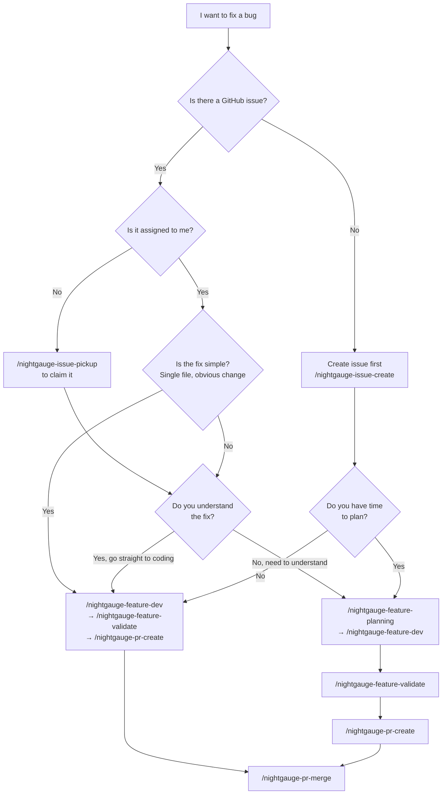

**Quick Answer:**
Most bugs follow this path:

1. `nightgauge-issue-pickup` (claim it)
2. `nightgauge-feature-dev` (implement)
3. `nightgauge-feature-validate` (test)
4. `nightgauge-pr-create` (create PR)
5. `nightgauge-pr-merge` (merge)

If you need to understand the codebase first, insert `nightgauge-feature-planning` after pickup.

---

## Tree 2: "I want to add a feature"

**Intent:** You have a feature request and want to implement it end-to-end.

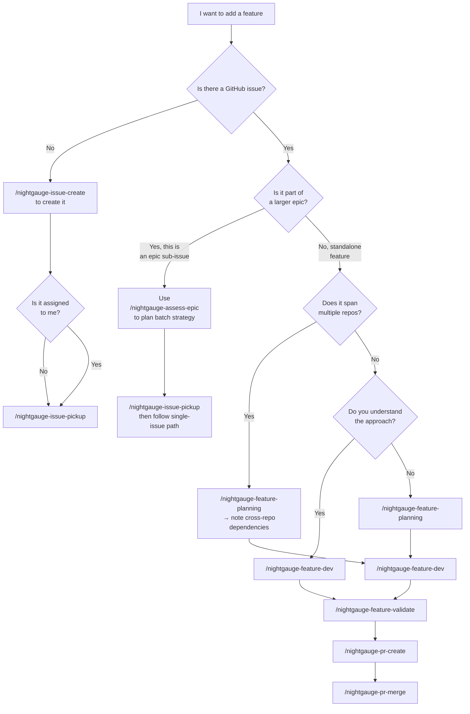

**Quick Answer:**
Standard feature flow:

1. `nightgauge-issue-pickup` (claim it)
2. `nightgauge-feature-planning` (design with docs-first approach)
3. `nightgauge-feature-dev` (implement)
4. `nightgauge-feature-validate` (test)
5. `nightgauge-pr-create` (create PR)
6. `nightgauge-pr-merge` (merge)

For epics with multiple sub-issues, use `nightgauge-assess-epic` first to understand the batch strategy.

---

## Tree 3: "I want to check code quality"

**Intent:** You want to assess the overall health and quality of the codebase.

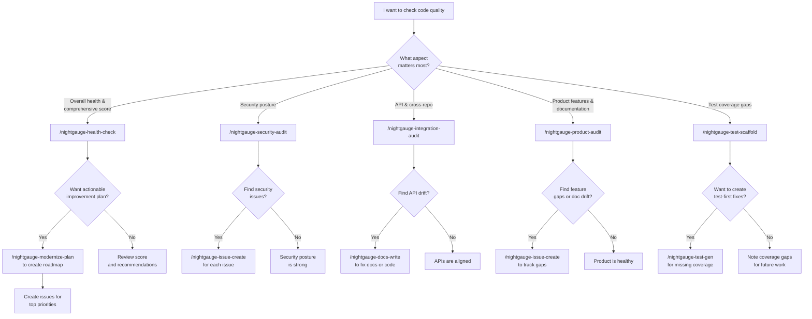

**Quick Answer:**
Quick quality snapshot: `/nightgauge-health-check`

- Gives you 6 dimensions (architecture, testing, docs, security, dependencies, API)
- If you want a detailed plan: add `/nightgauge-modernize-plan`

For targeted audits:

- Security: `/nightgauge-security-audit`
- Cross-repo API alignment: `/nightgauge-integration-audit`
- Test coverage: `/nightgauge-test-scaffold`
- Entire product suite: `/nightgauge-product-audit`

---

## Tree 4: "I want to modernize or refactor code"

**Intent:** You want to update dependencies, improve code quality, or make architectural changes.

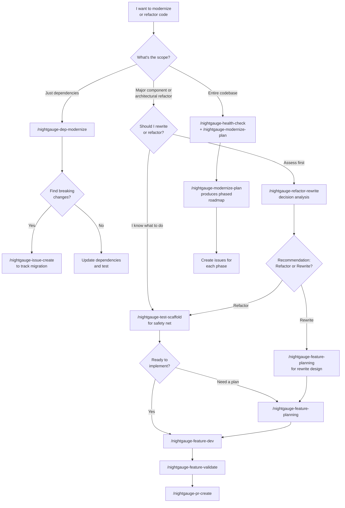

**Quick Answer:**
Full modernization flow:

1. `nightgauge-health-check` (assess current state)
2. `nightgauge-modernize-plan` (get phased roadmap)
3. For each phase: `nightgauge-feature-dev` or `nightgauge-feature-planning` + `nightgauge-feature-dev`

For quick dependency updates:

- `nightgauge-dep-modernize` (handles compatibility + breaking changes)

For architectural refactor:

- `nightgauge-refactor-rewrite` (assess refactor vs rewrite)
- Then `nightgauge-test-scaffold` (create safety net)
- Then implement via feature pipeline

---

## Tree 5: "I want to set up a new repository or workspace"

**Intent:** You have a new repo (or a parent folder grouping several repos)
and want it ready for the Nightgauge pipeline and/or AI-assisted development.

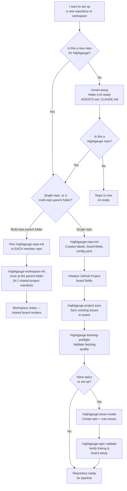

**Quick Answer:**
For a new Nightgauge repo:

1. `nightgauge-repo-init` (creates labels & board config)
2. `nightgauge-project-sync` (sync existing issues)
3. `nightgauge-backlog-preflight` (validate quality)
4. Start using the pipeline: `nightgauge-issue-pickup`

For a multi-repo parent folder (several repos sharing one GitHub Project):

1. `nightgauge-repo-init` in **each** member repo first
2. `nightgauge-workspace-init` **once** at the parent folder — scaffolds
   `.vscode/nightgauge-workspace.yaml` so the shared board renders

For any other repo (pipeline or not) that just needs AI-ready docs:

- `smart-setup` (adds AGENTS.md, CLAUDE.md, basic docs)

---

## Tree 6: "I want to manage my backlog"

**Intent:** You want to triage, organize, or prioritize your issue backlog.

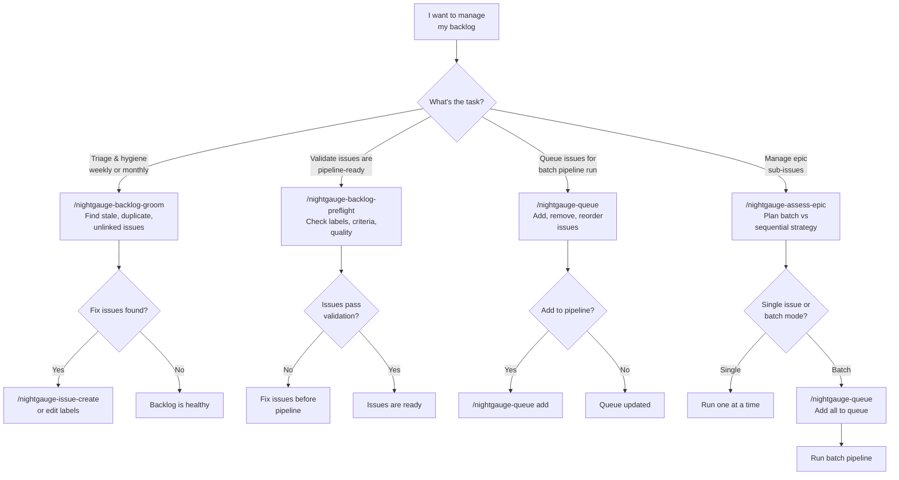

**Quick Answer:**
Regular backlog maintenance:

- `nightgauge-backlog-groom` (weekly/monthly)
- `nightgauge-backlog-preflight` (before starting pipeline)
- `nightgauge-queue` (add issues to pipeline)

For epic management:

- `nightgauge-assess-epic` (understand strategy)
- Then queue or run sequentially

---

## Tree 7: "I want to create or update documentation"

**Intent:** You want to write, generate, or update documentation in the codebase.

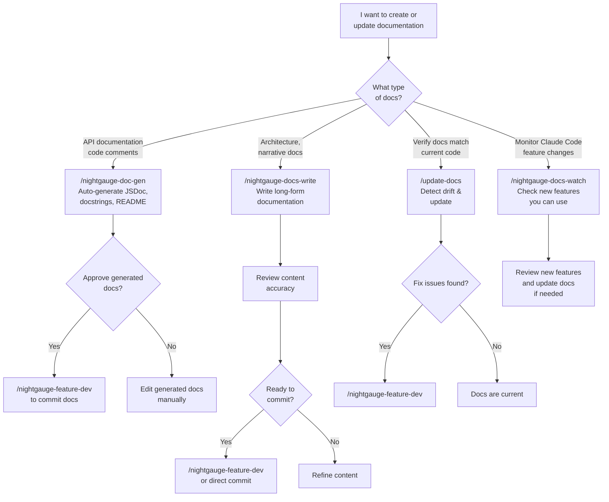

**Quick Answer:**
Auto-generate API docs: `/nightgauge-doc-gen`
Write narrative docs: `/nightgauge-docs-write`
Check for drift: `/update-docs`

---

## Tree 8: "I want to run tests"

**Intent:** You want to generate tests, find coverage gaps, or validate a feature.

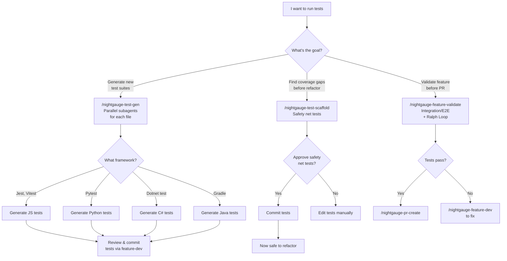

**Quick Answer:**
Generate tests: `/nightgauge-test-gen` (parallel subagents)
Safety net before refactor: `/nightgauge-test-scaffold`
Validate feature: `/nightgauge-feature-validate` (includes Ralph Loop auto-healing)

---

## Tree 9: "I want to monitor pipeline health"

**Intent:** You want to understand how well the pipeline is performing and where to improve.

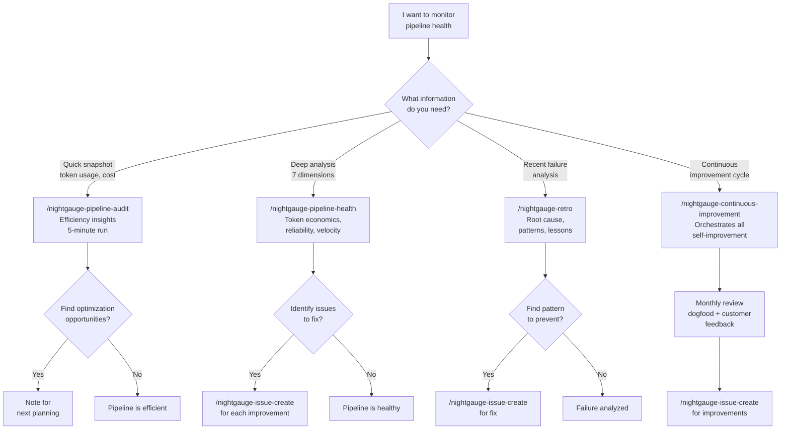

**Quick Answer:**
Quick check: `/nightgauge-pipeline-audit` (token usage, cost, trends)
Deep dive: `/nightgauge-pipeline-health` (7-dimension analysis)
After a failure: `/nightgauge-retro` (root cause + prevention)
Monthly review: `/nightgauge-continuous-improvement` (dogfood + customer feedback)

---

## Tree 10: "I want to create a pull request"

**Intent:** You have code ready and want to create or validate a pull request.

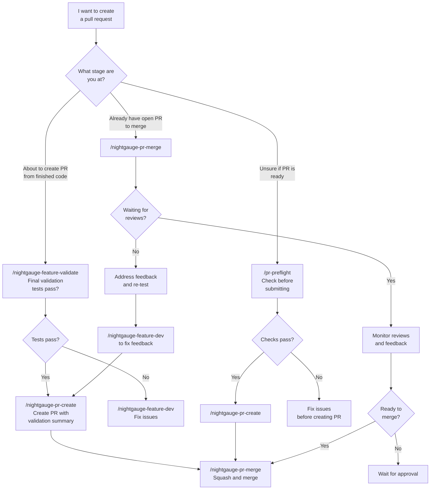

**Quick Answer:**
Standard PR creation:

1. `nightgauge-feature-validate` (final tests)
2. `nightgauge-pr-create` (create PR)
3. `nightgauge-pr-merge` (merge after reviews)

Quick pre-flight check: `/pr-preflight` (validates common issues)

---

## Tree 11: "I want to work with epics"

**Intent:** You want to create, assess, or validate epics and their sub-issues.

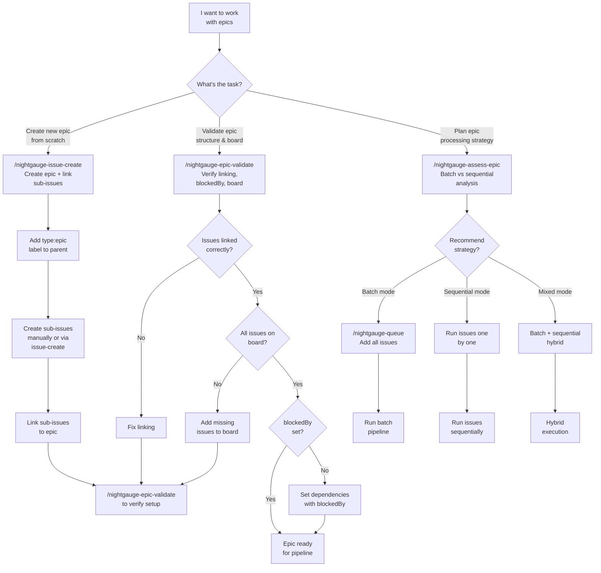

**Quick Answer:**
Create an epic:

1. `nightgauge-issue-create` (parent + sub-issues)
2. `nightgauge-epic-validate` (verify structure)
3. `nightgauge-assess-epic` (plan processing)
4. `nightgauge-queue` (add to pipeline)

Validate existing epic: `/nightgauge-epic-validate`
Plan epic processing: `/nightgauge-assess-epic`

---

## Tree 12: "I want to check security"

**Intent:** You want to audit the codebase for security vulnerabilities and issues.

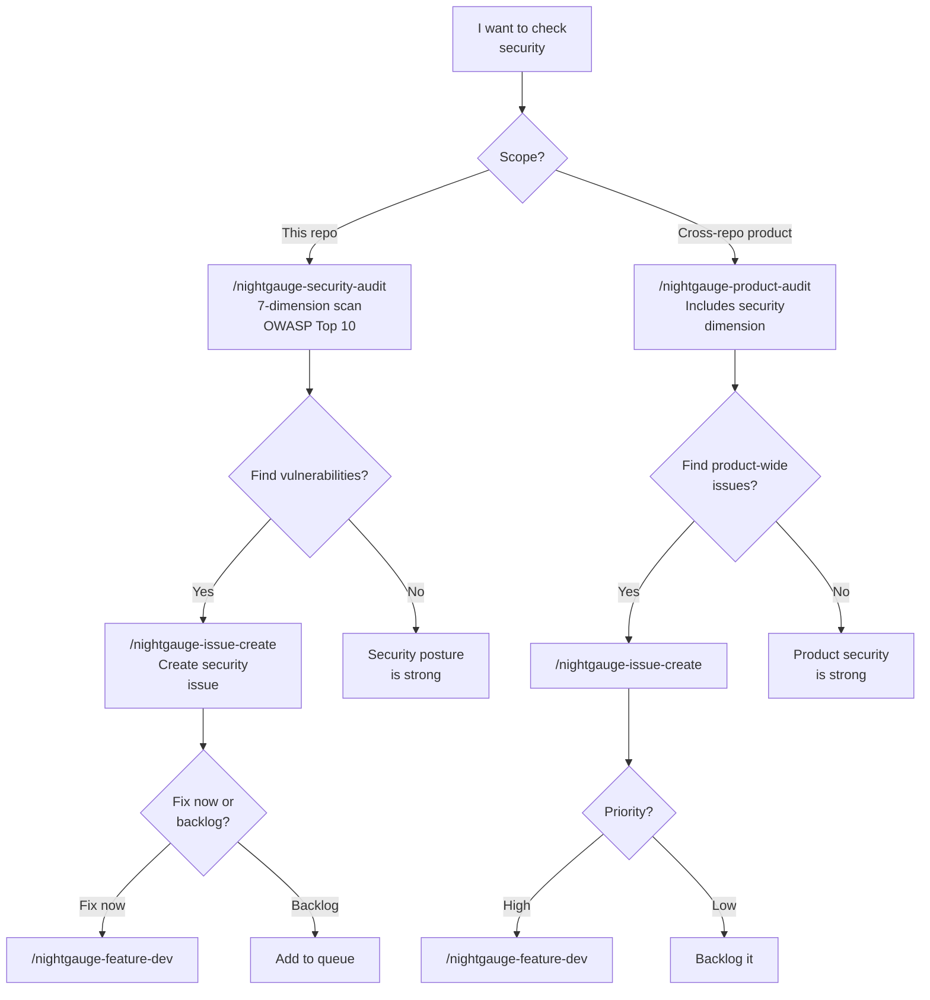

**Quick Answer:**
Security audit: `/nightgauge-security-audit` (7 dimensions: vulnerabilities, hardcoded secrets, OWASP Top 10, weak crypto, input validation, auth, misconfiguration)

If you find issues:

1. `nightgauge-issue-create` (track them)
2. `nightgauge-feature-dev` (fix)
3. `nightgauge-feature-validate` + `nightgauge-pr-create`

---

## Tree 13: "I want to assess API and integration health"

**Intent:** You want to validate that your APIs and cross-repository integrations are working correctly.

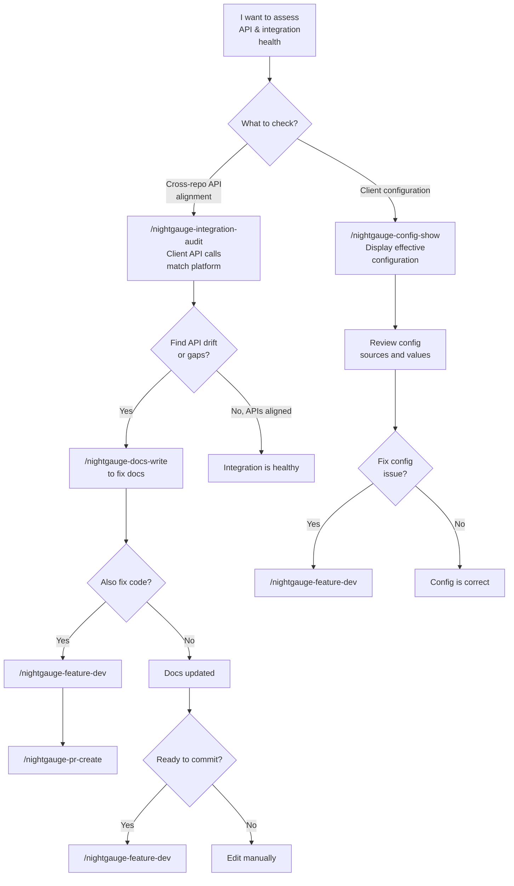

**Quick Answer:**
Check API alignment: `/nightgauge-integration-audit`
Display effective config: `/nightgauge-config-show`

---

## Choosing Between Similar Skills

Some pairs of skills overlap. Here's how to choose:

### Pipeline Audit vs Pipeline Health

- **Pipeline Audit** (`/nightgauge-pipeline-audit`) — Quick 5-minute check on token usage, cost, and trends
- **Pipeline Health** (`/nightgauge-pipeline-health`) — Deep 7-dimension analysis of reliability, economics, velocity, and self-improvement

**Choose:** Audit for quick insights, Health for comprehensive analysis.

### Test Gen vs Test Scaffold

- **Test Gen** (`/nightgauge-test-gen`) — Generate comprehensive test suites from scratch using parallel subagents
- **Test Scaffold** (`/nightgauge-test-scaffold`) — Create focused safety net tests before refactoring

**Choose:** Gen for building test coverage, Scaffold for safety before refactoring.

### Docs Write vs Doc Gen

- **Docs Write** (`/nightgauge-docs-write`) — Write narrative architecture/design documentation
- **Doc Gen** (`/nightgauge-doc-gen`) — Auto-generate API docs, JSDoc, docstrings

**Choose:** Write for long-form docs, Gen for API/code documentation.

### Update Docs vs Docs Watch

- **Update Docs** (`/update-docs`) — Verify existing documentation matches current code
- **Docs Watch** (`/nightgauge-docs-watch`) — Monitor Claude Code for new features

**Choose:** Update-docs for periodic sync, Docs-watch for following Claude Code updates.

### Backlog Groom vs Backlog Preflight

- **Backlog Groom** (`/nightgauge-backlog-groom`) — Periodic hygiene: find stale, duplicate, unlinked issues
- **Backlog Preflight** (`/nightgauge-backlog-preflight`) — Validate backlog is ready for pipeline processing

**Choose:** Groom weekly/monthly for maintenance, Preflight before starting pipeline.

### Product Audit vs Health Check

- **Health Check** (`/nightgauge-health-check`) — Single repository, 6 dimensions (architecture, testing, docs, security, dependencies, API)
- **Product Audit** (`/nightgauge-product-audit`) — Multiple repositories, 8 dimensions (adds feature parity and CI/CD)

**Choose:** Health Check for single repo, Product Audit for cross-repo product.

### Modernize Plan vs Refactor Rewrite

- **Modernize Plan** (`/nightgauge-modernize-plan`) — Creates phased roadmap consuming assessments
- **Refactor Rewrite** (`/nightgauge-refactor-rewrite`) — Decides whether to refactor or rewrite a component

**Choose:** Refactor-rewrite when assessing a single component, Modernize-plan after running health-check for full roadmap.

---

## Common Workflow Sequences

### "I'm starting a new feature from scratch"

```
1. /nightgauge-issue-pickup [#]         (claim issue)
2. /nightgauge-feature-planning          (design with docs-first)
3. /nightgauge-feature-dev               (implement)
4. /nightgauge-feature-validate          (test & validate)
5. /nightgauge-pr-create                 (create PR)
6. /nightgauge-pr-merge                  (merge)
```

### "I'm fixing a simple bug"

```
1. /nightgauge-issue-pickup [#]         (claim issue)
2. /nightgauge-feature-dev               (implement quick fix)
3. /nightgauge-feature-validate          (test)
4. /nightgauge-pr-create                 (create PR)
5. /nightgauge-pr-merge                  (merge)
```

### "I'm planning a modernization effort"

```
1. /nightgauge-health-check             (assess current state)
2. /nightgauge-modernize-plan           (create phased roadmap)
3. For each phase:
   - /nightgauge-feature-planning        (design phase)
   - /nightgauge-test-scaffold           (create safety net)
   - /nightgauge-feature-dev             (implement)
   - /nightgauge-feature-validate        (test)
   - /nightgauge-pr-create               (create PR)
   - /nightgauge-pr-merge                (merge)
```

### "I'm setting up a new repository"

```
1. /nightgauge-repo-init [options]      (create labels, config)
2. /nightgauge-project-sync             (sync existing issues)
3. /nightgauge-backlog-preflight        (validate quality)
4. /nightgauge-issue-pickup [#]         (start first issue)
```

### "I'm running an epic with multiple sub-issues"

```
1. /nightgauge-assess-epic [#]          (plan strategy)
2. /nightgauge-queue add [#1] [#2] ...  (add to queue)
3. /nightgauge-queue process            (run all sequentially)
4. /nightgauge-epic-validate [#]        (verify completion)
```

### "I'm doing a security audit"

```
1. /nightgauge-security-audit [options] (7-dimension scan)
2. /nightgauge-issue-create [...]       (create issues for findings)
3. For each issue:
   - /nightgauge-feature-dev             (implement fix)
   - /nightgauge-feature-validate        (test)
   - /nightgauge-pr-create               (create PR)
   - /nightgauge-pr-merge                (merge)
```

---

## Next Steps

Once you've identified the right skill(s):

1. **Read the skill documentation** — See [docs/SKILLS_USAGE_GUIDE.md](SKILLS_USAGE_GUIDE.md) for detailed skill info
2. **Check the SKILL.md file** — Each skill has a `SKILL.md` file with instructions and examples
3. **Invoke the skill** — Use the invocation pattern for your tool (Claude Code, Copilot, etc.)
4. **Follow the phases** — Skills are structured as execution phases; complete each phase

---

## See Also

- [docs/SKILLS_USAGE_GUIDE.md](SKILLS_USAGE_GUIDE.md) — Complete skill reference and documentation
- [skills/README.md](../skills/README.md) — Skill catalog and lifecycle
- [docs/CONTEXT_ARCHITECTURE.md](CONTEXT_ARCHITECTURE.md) — Pipeline context handoff schemas
- [docs/PIPELINE_EXECUTION.md](PIPELINE_EXECUTION.md) — How the pipeline executes (interactive vs headless)

---

**Last Updated:** March 2026
