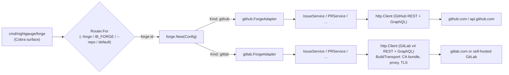

# Forge Abstraction

Canonical design doc for the forge abstraction layer at `internal/forge/`.

This doc explains the **what** and **why** of the abstraction so a contributor
can navigate the layer without reverse-engineering it from the adapters. For
the historical decisions that produced it, see
[ADR-006 (`internal/forge/` interface package)](decisions/006-forge-abstraction.md)
and [ADR-008 (Skills target the `nightgauge forge` CLI)](decisions/008-skill-forge-cli.md).
For the v2 workspace schema that exposes the layer to users, see
[ADR-009 (Workspace schema migration)](decisions/009-workspace-schema-migration.md)
and the [Configuration reference](CONFIGURATION.md#forge-configuration-schema_version-2).

> **Drift risk** — the touch-point table and CE-vs-EE matrix in this doc are
> hand-maintained against `internal/forge/*.go` and `internal/gitlab/edition.go`.
> Counts and tier rows are accurate as of 2026-05-15 but will drift with code
> changes. Auto-generation from interface introspection is tracked as a
> follow-up; until then, treat the table as authoritative for the **shape**
> (which services exist, which operations they expose) and re-count exported
> methods locally before quoting absolute numbers.

---

## 1. Motivation

`internal/github/` shipped first and exposed ~14 service structs with ~100
exported methods. Every consumer (`cmd/nightgauge/`,
`internal/orchestrator/`, `internal/intelligence/`, `internal/state/`,
`internal/depgraph/`, `internal/hooks/`, `internal/doctor/`,
`internal/audit/`) coupled directly to those concrete types. Three forces
made that coupling untenable:

1. **Multi-forge support.** Adding GitLab via per-call-site branching grows
   complexity as `forges × call sites`. Each new forge would touch every
   consumer. A single bridge point pays the abstraction cost once.
2. **Mocking pain.** Unit tests against `*github.IssueService` required
   constructing a real `*Client`, which in turn required network plumbing or
   `httptest` fixtures. A small interface gives callers cheap, constructor-
   free fakes — see `internal/forge/contract_test.go` for the pattern.
3. **Sentinel-error vocabulary.** Pre-abstraction, callers detected
   "not found" by string-matching `fmt.Errorf` output. Routing decisions
   (autonomous scheduler retry, doctor diagnostics) need stable
   `errors.Is(err, forge.ErrX)` checks. The abstraction defines that
   vocabulary at the boundary so adapters translate native errors once and
   callers branch reliably.

The abstraction is **structural**: it does not own data, does not introduce
new behavior, and does not change call-site control flow. Its single
contribution is a stable surface that adapters satisfy at compile time.

---

## 2. Interface Package Layout

`internal/forge/` is a flat package — no subpackages except `types/`,
`output/`, and `webhook/`. One file per concept; signatures only, no
implementation. This keeps the contract auditable in a single directory
listing.

| File          | Purpose                                                                                  |
| ------------- | ---------------------------------------------------------------------------------------- |
| `forge.go`    | `ForgeClient` aggregate interface, `Kind`, `Config`, `New`, `RegisterAdapter`, factory.  |
| `errors.go`   | Sentinel errors (`ErrNotFound`, `ErrRateLimited`, `ErrUnauthorized`, …).                 |
| `router.go`   | `Router` — resolves forge IDs from `--forge` / `IB_FORGE` / repo spec / default.         |
| `iterator.go` | `Iterator[T]` — generic paged iteration shape used by list operations.                   |
| `issues.go`   | `IssueService` — issue CRUD, comments, labels, sub-issues, blocking, epics.              |
| `prs.go`      | `PRService` — pull/merge-request CRUD, merge strategies, epic-PR helpers.                |
| `project.go`  | `ProjectService` (project-board mutations) and `BoardService` (read-only enumeration).   |
| `labels.go`   | `LabelService` — repository label CRUD.                                                  |
| `ci.go`       | `CIService` — check status, required checks, run logs, wait helpers.                     |
| `repo.go`     | `RepoService` (metadata) and `GraphQLService` (optional ad-hoc passthrough).             |
| `auth.go`     | `AuthService` — token scopes, whoami.                                                    |
| `rulesets.go` | `RulesetService` — branch protection / push rule pre-checks.                             |
| `webhook/`    | Forge-agnostic webhook server, dispatcher, handler. Used by the `webhook` IPC surface.   |
| `types/`      | Forge-agnostic typed shapes returned by the services (`Issue`, `PullRequest`, `Label`…). |
| `output/`     | Output marshalling helpers (text / JSON envelope) for `nightgauge forge`.                |
| `doc.go`      | Package-level GoDoc (consumed by `go doc`).                                              |
| `*_test.go`   | `contract_test.go` (per-adapter contract harness), `parity_test.go`, `router_test.go`.   |

Adapter packages live as siblings:

| Adapter package    | Implements                                                |
| ------------------ | --------------------------------------------------------- |
| `internal/github/` | All `forge.*` services + optional `forge.GraphQLService`. |
| `internal/gitlab/` | All `forge.*` services; CE/EE detection in `edition.go`.  |

Each adapter package contains a `forge_adapter.go` whose top is a wall of
compile-time assertions:

```go
var (
    _ forge.IssueService   = (*IssueService)(nil)
    _ forge.PRService      = (*PRService)(nil)
    // ...
    _ forge.ForgeClient    = (*ForgeAdapter)(nil)
)
```

Drift between the adapter and the interface fails the build immediately,
pointing at the offending method one service at a time. These asserts are
the load-bearing check that the touch-point mapping in §6 stays accurate.

---

## 3. Adapter Contract

An adapter is a Go package that satisfies `forge.ForgeClient` and registers
itself with `forge.New` via an `init()` block. To add a new adapter, the
following must hold:

1. **Register on import.** `init()` calls `forge.RegisterAdapter(kind,
factory)`. Importing the package is the only wiring a caller needs.
2. **Construct lazily.** Service singletons inside the adapter struct are
   built on first access and cached. The factory body itself does no
   network I/O.
3. **Translate errors at the boundary.** Every native error
   (`http.Response.StatusCode`, `gitlab.ErrorResponse`, etc.) is wrapped
   via `%w` around one of the sentinels in `forge/errors.go`. Callers must
   be able to use `errors.Is(err, forge.ErrNotFound)` without pattern-
   matching strings.
4. **Honour interface field semantics.** Pointer fields on
   `UpdateIssueOptions` / `UpdatePROptions` distinguish "do not change"
   (nil) from "set to empty" (non-nil pointer to zero value). State
   strings use the forge-agnostic vocabulary (`"opened"` / `"closed"`).
5. **Return `ErrUnsupportedOnEdition`, not a generic error**, when a
   feature exists in the forge family but not in the licensed edition the
   caller has access to (e.g. GitLab CE silently dropping
   `approvals_before_merge`). Callers can then choose to treat the
   condition as a soft warning rather than a hard failure.
6. **Pass the contract harness.** `internal/forge/contract_test.go`
   exposes `RunContract(t, adapter, client, fixtures)`. Each adapter
   wires it under `TestForgeContract_<Adapter>` with stub HTTP servers
   that return canned responses. The harness exercises the cross-adapter
   invariants (issue read, list, board enumeration, CI status).
7. **Pass the parity harness.** `internal/forge/parity_test.go` exercises
   GitLab-vs-GitHub equivalence on Status / Priority / Size mapping,
   `addBlockedBy` round-trip, plan-wave assignment, and CE iteration
   fallback. New adapters must satisfy the same parity assertions.
8. **Compile-time satisfaction asserts** at the top of `forge_adapter.go`,
   one per service. Build failure on drift is non-negotiable.

The contract test harness ships fixtures inline so adapters do not need to
share testdata. A new adapter copies the harness invocation and provides
its own stub server.

---

## 4. Lifecycle

A typical caller path through the abstraction:

```
caller
  │
  ▼
forge.New(Config)        // factory dispatches on Kind
  │
  ▼
ForgeAdapter             // adapter struct returned as ForgeClient
  │
  ├── .Issues()  ──► IssueService     ──► HTTP transport ──► forge API
  ├── .PRs()     ──► PRService        ──► HTTP transport ──► forge API
  ├── .Project() ──► ProjectService   ──► HTTP transport ──► forge API
  ├── .Board()   ──► BoardService     ──► HTTP transport ──► forge API
  ├── .CI()      ──► CIService        ──► HTTP transport ──► forge API
  ├── .Labels()  ──► LabelService     ──► HTTP transport ──► forge API
  ├── .Rulesets()──► RulesetService   ──► HTTP transport ──► forge API
  ├── .Auth()    ──► AuthService      ──► HTTP transport ──► forge API
  └── .Repo()    ──► RepoService      ──► HTTP transport ──► forge API
```

In a multi-forge workspace the entry point is the `Router`:



<details>
<summary>ASCII fallback for the lifecycle diagram</summary>

```
                 ┌─────────────────────────────────────┐
                 │ cmd/nightgauge/forge (Cobra)   │
                 └──────────────┬──────────────────────┘
                                │
                                ▼
                  ┌──────────────────────────┐
                  │ Router.For               │  precedence:
                  │  (--forge / IB_FORGE /   │  --forge > IB_FORGE >
                  │   --repo / default)      │  --repo > default
                  └──────────────┬───────────┘
                                 │ forge id
                                 ▼
                       ┌──────────────────┐
                       │ forge.New(Config)│
                       └────────┬─────────┘
                                │
              ┌─────────────────┴────────────────┐
              ▼                                  ▼
   ┌────────────────────┐              ┌────────────────────┐
   │ github.ForgeAdapter│              │ gitlab.ForgeAdapter│
   └─────────┬──────────┘              └─────────┬──────────┘
             │                                   │
             │ Issues/PRs/Project/Board/CI/      │ same surface
             │ Labels/Rulesets/Auth/Repo         │
             ▼                                   ▼
   ┌────────────────────┐              ┌──────────────────────────┐
   │ http.Client        │              │ http.Client              │
   │ (REST + GraphQL)   │              │ BuildTransport:          │
   │                    │              │  CA bundle / proxy / TLS │
   └────────┬───────────┘              └────────┬─────────────────┘
            ▼                                   ▼
     github.com / api.github.com    gitlab.com or self-hosted GitLab
```

</details>

### Resolution precedence (`Router.For`)

`Router.For(forgeFlag, repoSpec)` walks the precedence chain in
`internal/forge/router.go`:

1. `--forge <id>` flag (explicit caller intent — wins unconditionally).
2. `IB_FORGE` environment variable (process-level selector).
3. `--repo <owner/repo>` lookup against the registered repo→forge map.
4. `Router.SetDefault(id)` fallback (workspace default forge).
5. Sole-registered-forge fallback (single-forge workspaces resolve without
   any selector).

An unregistered forge ID at step 1 or 2 returns `ErrUnsupported` (wrapped),
not a fallback — explicit selection of an unknown forge is treated as a
hard configuration error.

### Cross-forge link rendering (`Router.ResolveLink`)

When a link crosses forge boundaries (e.g. an issue body in GitLab repo X
references `nightgauge/nightgauge#42`), `Router.ResolveLink(fromRepo,
toRepo, linkSlug)` renders the canonical full URL using the target forge's
`Config.Host`. Same-forge links collapse back to compact `owner/repo#N`
slugs. This is invoked by the depgraph parser and by the issue/PR body
renderers in `cmd/nightgauge/forge/`.

### Validation (`Router.Validate`)

`Router.Validate()` returns a `[]ValidationError` covering:

- **Dangling forge refs** — a `MapRepo` entry references a forge ID not in
  `configs` (Fatal).
- **Orphan forges** — a registered forge has no repos mapped to it
  (warning; the forge is still usable via `--forge`).

The default forge is implicitly considered "used" — orphan reporting only
fires for non-default registrations with no repo mapping.

---

## 5. Error Semantics

`internal/forge/errors.go` declares the sentinel vocabulary. Adapters wrap
their native errors via `fmt.Errorf("...: %w", forge.ErrX)`; callers branch
with `errors.Is`.

| Sentinel                  | When                                                                                 |
| ------------------------- | ------------------------------------------------------------------------------------ |
| `ErrNotFound`             | Resource does not exist or caller cannot see it (HTTP 404; GraphQL `NOT_FOUND`).     |
| `ErrRateLimited`          | Caller has exceeded the forge's rate limit. Back off per the published reset window. |
| `ErrPermissionDenied`     | Token is valid but lacks permission (HTTP 403; scope-mismatch).                      |
| `ErrUnauthorized`         | Token missing, expired, or revoked (HTTP 401).                                       |
| `ErrUnsupported`          | Forge kind recognised but no adapter registered, OR adapter method not implemented.  |
| `ErrUnsupportedOnEdition` | Feature exists in the forge family but not in the licensed edition (e.g. GitLab CE). |

Two design rules govern the vocabulary:

- **Adapters translate at the boundary.** A consumer never needs to know
  whether an `errors.Is(err, forge.ErrNotFound)` came from a GitHub 404 or
  a GitLab 404 — translation happens once, inside the adapter.
- **Sentinels are stable.** New sentinels can be added; existing sentinels
  never change semantics. Callers using `errors.Is` keep working across
  adapter upgrades.

The `ErrUnsupportedOnEdition` sentinel is the one most likely to surface
in caller logs. GitLab CE silently drops fields like
`approvals_before_merge` in `UpdatePROptions`; the GitLab adapter wraps the
silent drop as `ErrUnsupportedOnEdition` so callers can either log the
warning and continue or escalate to a hard failure depending on policy.

---

## 6. Touch-Point Mapping Table

> **Audit count (2026-05-15):** 76 exported methods across the 9 services
> aggregated by `ForgeClient`, plus 1 method on the optional
> `GraphQLService`. ADR-006 noted the issue body's "43 exported methods" was
> an early estimate; the audit count is the authoritative number. If you
> are reading this after additional methods have landed, re-run
> `awk '/^type X interface/,/^}/' internal/forge/<file>.go | grep -E "^\s+[A-Z]" | wc -l`
> per service and update the table.

The table below maps every interface method to its GitHub adapter wiring
(via `internal/github/forge_adapter.go`) and GitLab adapter wiring (via
`internal/gitlab/forge_adapter.go`). The factory accessor on
`ForgeAdapter` (`Issues()`, `PRs()`, …) returns the per-service struct
listed here.

| Service             | Methods | GitHub wiring                           | GitLab wiring                                              |
| ------------------- | ------: | --------------------------------------- | ---------------------------------------------------------- |
| `IssueService`      |      24 | `internal/github/issues.go`             | `internal/gitlab/issues.go`                                |
| `PRService`         |      11 | `internal/github/prs.go`                | `internal/gitlab/mrs.go` (MR ↔ PR vocab translation)       |
| `ProjectService`    |      24 | `internal/github/project.go` (V2)       | `internal/gitlab/project.go` (issue board + scoped labels) |
| `BoardService`      |       4 | `internal/github/board.go`              | `internal/gitlab/board.go`                                 |
| `CIService`         |       5 | `internal/github/ci.go`                 | `internal/gitlab/ci.go`                                    |
| `LabelService`      |       3 | `internal/github/labels.go`             | `internal/gitlab/links.go` + label CRUD                    |
| `RulesetService`    |       2 | `internal/github/rulesets.go`           | `internal/gitlab/rulesets.go` (push rules, EE)             |
| `AuthService`       |       2 | `internal/github/auth.go` (`*Client`)   | `internal/gitlab/auth.go` (`AuthAdapter`)                  |
| `RepoService`       |       1 | `internal/github/repo.go`               | `internal/gitlab/forge_adapter.go` (`RepoAdapter`)         |
| **Subtotal**        |  **76** |                                         |                                                            |
| `GraphQLService` \* |       1 | `internal/github/client.go` (`*Client`) | not implemented (returns `ErrUnsupported`)                 |

\* `GraphQLService` is **not** part of `ForgeClient`. It is fetched via a
type assertion on the concrete adapter and exists to support the
`nightgauge forge graphql` pass-through subcommand. The GitLab adapter
intentionally does not implement it — ad-hoc GraphQL against GitLab routes
through `forge graphql --forge <id>` and the GitHub adapter only.

### Method counts per service

The per-service method count comes from a literal inspection of
`internal/forge/<service>.go`:

```bash
for svc in IssueService PRService ProjectService BoardService CIService \
           LabelService RulesetService AuthService RepoService GraphQLService; do
  file=$(grep -l "^type $svc interface" internal/forge/*.go)
  count=$(awk "/^type $svc interface/,/^}/" "$file" \
            | grep -E "^\s+[A-Z][a-zA-Z]+\(" | wc -l)
  printf "%-18s %s methods\n" "$svc" "$count"
done
```

`IssueService` and `ProjectService` dominate the surface — together they are
~63% of the total. New adapter authors should expect those two files to be
the bulk of the implementation effort.

### Webhook subpackage

The `internal/forge/webhook/` subpackage exposes a forge-agnostic webhook
delivery surface (`Server`, `NewMux`, `EventDispatcher`,
`NewIPCEventDispatcher`). Webhook payloads are normalised at the adapter
ingestion edge and dispatched as `Event` values; this lets the IPC layer
treat GitHub `push` events and GitLab `Push Hook` events the same way.

---

## 7. CE-vs-EE Feature Matrix (GitLab)

> **Operator runbook**: For end-to-end self-hosted GitLab setup, see
> [docs/SELF_HOSTED_GITLAB_SETUP.md](SELF_HOSTED_GITLAB_SETUP.md).

GitLab ships in two editions:

- **CE (Community Edition)** — open-source, free; the only tier available
  for self-hosted instances without a paid licence.
- **EE (Enterprise Edition)** — proprietary; further split into Free,
  Premium, and Ultimate subscription tiers on gitlab.com SaaS or licensed
  self-hosted EE.

The GitLab adapter detects edition once per process via
`internal/gitlab/edition.go`:

```
GET /api/v4/license
  200 → EditionEE
  403/404 → EditionCE   (CE deliberately omits the endpoint)
  401     → EditionUnknown + err  (token may lack `api` scope)
  5xx/net → EditionUnknown + err
```

The probe is cached behind a `sync.Once`. Edition feeds into per-method
behaviour — features that require Premium or Ultimate return
`ErrUnsupportedOnEdition` (wrapped) when invoked against CE.

> **Tier rows below are sourced from `internal/gitlab/edition.go`,
> `parity_test.go` (CE iteration fallback), the GitLab API tier table at
> <https://docs.gitlab.com/ee/api/api_resources.html>, and the
> billing-tier comparison at <https://about.gitlab.com/pricing/feature-comparison/>.
> Verified 2026-05-15. Re-confirm tier minimums before relying on them
> in customer-facing decisions.**

| Surface                               | CE  | EE Free | Premium | Ultimate | Notes                                                                                                    |
| ------------------------------------- | :-: | :-----: | :-----: | :------: | -------------------------------------------------------------------------------------------------------- |
| Issues CRUD                           |  ✓  |    ✓    |    ✓    |    ✓     | All `IssueService` core methods.                                                                         |
| Issue scoped labels (Status::\*)      |  ✓  |    ✓    |    ✓    |    ✓     | Adapter uses scoped-label exclusion to emulate single-select Status.                                     |
| Iteration field                       |  —  |    —    |    ✓    |    ✓     | CE falls back to milestone — see `parity_test.go::TestParityContract_Iteration_CEUsesMilestoneFallback`. |
| Merge requests CRUD                   |  ✓  |    ✓    |    ✓    |    ✓     | All `PRService` core methods.                                                                            |
| `approvals_before_merge`              |  —  |    —    |    ✓    |    ✓     | Silently dropped on CE; adapter wraps as `ErrUnsupportedOnEdition`.                                      |
| `allow_force_push` per branch         |  —  |    ✓    |    ✓    |    ✓     | EE-only protected-branch field.                                                                          |
| Push rules (`RulesetService`)         |  —  |    —    |    ✓    |    ✓     | `CheckRulesets` returns `ErrUnsupportedOnEdition` on CE.                                                 |
| Group epics                           |  —  |    —    |    ✓    |    ✓     | Used by epic-PR helpers; CE falls back to issue-only relations.                                          |
| Sub-issue / blocking relations        |  ✓  |    ✓    |    ✓    |    ✓     | Round-trip parity verified by `parity_test.go::TestParityContract_BlockedBy_RoundTrip`.                  |
| Project CI/CD pipelines (`CIService`) |  ✓  |    ✓    |    ✓    |    ✓     | Status roll-up matches GitHub Checks vocabulary.                                                         |
| Required pipeline jobs                |  —  |    —    |    ✓    |    ✓     | Per-pipeline required-job declarations.                                                                  |
| Compliance frameworks                 |  —  |    —    |    —    |    ✓     | Not consumed by current `forge.*` services.                                                              |
| `License` API endpoint                |  —  |    ✓    |    ✓    |    ✓     | Probe target for `Edition()` detection.                                                                  |

Cells marked "—" mean the feature is **not** available at that tier and the
adapter will return `ErrUnsupportedOnEdition` when invoked. CE callers that
catch the sentinel can degrade gracefully (log and continue) or fail hard
depending on policy.

### Operator implications

- **Self-hosted CE deployments** lose iteration, push rules,
  `approvals_before_merge`, and group epics. The pipeline still functions —
  status mapping degrades to milestones, MR approvals fall back to the
  default-branch protected-branch rule, and epic relationships use
  parent/child issue links instead of group epics.
- **Self-hosted EE Premium / Ultimate** behaves identically to gitlab.com
  SaaS at the same tier. No code path branches on "self-hosted vs SaaS",
  only on edition.
- Edition probe failure (401) does not block requests — adapters treat
  `EditionUnknown` as "assume CE" for safety and re-probe on the next
  process restart.

The W6-2 GitLab operator setup guide (cross-link target; not yet landed)
will cover the deployment-side checklist for self-hosted EE.

---

## 8. Future-Adapter Checklist

Adding a Bitbucket / Gitea / Forgejo adapter follows the same five-step
contract that GitLab did. Concretely:

1. **Create the adapter package** at `internal/<forge>/`. Stand up a
   `Client` type with the HTTP transport, auth, and rate-limit tracker.
   Mirror `internal/gitlab/transport.go` for self-hosted-friendly
   defaults (CA bundle, proxy, `InsecureSkipTLS` opt-in).
2. **Implement the per-domain services.** Start with `IssueService` and
   `RepoService` (smallest blast radius); use the contract harness in
   `internal/forge/contract_test.go` to drive each method to green.
   Translate native errors at every boundary into the sentinels in
   `forge/errors.go`.
3. **Add compile-time satisfaction asserts** at the top of
   `<forge>/forge_adapter.go`. The build will fail until all interfaces are
   satisfied — work one service at a time, the `var _` pattern surfaces the
   missing method by name.
4. **Register the adapter** in an `init()` block:
   ```go
   func init() {
       forge.RegisterAdapter(forge.Kind("bitbucket"), func(cfg forge.Config) (forge.ForgeClient, error) {
           // build transport + adapter, return as forge.ForgeClient
       })
   }
   ```
5. **Wire the contract + parity tests.** Copy the `TestForgeContract_GitLab`
   shape from `internal/forge/contract_test.go`, supply a stub HTTP server
   for the new forge's API responses, and run the harness. Then add a
   `TestParity_<Adapter>` for cross-forge invariants (Status mapping, blocked-by
   round-trip).
6. **Surface the new forge in the CLI.** Add a one-line case to the
   `Kind` enum (`forge.go`) and to `Router.For`'s precedence chain by
   registering the new ID in workspace yaml. No changes are needed in
   `cmd/nightgauge/forge/` — the Cobra surface is forge-agnostic.
7. **Document edition / tier semantics** if the new forge has them. Add a
   matrix to this doc analogous to §7. Adapters without edition splits
   skip this step.
8. **Update the doc map** in [CLAUDE.md](../CLAUDE.md) so AI agents
   discover the new adapter on relevant keywords.

What you do **not** need to do: touch any caller in
`cmd/nightgauge/`, `internal/orchestrator/`, `internal/intelligence/`,
`internal/state/`, `internal/depgraph/`, `internal/hooks/`,
`internal/doctor/`, or `internal/audit/`. Caller code consumes
`forge.ForgeClient`; new adapters land transparently.

---

## Related Documentation

- [ADR-006 — `internal/forge/` interface package](decisions/006-forge-abstraction.md)
- [ADR-008 — Skills target the `nightgauge forge` CLI](decisions/008-skill-forge-cli.md)
- [ADR-009 — Workspace schema migration](decisions/009-workspace-schema-migration.md)
- [Configuration → Forge Configuration](CONFIGURATION.md#forge-configuration-schema_version-2)
- [Multi-Repo Workspace → Multi-Forge Workspaces](MULTI_REPO_WORKSPACE.md#multi-forge-workspaces)
- [Architecture → Forge Layer](ARCHITECTURE.md#forge-layer)
- [Go Binary CLI reference](GO_BINARY.md)

---

## Author

nightgauge
