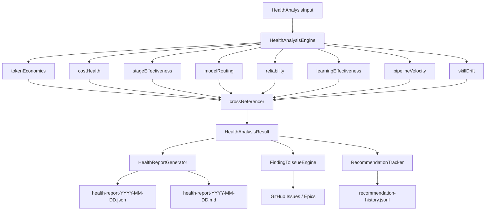

# Health Monitoring and Analysis Engine

> Comprehensive reference for the multi-dimensional pipeline health analysis
> system. For a high-level overview and component table, see
> [docs/ARCHITECTURE.md](ARCHITECTURE.md#health-monitoring-and-analysis-engine).

## Overview

The health monitoring system evaluates pipeline performance across **two
separate concerns**:

1. **Pipeline health** — How well the automated Issue-to-PR pipeline is
   performing (cost, speed, reliability, model selection, etc.). Analyzed by the
   SDK `HealthAnalysisEngine` across 8 dimensions.
2. **Codebase health** — The quality of the software being developed
   (dependencies, test coverage, code quality, documentation, etc.). Assessed by
   the `nightgauge-health-check` skill across 6 dimensions.

This document covers **pipeline health** — the SDK engine, its 8 dimensions,
report generation, finding-to-issue workflow, and recommendation tracking. See
[skills/nightgauge-health-check/SKILL.md](../skills/nightgauge-health-check/SKILL.md)
for codebase health analysis.

## System Architecture



## Analysis Pipeline

### Input Data (`HealthAnalysisInput`)

The engine accepts a `HealthAnalysisInput` object populated by callers from
pipeline telemetry. Callers map their `AggregatedDataset` →
`HealthAnalysisInput` to avoid circular dependencies between the SDK and VSCode
packages.

| Field                   | Type                           | Source                                                |
| ----------------------- | ------------------------------ | ----------------------------------------------------- |
| `executionHistory`      | `ExecutionHistoryRecord[]`     | Per-stage execution records (stage, success, cost…)   |
| `healthScores`          | `HealthScoreEntry[]`           | Persisted composite scores from prior runs            |
| `selfTuningLog`         | `SelfTuningEntry[]`            | Legacy field (always `[]` — self-tuning removed)      |
| `experimentResults`     | `ExperimentEntry[]`            | A/B experiment control/treatment records              |
| `healthReports`         | `HealthReportEntry[]`          | Prior report summaries (finding/recommendation count) |
| `recommendationHistory` | `RecommendationHistoryEntry[]` | Optional — prior recommendation-to-issue mappings     |

### `HealthAnalysisEngine.analyze()` Flow

1. Filter enabled dimensions from `config.dimensions` against `ALL_DIMENSIONS`
2. Run each dimension analyzer synchronously via `DIMENSION_ANALYZERS` map
3. Collect `DimensionResult` entries into a
   `Map<HealthDimension, DimensionResult>`
4. Pass the map to `crossReference()` for a second cross-dimension pass
5. Compute weighted overall score (auto-normalized weights)
6. Derive `overallStatus` via `getHealthStatus(score)`
7. Generate human-readable `summary` string
8. Return `HealthAnalysisResult`

### Weighted Scoring Formula

The overall score is computed from dimension scores using auto-normalized
weights so the sum of active weights does not need to equal 1.0:

```
overallScore = round(Σ(dimensionScore[d] × weight[d]) / Σ(weight[d]))
               clamped to [0, 100]
```

Default weights (`DEFAULT_HEALTH_CONFIG`):

| Dimension                | Weight |
| ------------------------ | ------ |
| `cost-health`            | 0.18   |
| `stage-effectiveness`    | 0.18   |
| `token-economics`        | 0.15   |
| `reliability`            | 0.15   |
| `model-routing`          | 0.12   |
| `pipeline-velocity`      | 0.12   |
| `learning-effectiveness` | 0.10   |
| `skill-drift`            | 0.08   |

Weights can be overridden by passing `config.weights` to the engine constructor.

### Cross-Reference Pass (`crossReferencer.ts`)

After all dimension analyzers run, `crossReference()` examines the complete
result set to detect correlated patterns that no single dimension can identify
in isolation. It applies 5 correlation rules:

| Rule | Dimensions                               | Trigger                                      |
| ---- | ---------------------------------------- | -------------------------------------------- |
| 1    | `cost-health` + `model-routing`          | Both have high/critical findings             |
| 2    | `reliability` + `stage-effectiveness`    | Overlapping stages in evidence               |
| 3    | `learning-effectiveness` + any degrading | Worsening findings with degrading dimensions |
| 4    | `token-economics` + `cost-health`        | Token waste findings + anomaly findings      |
| 5    | `pipeline-velocity` + `reliability`      | Both degrading/below 50                      |

Each detected correlation produces a `CrossReference` with `id`, `dimensions`,
`severity`, `correlatedFindings`, and `confidence`.

### `HealthAnalysisResult` Output

```typescript
interface HealthAnalysisResult {
  dimensions: Partial<Record<HealthDimension, DimensionResult>>;
  crossReferences: CrossReference[];
  overallScore: number; // 0–100
  overallStatus: HealthStatus;
  summary: string;
  analyzedAt: string; // ISO 8601
  config: HealthAnalysisConfig;
}
```

## The 8 Health Dimensions

Each dimension returns a `DimensionResult`:

```typescript
interface DimensionResult {
  dimension: HealthDimension;
  score: number; // 0–100
  status: HealthStatus;
  findings: Finding[];
  metrics: Record<string, number>;
  hasEnoughData: boolean;
  sampleSize: number;
  periodComparison?: PeriodComparison; // present when baseline provided
}
```

Minimum sample sizes (from `DEFAULT_HEALTH_CONFIG.minimumSampleSizes`):

- `basic`: 5 records — required before emitting findings
- `trend`: 10 records — required for trend analysis
- `significance`: 20 records — required for high-confidence findings

---

### 1. Token Economics (`token-economics`)

**Weight**: 0.15 | **File**: `dimensions/tokenEconomics.ts`

Measures token usage efficiency across pipeline stages.

**Key metrics**:

| Metric                         | Description                                                          |
| ------------------------------ | -------------------------------------------------------------------- |
| `avgCacheHitRate`              | `cacheReadTokens / (cacheReadTokens + inputTokens)`                  |
| `perStageCacheHitRate.<stage>` | Per-stage cache hit rate (Issue #3804) — see formula below           |
| `stagesWithCacheData`          | Count of stages that had cacheable input (non-`null` per-stage rate) |
| `avgTotalTokensPerRun`         | Mean total tokens per execution record                               |
| `inputOutputRatio`             | `totalInputTokens / totalOutputTokens`                               |
| `wasteyStageFraction`          | Fraction of stages where P95 > 3× median                             |
| `tokenSlope`                   | Linear trend slope of per-run token counts                           |
| `wastedTokenFraction`          | Tokens consumed by failed runs / total tokens                        |

**Per-stage cache hit rate (Issue #3804)**

The dimension surfaces a cache hit rate **per stage** using the canonical
formula (the same one `nightgauge-pipeline-audit` and
`TokenEfficiencyAnalyzer` use, so all surfaces agree):

```
cache_hit_rate = cache_read / (cache_read + cache_creation + input)
```

It is computed by grouping execution records by `stage` and summing each token
dimension. A stage with **zero cacheable input** (denominator `0` — e.g. a
skipped deterministic stage) reports `null` ("no data") and is omitted from the
`metrics` map, never reported as `0%`, so it never raises a false low-reuse
alarm.

The **low-reuse threshold** is configurable per stage and resolves from
`pipeline.cache` (see [CONFIGURATION.md](CONFIGURATION.md#pipelinecache)):
`stage_alert_thresholds.<stage>` if present, otherwise the global
`alert_threshold` (default `40` → 0.40). The audit skill and this dimension read
the same resolved value.

> **Granularity note**: In the production VSCode path, `buildHealthInput` maps
> each run to a single `"pipeline"` record, so the health dimension's per-stage
> breakdown collapses to one entry mirroring the global rate. True per-stage
> numbers come from `nightgauge-pipeline-audit`, which reads the Go
> aggregator's `stage_metrics.<stage>.token_stats` directly. The dimension's
> per-stage logic is forward-compatible: it produces a real breakdown whenever
> stage-granular records are supplied.

**Findings emitted**:

- Low cache hit rate, global (< 30%) — severity high if < 10%, medium otherwise
- **Low cache hit rate, per stage (Issue #3804)** — for each stage with enough
  samples whose rate is below its resolved threshold; severity high if < 10%,
  medium otherwise
- Token waste outliers (P95 > 3× median in any stage)
- Token usage trending upward (normalized slope > 2%)
- High input-to-output ratio (> 10×)

---

### 2. Cost Health (`cost-health`)

**Weight**: 0.18 | **File**: `dimensions/costHealth.ts`

Evaluates pipeline cost efficiency and anomaly detection.

**Key metrics**:

| Metric                   | Description                                        |
| ------------------------ | -------------------------------------------------- |
| `avgCostPerRun`          | Mean per-run cost (USD)                            |
| `p95CostPerRun`          | 95th percentile cost per run                       |
| `coefficientOfVariation` | `stdDev / mean` — cost predictability              |
| `anomalyRate`            | Fraction of runs exceeding mean + 2σ threshold     |
| `trendSlope`             | Linear trend slope of chronological per-run costs  |
| `efficiencyRatio`        | Avg cost of successful runs / avg cost of all runs |

**Findings emitted**:

- Cost anomalies detected (runs exceeding mean + 2σ)
- Cost trend worsening (degrading slope)
- High stage cost concentration (> 60% of total in one stage)

---

### 3. Stage Effectiveness (`stage-effectiveness`)

**Weight**: 0.18 | **File**: `dimensions/stageEffectiveness.ts`

Evaluates per-stage success rates, retry patterns, and bottleneck
identification.

**Key metrics**:

| Metric                        | Description                                       |
| ----------------------------- | ------------------------------------------------- |
| `overallSuccessRate`          | Fraction of all executions that succeeded         |
| `overallFirstAttemptPassRate` | Fraction succeeding on first attempt              |
| `overallAvgRetries`           | Mean retries per execution                        |
| `bottleneckCount`             | Stages that are duration or success-rate outliers |
| `successRate_{stage}`         | Per-stage success rate                            |
| `avgRetries_{stage}`          | Per-stage average retry count                     |

**Bottleneck detection**: A stage is a bottleneck if its success rate is 20+
percentage points below the overall rate, OR its average duration is > 2× the
mean across all stages.

**Findings emitted**:

- Low success rate per stage (< 70%)
- Bottleneck stages (by success rate or duration)
- High retry rate (overall avg retries > 0.5)
- Duration drift (global trend > 50ms/record)

---

### 4. Model Routing (`model-routing`)

**Weight**: 0.12 | **File**: `dimensions/modelRouting.ts`

Evaluates model selection effectiveness including auto-selection accuracy and
under/over-routing detection.

**Key metrics**:

| Metric                                 | Description                                                           |
| -------------------------------------- | --------------------------------------------------------------------- |
| `autoSelectionSuccessRate`             | Success rate for `selectionSource === 'auto'` records                 |
| `underRoutingCount`                    | Auto-selected, lightweight model, high-complexity task, failed        |
| `overRoutingCount`                     | Auto-selected, Opus model, low-complexity task, first-attempt success |
| `distinctModelCount`                   | Number of distinct models observed                                    |
| `model.{name}.successRate`             | Per-model success rate                                                |
| `model.{name}.effectiveCostPerSuccess` | Per-model cost per successful run                                     |

**Under-routing**: lightweight model (Haiku/Sonnet) on L/XL complexity → failed.
**Over-routing**: Opus on XS/S complexity → first-attempt success.

**Findings emitted**:

- Under-routing detected
- Over-routing detected
- Low auto-selection accuracy (failure rate > 20%)
- Cost-ineffective models (> 2× mean effective cost per success)

---

### 5. Reliability (`reliability`)

**Weight**: 0.15 | **File**: `dimensions/reliability.ts`

Evaluates failure rates, MTBF, auto-recovery, and failure trend analysis.

**Weighted failure rate**: Infrastructure failures count 5%, agent failures 50%,
organic failures 100% (via `failureClassifier.ts`).

**Key metrics**:

| Metric                  | Description                                  |
| ----------------------- | -------------------------------------------- |
| `failureRate`           | Raw fraction of failed executions            |
| `weightedFailureRate`   | Failure rate weighted by category severity   |
| `mtbfHours`             | Mean time between failures in hours          |
| `autoRecoveryRate`      | Retried executions that ultimately succeeded |
| `trendSlope`            | Slope of weekly failure rates                |
| `highFailureStageCount` | Stages with > 30% failure rate               |

**Scoring**: Base `(1 - weightedFailureRate) × 100`, +10 bonus if
`autoRecoveryRate > 50%`, −10 penalty for worsening trend, up to −15 for
high-failure stages.

**Findings emitted**:

- High overall failure rate (weighted > 20%)
- Failure rate worsening over time
- Low MTBF (< 24 hours)
- High failure concentration in specific stages (> 30%)

---

### 6. Learning Effectiveness (`learning-effectiveness`)

**Weight**: 0.10 | **File**: `dimensions/learningEffectiveness.ts`

Evaluates whether the pipeline's learning systems (calibration, tuning,
experiments) are producing measurable improvements.

**Key metrics**:

| Metric                            | Description                                              |
| --------------------------------- | -------------------------------------------------------- |
| `avgHealthScore`                  | Mean health score across recorded data points            |
| `scoreSlope`                      | Linear slope of health score time series                 |
| `tuningActionCount`               | Total self-tuning log entries                            |
| `tuningEffectiveCount`            | Tuning actions followed by score improvement             |
| `experimentsCount`                | Distinct A/B experiment names observed                   |
| `positiveExperimentCount`         | Experiments where treatment > control success            |
| `recommendationFollowThroughRate` | Closed issues / total issues with linked recommendations |
| `recommendationEffectivenessRate` | Improved outcomes / closed recommendations with metrics  |

**Scoring**: Starts at 50 (neutral). Gains from improving score trend, effective
tuning, positive experiments, decreasing recommendation counts, and high
recommendation effectiveness. Penalties for worsening trend and recurring
unresolved findings.

**Findings emitted**:

- Low recommendation effectiveness (< 30% of closed recs show improvement)
- Low recommendation follow-through (< 40% of issues closed)
- Recurring findings (same title opened and closed 2+ times)
- No self-tuning activity recorded
- Health score trajectory declining
- No A/B experiments recorded

---

### 7. Pipeline Velocity (`pipeline-velocity`)

**Weight**: 0.12 | **File**: `dimensions/pipelineVelocity.ts`

Evaluates pipeline throughput and stage duration trends.

**Key metrics**:

| Metric                    | Description                                                |
| ------------------------- | ---------------------------------------------------------- |
| `avgRunDurationMs`        | Mean total pipeline duration per issue run                 |
| `p95RunDurationMs`        | 95th percentile total pipeline duration                    |
| `avgWeeklyThroughput`     | Mean pipeline runs completed per ISO week                  |
| `uniqueRuns`              | Distinct issue numbers processed                           |
| `normalisedDurationSlope` | Duration slope normalized against mean (scale-independent) |
| `p95OutlierStageCount`    | Stages where P95 > 3× median duration                      |
| `bottleneckAvgDurationMs` | Avg duration of the slowest stage                          |

**Scoring**: Starts at 70 (moderate baseline). Gains/losses from throughput
trend, duration trend, and P95 outlier counts.

**Findings emitted**:

- Pipeline throughput declining (weekly runs trending down)
- Stage durations worsening over time (normalized slope > 1%)
- Critical path bottleneck (one stage > 2× average of others)
- P95 duration spike per stage (P95 > 3× median)

---

### 8. Skill Drift (`skill-drift`)

**Weight**: 0.08 | **File**: `dimensions/skillDrift.ts`

Evaluates skill-instruction health from the self-assessment synthesis data
produced by `SkillSelfAssessmentSynthesizer` — recurring friction patterns
across skill executions indicate that SKILL.md instructions are drifting from
what the pipeline actually needs.

**Scoring**: Starts at 100 (no friction) and subtracts a severity-weighted
penalty per recurring amendment proposal (high −20, medium −10, low −5),
clamped to [0, 100]. With no assessment data, the dimension reports a perfect
score flagged as insufficient data.

**Findings emitted**:

- Recurring friction in a specific skill (per amendment proposal, with the
  affected SKILL.md named)

See [docs/SKILL_SELF_ASSESSMENT.md](SKILL_SELF_ASSESSMENT.md) for the
underlying assessment/synthesis pipeline and scoring table.

---

## Health Status and Severity

### `HealthStatus` Thresholds

Defined in `getHealthStatus()` (`types.ts`):

| Score Range | Status      |
| ----------- | ----------- |
| ≥ 90        | `excellent` |
| ≥ 70        | `good`      |
| ≥ 50        | `fair`      |
| ≥ 30        | `poor`      |
| < 30        | `critical`  |

### `Severity` Levels

Used for `Finding.severity` and `CrossReference.severity`:

| Level      | GitHub Label  | Priority Label      | Type Label   | Size Label |
| ---------- | ------------- | ------------------- | ------------ | ---------- |
| `critical` | `component:…` | `priority:critical` | `type:fix`   | `size:M`   |
| `high`     | `component:…` | `priority:high`     | `type:fix`   | `size:S`   |
| `medium`   | `component:…` | `priority:medium`   | `type:chore` | `size:S`   |
| `low`      | `component:…` | `priority:low`      | `type:chore` | `size:XS`  |
| `info`     | `component:…` | `priority:low`      | `type:chore` | `size:XS`  |

### `FindingToIssueConfig` Defaults

```typescript
const DEFAULT_FINDING_TO_ISSUE_CONFIG: FindingToIssueConfig = {
  severityThreshold: "high", // Only convert findings >= high to issues
  epicGroupingThreshold: 3, // 3+ findings in a dimension → epic + sub-issues
  dryRun: false,
};
```

### `Confidence` Levels

`Finding.confidence` reflects data quality:

| Level    | Typical condition                              |
| -------- | ---------------------------------------------- |
| `high`   | ≥ significance threshold (20 records)          |
| `medium` | ≥ trend threshold (10 records) or partial data |
| `low`    | Insufficient data or single-pass observation   |

## Report Generation (`HealthReportGenerator`)

**File**:
`packages/nightgauge-sdk/src/analysis/health/HealthReportGenerator.ts`

Converts `HealthAnalysisResult` into three output formats:

| Method                     | Output                       | Description                                                 |
| -------------------------- | ---------------------------- | ----------------------------------------------------------- |
| `generateJsonReport()`     | `HealthReport` (validated)   | Zod-validated structured JSON matching `HealthReportSchema` |
| `generateMarkdownReport()` | GFM Markdown string          | Human-readable report with sparklines and severity badges   |
| `generateConsoleSummary()` | Compact string (< 20 lines)  | Terminal-friendly dimension table + top 3 findings          |
| `writeReports()`           | `{ jsonPath, markdownPath }` | Writes both formats to disk, enforces retention             |

### Report File Paths

```
.nightgauge/pipeline/health-report-YYYY-MM-DD.json
.nightgauge/pipeline/health-report-YYYY-MM-DD.md
```

**Retention**: Maximum 20 files per type (JSON and MD independently). Oldest
files pruned automatically on each write via `enforceRetention()`.

### `HealthReportSchema` (Zod)

Top-level fields (`reportSchema.ts`):

| Field                          | Type     | Description                                                 |
| ------------------------------ | -------- | ----------------------------------------------------------- |
| `schema_version`               | `"1.0"`  | Schema version for forward compatibility                    |
| `generated_at`                 | ISO 8601 | Report generation timestamp                                 |
| `analysis_period`              | object   | `start_date`, `end_date`, `period_days`                     |
| `metadata`                     | object   | `data_sources[]`, `total_records`, `analysis_duration_ms`   |
| `summary`                      | object   | `overall_score`, `overall_status`, `total_findings`, `text` |
| `dimensions`                   | Record   | Per-dimension results (score, status, findings, metrics)    |
| `cross_references`             | array    | Correlated findings across dimensions                       |
| `trend_comparison`             | object   | `has_baseline`, optional `per_dimension` changes            |
| `data_quality`                 | object   | Dimensions with/without sufficient data, avg sample size    |
| `issue_references`             | array    | Optional finding-to-issue mappings                          |
| `recommendation_effectiveness` | object   | Optional effectiveness score                                |

## Finding-to-Issue Workflow (`FindingToIssueEngine`)

**File**:
`packages/nightgauge-sdk/src/analysis/health/FindingToIssueEngine.ts`

Converts `HealthAnalysisResult` findings into well-structured GitHub issues.

### Workflow

1. Extract all findings from all dimension results
2. Filter by `severityThreshold` (default: `'high'` — only high/critical
   proceed)
3. Group filtered findings by dimension
4. For each dimension group:
   - **≥ `epicGroupingThreshold` (3) findings**: Create an epic issue +
     sub-issues
   - **< 3 findings**: Create standalone issues
5. Check for duplicates via `gh issue list --search` (fuzzy title match)
6. Create issues via `gh issue create`; add to project board via
   `add-to-project.sh`
7. Sub-issues linked to parent epic via `create-sub-issue.sh`

### Epic Grouping

When a dimension has 3+ filtered findings:

1. `formatEpicTitle(dimension, findingCount)` → epic title
2. `formatEpicBody(dimension, findings, healthReportRef)` → epic body with
   sub-task checklist
3. Epic labels: `['type:epic', 'component:health-{dimension}']`
4. Each finding becomes a sub-issue linked to the epic

### Issue Templates (`issueTemplates.ts`)

All generated issues follow a consistent template:

- **Title**: `[HEALTH] {dimension}: {finding.title}` (via `formatIssueTitle()`)
- **Body**: Sections for Dimension, Severity, Description, Impact, Evidence,
  Recommendation, and Cross-References (via `formatIssueBody()`)

### `FindingToIssueResult`

```typescript
interface FindingToIssueResult {
  totalFindings: number;
  filteredFindings: number;
  duplicatesSkipped: number;
  issuesCreated: number;
  epicsCreated: number;
  generatedIssues: GeneratedIssue[];
  epicGroups: EpicGroup[];
  dryRun: boolean;
  healthReportRef?: string;
}
```

## Recommendation Tracker (`RecommendationTracker`)

**File**:
`packages/nightgauge-sdk/src/analysis/health/RecommendationTracker.ts`

Persists recommendation history to JSONL for effectiveness assessment and
recurring-finding detection across health runs.

**Storage**: `.nightgauge/pipeline/recommendation-history.jsonl`

Each entry (`RecommendationHistoryEntry`, `schema_version: '1'`):

| Field                 | Description                                             |
| --------------------- | ------------------------------------------------------- |
| `finding_id`          | Source finding ID (e.g., `te-1`)                        |
| `dimension`           | Source dimension                                        |
| `severity`            | Finding severity at creation time                       |
| `title`               | Finding title                                           |
| `recommendation`      | Action text (extracted from issue body or finding)      |
| `issue_number`        | GitHub issue number (if created)                        |
| `issue_state`         | `open`, `closed`, or `not_created`                      |
| `metric_before`       | Dimension score at recommendation creation time         |
| `metric_after`        | Dimension score at assessment time (after issue closed) |
| `improvement_percent` | `((after - before) / before) × 100`                     |
| `assessed_at`         | ISO 8601 timestamp of last GitHub state check           |
| `health_report_ref`   | Filename of the health report that generated this entry |

**Retention**: 90 days (entries older than `DEFAULT_RETENTION_DAYS` pruned by
`enforceRetention()`).

### Effectiveness Assessment

`RecommendationTracker.assessEffectiveness()`:

1. Calls `crossReference()` to refresh all open issue states from GitHub
2. Computes `metric_after` and `improvement_percent` for closed entries
3. Builds `RecommendationEffectivenessScore`
4. Detects recurring findings (same normalized title appearing 2+ times)
5. Builds `self_assessment` summary:
   - `finding_count_trend`: Is the number of findings per run increasing or
     decreasing?
   - `recommendation_follow_through_rate`: Issues created / total entries
   - `overall_effectiveness`: `'effective'` ≥ 60%, `'mixed'` ≥ 30%,
     `'ineffective'` < 30%

### `RecommendationEffectivenessScore`

```typescript
interface RecommendationEffectivenessScore {
  total_recommendations: number;
  implemented_count: number; // Issues closed
  pending_count: number; // Issues still open
  not_created_count: number; // No issue was created
  improved_count: number; // metric_after > metric_before
  no_effect_count: number; // metric_after <= metric_before
  effectiveness_percent: number; // (improved / implemented) × 100
}
```

## TeammateHealthMonitor

**File**: `packages/nightgauge-sdk/src/agent-teams/healthMonitor.ts`

Provides guard rails for parallel agent team execution (see
[docs/ARCHITECTURE.md — Agent Teams](ARCHITECTURE.md#agent-teams-parallel-execution)).
This is a **separate concern** from the pipeline health analysis engine above.

### Purpose

Monitors the liveness of teammate subprocess agents during a parallel wave to
detect stalled or crashed agents before they block the entire wave.

### `TeammateStatus` Lifecycle

```
registerTeammate() → running
                          ↓ updateActivity() (heartbeat)
                          ↓ checkHealth()
                    ┌─────┴─────┐
              completed       stalled
                 ↑               ↑
           markCompleted()   stallTimeoutMs exceeded
           markFailed() → failed
```

### Stall Detection

Default stall timeout: **300,000 ms (5 minutes)**.

Stall detection is **lazy** — triggered only on calls to `checkHealth()` or
`getStalledTeammates()`. A teammate is marked `'stalled'` when:

```
Date.now() - lastActivity > stallTimeoutMs
```

Only teammates with `status === 'running'` are evaluated.

### Key Methods

| Method                                | Description                                               |
| ------------------------------------- | --------------------------------------------------------- |
| `registerTeammate(issueNumber, pid?)` | Register a new teammate as `running`                      |
| `updateActivity(issueNumber)`         | Refresh `lastActivity` timestamp on heartbeat             |
| `markCompleted(issueNumber)`          | Transition to `completed`                                 |
| `markFailed(issueNumber, error?)`     | Transition to `failed` with optional error                |
| `checkHealth()`                       | Detect stalled teammates; return all statuses             |
| `getStalledTeammates()`               | Trigger `checkHealth()` then return stalled issue numbers |
| `getFailedTeammates()`                | Return failed issue numbers                               |
| `clear()`                             | Reset all tracked teammates                               |

### Integration with Agent Teams

The orchestrator calls `checkHealth()` periodically during parallel wave
execution and calls `registerTeammate()`, `updateActivity()`, `markCompleted()`,
and `markFailed()` as teammate lifecycle events occur.

## Dashboard Health Widget

The VSCode dashboard includes a health widget that displays a composite score
and per-component breakdown for the **current run** (not the 7-dimension engine
above).

The widget uses `HealthWidgetTypes.ts` (`HealthWidgetData`, `HealthComponent`,
`HealthScoreWeights`) to compute a composite score from exactly **4 scored
components**:

| Component      | Description                                | Scored/Weighted |
| -------------- | ------------------------------------------ | --------------- |
| `successRate`  | Pipeline stage success rate                | **Yes**         |
| `costTrend`    | Cost trend direction (improving/worsening) | **Yes**         |
| `failureRate`  | Weighted failure rate across stages        | **Yes**         |
| `cacheHitRate` | Token cache hit ratio                      | **Yes**         |

`predictionAccuracy` is **display-only** — it is shown in the dashboard UI for
informational purposes but does NOT contribute to the composite health score.

These two health systems are **independent**:

- The dashboard widget shows real-time per-run health for the active issue.
- The `HealthAnalysisEngine` analyzes historical trends across many runs.

### Configurable Trend Range

The dashboard health widget includes a trend chart with a user-selectable time
range. Users can choose from four ranges via a dropdown selector:

| Range | Granularity | Default | Comparison Buckets | Retention Required |
| ----- | ----------- | ------- | ------------------ | ------------------ |
| 24h   | Hourly      | No      | 12                 | 1 day              |
| 7d    | Daily       | **Yes** | 3                  | 7 days             |
| 30d   | Daily       | No      | 7                  | 30 days            |
| 90d   | Daily       | No      | 14                 | 90 days            |

**Default range**: 7 days — provides a weekly cadence that surfaces regressions
quickly in AI-driven pipelines without noise from hourly fluctuations.

**Hourly granularity** (24h range): Uses
`HealthScoreHistoryReader.aggregateByHour()` to bucket snapshots by hour
(`timestamp.slice(0, 13)`), producing up to 24 bars. Useful for spotting
same-day regressions during active development.

**Daily granularity** (7d/30d/90d): Uses
`HealthScoreHistoryReader.aggregateByDay()` to bucket snapshots by date,
producing bars matching the range window.

**Trend analysis**: `analyzeTrend()` splits the bucketed data into two halves
(recent N vs prior N buckets, where N = comparison buckets) and computes the
direction (improving, stable, declining) from the score delta.

**Data retention**: `DEFAULT_RETENTION_DAYS` is set to 90 to support the full
90-day range. The JSONL history file is pruned on each write.

**Implementation files**:

| File                    | Role                                                                        |
| ----------------------- | --------------------------------------------------------------------------- |
| `HealthWidgetTypes.ts`  | `TrendRange` type, `TREND_RANGE_LABELS`, `DEFAULT_TREND_RANGE`              |
| `HealthWidget.ts`       | `getData(trendRange)` — maps range to window/granularity/comparison buckets |
| `HealthWidgetHtml.ts`   | Renders range selector dropdown and dynamic bar chart                       |
| `Dashboard.ts`          | Handles `healthTrendRange` webview message, stores selection                |
| `DashboardState.ts`     | Passes `trendRange` through to `HealthWidget.getData()`                     |
| `healthScoreHistory.ts` | `aggregateByHour()`, `aggregateByDay()`, `analyzeTrend(comparisonBuckets)`  |

See [docs/ARCHITECTURE.md — Dashboard](ARCHITECTURE.md) for the dashboard widget
implementation details.

## Related Skills

Two skills surface health analysis results to end users:

### `nightgauge-pipeline-health`

Runs the 7-dimension SDK `HealthAnalysisEngine` against historical pipeline
execution data. Produces a structured JSON/Markdown report and optionally
converts findings to GitHub issues via `FindingToIssueEngine`.

### `nightgauge-health-check`

Assesses codebase quality across 6 dimensions (dependencies, test coverage, code
quality, documentation, build health, technical debt). Operates independently of
the pipeline telemetry data and uses standalone Python/shell analysis scripts
rather than the TypeScript SDK engine.

|                | `pipeline-health`                     | `health-check`                              |
| -------------- | ------------------------------------- | ------------------------------------------- |
| **Focus**      | Pipeline operational health           | Codebase software quality                   |
| **Engine**     | TypeScript SDK `HealthAnalysisEngine` | Standalone Python/shell scripts             |
| **Dimensions** | 7 (cost, tokens, velocity, etc.)      | 6 (deps, tests, quality, docs, build, debt) |
| **Input data** | Pipeline telemetry JSONL              | Source code, package.json, test output      |
| **Output**     | JSON + Markdown health report         | Markdown health report                      |

## Health-Driven Pipeline Policies

Health scores drive automatic per-run pipeline adjustments when the pipeline is
in poor health. These adjustments are ephemeral — they apply to the next run
only and never persist to `config.yaml`.

`HealthActionService.computePolicies()` evaluates the most recent health score
and assigns a policy tier:

| Tier        | Score | Retry Budget | Model Escalation                       | Auto-Routing |
| ----------- | ----- | ------------ | -------------------------------------- | ------------ |
| `none`      | ≥ 70  | +0           | No                                     | Normal       |
| `warning`   | < 70  | +1           | No                                     | Normal       |
| `critical`  | < 50  | +2           | All stages escalated by one model tier | Normal       |
| `emergency` | < 30  | +2           | All stages escalated by one model tier | Paused       |

Default thresholds come from `HealthActionService.ts` constants:
`DEFAULT_WARNING_THRESHOLD = 70`, `DEFAULT_CRITICAL_THRESHOLD = 50`,
`DEFAULT_EMERGENCY_THRESHOLD = 30`. The emergency threshold is configurable via
`feedback_loop.health_emergency_threshold` in `config.yaml`; warning and
critical thresholds are currently fixed.

The resulting `PipelinePolicyOverrides` object is passed to
`HeadlessOrchestrator` which applies it to every stage invocation in that run.
Active policies are persisted to `state.json` (`active_health_policies`) and
surfaced in the VSCode Health Dashboard widget under "Active Policies".

**Source file**:
`packages/nightgauge-vscode/src/services/HealthActionService.ts` **Policy
types**:
`packages/nightgauge-vscode/src/services/PipelinePolicyOverrides.ts`

See
[docs/ADAPTIVE_PIPELINE.md §3](ADAPTIVE_PIPELINE.md#3-health-gated-pipeline-policies)
for the complete policy reference including per-tier override mechanics.

## Auto-Rollback

> **Status**: `AutoRollbackEngine` is an SDK library export
> (`packages/nightgauge-sdk/src/services/AutoRollbackEngine.ts`) retained
> for analysis and platform use. The runtime integration into the VSCode
> extension was removed — the engine is **not** wired into the extension
> runtime. The class remains available for programmatic/platform consumers.

When `adaptive_policy.auto_tune` applies a configuration change and subsequent
health scores indicate degradation, the Auto-Rollback Engine automatically
reverts the change.

**Trigger**: Health score drops ≥ 10 points (averaged over the last 5 runs after
the change vs. the last 5 runs before) triggers a rollback decision.

**Cooldown**: After an auto-rollback fires for a field, that field enters a
10-run cooldown. Re-tuning the same field is suppressed during cooldown to
prevent oscillation.

**Idempotency**: The engine inspects the self-tuning log for each field. A field
whose most recent log entry is `action: 'rollback'` or `action: 'auto-rollback'`
is treated as already rolled back — no duplicate rollback is issued.

Rollback actions are appended to
`.nightgauge/pipeline/self-tuning-log.jsonl` with `action: 'auto-rollback'`
and are visible in the VSCode Health Dashboard under "Recent Rollbacks".

**Source file**:
`packages/nightgauge-sdk/src/services/AutoRollbackEngine.ts`

See [docs/ADAPTIVE_PIPELINE.md §2](ADAPTIVE_PIPELINE.md#2-auto-rollback-engine)
for complete configuration defaults and evaluation algorithm.

## Pipeline Resilience and Recovery

### Deterministic Fallback Context

When prior-stage context files are missing or corrupted, each stage can generate
a deterministic fallback context to avoid a hard failure. Three stages now have
fallback context generators:

- **issue-pickup** — generates minimal context from the GitHub issue metadata
- **feature-validate** — generates fallback context from repository state and
  issue metadata, matching the pattern established by issue-pickup
- **pr-create** — generates fallback context from branch diff and issue metadata

This ensures the pipeline can recover gracefully from context validation
failures after a stage succeeds but its output context is lost or invalid.

### Failure Preservation Contract (Issue #3001)

When a pipeline run hits a terminal failure — stall-kill, budget ceiling,
validation error, subagent crash, or orchestrator process crash — the Go
scheduler is required to preserve the full failure context so operators can
diagnose and decide what to do next. This is the foundation for epic #3000
(customer onboarding) and replaces the prior behavior where failures collapsed
the dashboard and silently drained queued work.

**Guarantees:**

1. **JSONL record preservation.** A V3 `ExecutionHistoryRunRecord` is appended
   to `.nightgauge/pipeline/history/<date>.jsonl` with:
   - `outcome: "failed"`
   - `terminal_failure_kind ∈ {stall_kill, budget_exceeded, validation_error, subagent_crash, orchestrator_crash}` — see [docs/FAILURE_TAXONOMY.md](FAILURE_TAXONOMY.md#terminal-failure-kind-issue-3001)
   - Full per-stage timeline (every stage with its `status`, `started_at`,
     `completed_at`, `duration_ms`, `error`, `failure_category`)
   - Per-stage `last_output_lines` for the failing stage (last 200 lines, ≤200KB)
   - Total cost (`tokens.estimated_cost_usd`) and total elapsed (`total_duration_ms`)
2. **Per-item queue pause.** Downstream queued items move to `status: "paused"`
   with `pausedReason = { kind: "upstream_failure", failed_run_id }` so
   operators can correlate paused items with the failed RunRecord. The
   queue-level `status: "paused"` is _derived_ — true iff any item is paused
   (ADR-005).
3. **Crash recovery.** A `current-run.json` sidecar is written at every
   stage-start and removed on clean shutdown. On scheduler startup, a stale
   sidecar triggers synthesis of a `failure_category: orchestrator_crash` /
   `terminal_failure_kind: orchestrator_crash` record and pauses the queue.
   This handles the "orchestrator process died with no chance to write" case
   that the normal failure path cannot cover (ADR-003).
4. **Operator-driven resume only when configured.** Default
   `pipeline.failure_mode = "halt"` means no automatic resumption. Operators
   opt into `continue-queue` (skip + keep going) or `auto-resume` (single
   capped retry) explicitly. See [docs/CONFIGURATION.md](CONFIGURATION.md#pipelinefailure_mode-issue-3001).

**What this is NOT:** mid-pipeline state-replay resume. The "Retry from failed
stage" action restarts the failed stage fresh; reconstructing the full
already-completed-stage state (so a retry can pick up exactly mid-RALPH-loop)
is out-of-scope and tracked as a follow-up.

### Resume State Restoration

On pipeline resume (e.g., after a VS Code restart or process crash), the
following state is restored from `state.json`:

- **Backtrack counts** — per-stage backtrack counters that track how many times
  the pipeline has looped back to retry a stage
- **Traversed edges** — the set of stage transitions already taken, used by
  oscillation detection to identify repeated loops
- **Escalation counts** — per-stage escalation counters that enforce escalation
  limits (e.g., maximum model upgrades)

This ensures oscillation detection and escalation limits survive across
restarts, preventing the pipeline from exceeding configured retry/escalation
budgets after a resume.

## Key File Map

| File                                                                           | Purpose                                                                   |
| ------------------------------------------------------------------------------ | ------------------------------------------------------------------------- |
| `packages/nightgauge-sdk/src/analysis/health/types.ts`                         | All types, `ALL_DIMENSIONS`, `DEFAULT_HEALTH_CONFIG`, `getHealthStatus()` |
| `packages/nightgauge-sdk/src/analysis/health/HealthAnalysisEngine.ts`          | Main orchestrator — runs all dimensions, computes weighted score          |
| `packages/nightgauge-sdk/src/analysis/health/crossReferencer.ts`               | Cross-dimension correlation pass (5 rules)                                |
| `packages/nightgauge-sdk/src/analysis/health/HealthReportGenerator.ts`         | JSON, Markdown, and console report formats                                |
| `packages/nightgauge-sdk/src/analysis/health/FindingToIssueEngine.ts`          | Finding → GitHub issue/epic conversion                                    |
| `packages/nightgauge-sdk/src/analysis/health/RecommendationTracker.ts`         | JSONL persistence and effectiveness scoring                               |
| `packages/nightgauge-sdk/src/analysis/health/reportSchema.ts`                  | Zod schema validating JSON report output                                  |
| `packages/nightgauge-sdk/src/analysis/health/issueTemplates.ts`                | Issue title and body formatters                                           |
| `packages/nightgauge-sdk/src/analysis/health/severityMapping.ts`               | Severity → GitHub labels, priority, size, type                            |
| `packages/nightgauge-sdk/src/analysis/health/failureClassifier.ts`             | Classify failure records into infrastructure/agent/organic categories     |
| `packages/nightgauge-sdk/src/analysis/health/statistics.ts`                    | Statistical utilities (trend, percentile, mean, stddev)                   |
| `packages/nightgauge-sdk/src/analysis/health/dimensions/tokenEconomics.ts`     | Dimension 1: token cache rate, waste, trend, I/O ratio                    |
| `packages/nightgauge-sdk/src/analysis/health/dimensions/costHealth.ts`         | Dimension 2: per-run cost, anomalies, stage distribution                  |
| `packages/nightgauge-sdk/src/analysis/health/dimensions/stageEffectiveness.ts` | Dimension 3: per-stage success, retries, bottlenecks                      |
| `packages/nightgauge-sdk/src/analysis/health/dimensions/modelRouting.ts`       | Dimension 4: auto-selection accuracy, under/over-routing                  |
| `packages/nightgauge-sdk/src/analysis/health/dimensions/reliability.ts`        | Dimension 5: weighted failure rate, MTBF, trend                           |
| `packages/nightgauge-sdk/src/analysis/health/dimensions/selfImprovement.ts`    | Dimension 6: tuning effectiveness, score trajectory                       |
| `packages/nightgauge-sdk/src/analysis/health/dimensions/pipelineVelocity.ts`   | Dimension 7: throughput, duration trend, bottleneck                       |
| `packages/nightgauge-sdk/src/agent-teams/healthMonitor.ts`                     | `TeammateHealthMonitor` — stall detection for parallel agents             |
| `packages/nightgauge-vscode/src/views/dashboard/HealthWidgetTypes.ts`          | VSCode dashboard health widget types and score weights                    |

---

> **Related Issues**: #1101 (engine), #1102 (finding-to-issue), #1103
> (recommendation tracking), #1104 (cross-referencing), #1105 (report
> generation), #1387 (Adaptive Policy Engine), #1388 (Auto-Rollback Engine),
> #1395 (Health-Gated Pipeline Policies), #1396 (A/B Experiment Automation),
> #1398 (Config Schema and Dashboard Integration)
