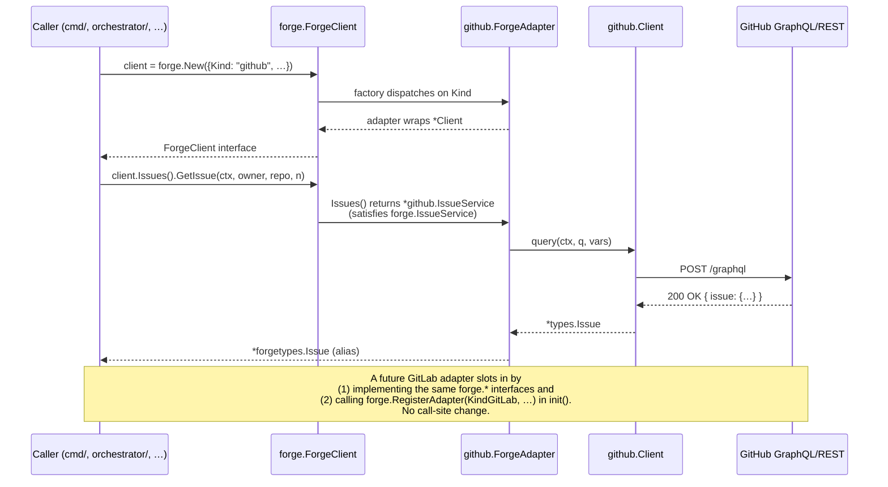

# Forge Abstraction Interface — `internal/forge/`

**Date:** 2026-05-08 **Author:** nightgauge **Status:** Decided (Phase 1
landed; call-site migration tracked as a follow-up)
**Issue:** #3350

---

## Executive Summary

`internal/github/` exposes ~100 exported methods across 14 service structs.
Every consumer (`cmd/nightgauge/`, `internal/orchestrator/`,
`internal/intelligence/`, `internal/state/`, `internal/depgraph/`,
`internal/hooks/`, `internal/doctor/`, `internal/audit/`) couples directly to
those concrete types. To support a second forge (GitLab, then potentially
others) without rewriting every call site, we introduce a forge-agnostic
interface package at `internal/forge/`. GitHub's existing services satisfy
those interfaces today; future GitLab support is a sibling adapter package
with no per-call-site branching.

This PR is **structural only** — no GitLab code lands here, no callers are
migrated. Compile-time `var _ forge.X = (*githubX)(nil)` assertions guarantee
the github package and the interface stay in sync.

---

## Context

### What we have today

- 14 services in `internal/github/`:
  `Client`, `IssueService`, `PRService`, `ProjectService`, `BoardService`,
  `EpicService`, `CIService`, `LabelService`, `RulesetService`,
  `SettingsService`, `ViewService`, `OutcomeService`,
  `LifecycleAuditService`, `SharedRateLimitTracker`.
- ~100 exported methods across them. (The issue body's "43 exported
  methods" was an early estimate — the audit table below documents the
  true count.)
- 27 import sites total (20 non-test) couple directly to concrete
  `*github.IssueService`, `*github.ProjectService`, etc.
- Public domain types (`Issue`, `PullRequest`, `BoardItem`,
  `EpicProgress`, `StatusCounts`, `SubIssueRef`, `BlockingRef`,
  `Priority`, `Size`) live in `pkg/types/` — already forge-agnostic.
- Service-specific types (`Label`, `CheckStatus`, `CheckDetail`,
  `WaitConfig`, `CIRunLog`, `RulesetCheckResult`, `EpicPRResult`,
  `TokenScopeInfo`, `BulkAddResult`, `FieldDrift`, `FieldInfo`,
  `FieldsSnapshot`, `FieldSchema`, `SingleSelectFieldDef`,
  `SingleSelectOptionDef`, `EnsureFieldsResult`) lived in
  `internal/github/`. They are forge-agnostic in shape but were defined
  in the wrong package.
- A single sentinel error exists (`github.ErrRateLimitGated`); other
  failure classes (404, 401, 403) are returned as opaque
  `fmt.Errorf("...: %w", err)` strings, so callers cannot reliably
  react to "not found" without string matching.

### Pressure to abstract

- Multi-forge support (GitLab in a follow-up epic) requires either
  per-call-site branching or a single bridge point. Per-call-site
  branching duplicates control flow at every consumer and grows
  quadratically with `forges × call sites`.
- Mocking GitHub services in unit tests requires constructing real
  `*Client` values today. A forge interface gives us cheap, constructor-
  free fakes.
- A clear sentinel error vocabulary lets callers (e.g., autonomous
  scheduler retry decisions) handle "not found" vs. "rate limited" vs.
  "permission denied" without parsing error strings.

---

## Decision

We adopt **Option C: a forge-agnostic interface package with adapter
pattern**.

```
internal/forge/                     (interfaces + factory + sentinels)
├── forge.go                        ForgeClient, Kind, Config, New, RegisterAdapter
├── errors.go                       Sentinels (ErrNotFound, ErrRateLimited, …)
├── issues.go                       IssueService interface
├── prs.go                          PRService interface
├── project.go                      ProjectService + BoardService interfaces
├── ci.go                           CIService interface
├── labels.go                       LabelService interface
├── rulesets.go                     RulesetService interface
├── auth.go                         AuthService interface
├── doc.go                          Package docs
└── types/                          Forge-agnostic data types
    ├── issue.go                    Issue, SubIssueRef, BlockingRef, EpicProgress, …
    ├── pr.go                       PullRequest, ReviewDecision, EpicPRResult
    ├── project.go                  BoardItem, StatusCounts, BulkAddResult, …
    ├── ci.go                       CheckStatus, CheckDetail, WaitConfig, CIRunLog
    ├── label.go                    Label
    ├── ruleset.go                  RulesetCheckResult
    └── auth.go                     TokenScopeInfo

internal/github/                    (canonical adapter)
├── forge_adapter.go                ForgeAdapter wrapping *Client + init() registration
├── forge_adapter_test.go           Compile-time + runtime asserts
├── …                               Existing service files; types now alias forgetypes.*
```

The github services stay where they are. Each service file gains a
compile-time `var _ forge.X = (*githubX)(nil)` assertion (consolidated in
`forge_adapter.go`) so any signature drift fails the build immediately.
Public types previously declared in `internal/github/*.go`
(`Label`, `CheckStatus`, etc.) become **type aliases** of
`forgetypes.*`; existing imports of `github.Label` continue to compile
because `type Label = forgetypes.Label` is zero-cost and identical to
direct use.

### Why not the alternatives

| Option                      | Pros                                       | Cons                                                                                                                                                        | Decision     |
| --------------------------- | ------------------------------------------ | ----------------------------------------------------------------------------------------------------------------------------------------------------------- | ------------ |
| **A. Per-call-site branch** | Trivial to add a second forge initially    | Duplicates control flow at every consumer; grows quadratically with `forges × call sites`; fragile (forgetting a branch silently routes to the wrong forge) | **Rejected** |
| **B. Go `plugin` package**  | Runtime adapter loading                    | Platform-limited (no Windows); breaks static linking; complicates distribution; adds zero flexibility users can observe                                     | **Rejected** |
| **C. Interface package**    | Compile-time safety, zero runtime overhead | Requires upfront audit + assertion plumbing                                                                                                                 | **Chosen**   |

### Sentinel errors

Five sentinels are defined in `internal/forge/errors.go`:

- `ErrNotFound` — resource missing or not visible
- `ErrRateLimited` — caller exceeded forge rate limit
- `ErrPermissionDenied` — token valid but lacks permission
- `ErrUnauthorized` — token missing/expired/revoked
- `ErrUnsupported` — `forge.New` called with an unregistered `Kind`

Adapters wrap their native errors with `%w` so callers use `errors.Is`.
This PR ships the sentinel definitions and the dispatch error path
(`forge.New` for unknown kinds); rewriting every github error-return
site to map HTTP status → sentinel is **out of scope** for this PR and
is tracked separately.

### Type-alias strategy

- Types that already live in `pkg/types/` (`Issue`, `PullRequest`,
  `BoardItem`, `EpicProgress`, `StatusCounts`, `SubIssueRef`,
  `BlockingRef`, `Priority`, `Size`, `ReviewDecision`) get re-aliased in
  `internal/forge/types/`. Both import paths continue to work.
- Types that lived in `internal/github/` (`Label`, `CheckStatus`,
  `CheckDetail`, etc.) move canonically to `internal/forge/types/`.
  Aliases in `internal/github/` preserve all existing
  `github.Label`-style call sites unchanged.
- Tests in the `github` package (same package, not `_test`) continue to
  work unchanged because the alias resolves at compile time.

### `forge.New` factory

```go
client, err := forge.New(forge.Config{
    Kind:          forge.KindGitHub,
    Token:         token,
    Owner:         "nightgauge",
    ProjectNumber: 1,
})
```

`Config` is the minimal cross-forge data: `Kind`, `Token`, `Owner`,
`ProjectNumber`, `OwnerType`. Adapter-specific knobs (rate-limit floor,
shared rate-limit tracker, GraphQL URL override for tests) remain on
the underlying `*github.Client` constructors and are not part of the
forge surface. The github adapter registers itself via `init()` —
importing `internal/github` is the only wiring needed.

---

## Audit Table

The interface set covers the public methods of the seven core services
plus a read-only `BoardService`. Methods on excluded services
(`OutcomeService`, `ViewService`, `SettingsService`,
`LifecycleAuditService`, `EpicService`, `SharedRateLimitTracker`) stay
on `internal/github/` and are reachable directly. See
"Adapter-only services" below for rationale.

### Core forge services

| Service          | github methods covered (forge interface)                                                                                                                                                                                                                                                                                                                                                                                                               | Method count |
| ---------------- | ------------------------------------------------------------------------------------------------------------------------------------------------------------------------------------------------------------------------------------------------------------------------------------------------------------------------------------------------------------------------------------------------------------------------------------------------------ | ------------ |
| `IssueService`   | `GetIssue`, `GetIssuesByNumbers`, `ListIssues`, `SearchIssues`, `HasLabel`, `GetRepoLabels`, `CreateIssue`, `CloseIssue`, `ReopenIssue`, `EditIssue`, `AddComment`, `AddSubIssue`, `RemoveSubIssue`, `LinkSubIssue`, `AddBlockedBy`, `RemoveBlockedBy`, `AddLabels`, `RemoveLabels`, `SyncStatusLabel`, `MarkRefined`, `GetEpicProgress`, `GetEpicProgressByNumber`                                                                                    | 22           |
| `PRService`      | `GetPR`, `ListPRs`, `CreatePR`, `MergePR`, `MergePRWithStrategy`, `DeleteBranch`, `CreateEpicPR`, `MergeEpicPR`                                                                                                                                                                                                                                                                                                                                        | 8            |
| `ProjectService` | `AddItem`, `AddIssueByNumber`, `BulkAddIssues`, `SyncStatus`, `MoveStatus`, `SyncIteration`, `SetSingleSelectField`, `SetNumberField`, `SetTextField`, `SetTextFieldOptional`, `SetDateField`, `SetDateFieldOptional`, `SetIterationField`, `SetFields`, `SetHours`, `SetDateFieldByNumber`, `SetEstimateFromLabels`, `AddBlockedByNumber`, `RemoveBlockedByNumber`, `UpdateEpicEstimates`, `EnsureFields`, `DriftCheck`, `DriftFix`, `SnapshotFields` | 24           |
| `BoardService`   | `ListItems`, `ListOpenItems`, `CountsByStatus`, `GetItem` (added in #3357)                                                                                                                                                                                                                                                                                                                                                                             | 4            |
| `CIService`      | `GetCheckStatus`, `GetRequiredCheckNames`, `GetIndividualCheckRuns`, `WaitForChecks`, `GetRunLogs`                                                                                                                                                                                                                                                                                                                                                     | 5            |
| `LabelService`   | `List`, `Create`, `Delete`                                                                                                                                                                                                                                                                                                                                                                                                                             | 3            |
| `RulesetService` | `CheckRulesets`, `SatisfyRulesets`                                                                                                                                                                                                                                                                                                                                                                                                                     | 2            |
| `AuthService`    | `CheckTokenScopes` (on `*Client`)                                                                                                                                                                                                                                                                                                                                                                                                                      | 1            |
| **Total**        |                                                                                                                                                                                                                                                                                                                                                                                                                                                        | **69**       |

> Note (#3357): `BoardService.GetItem` was added so the orchestrator can
> fetch a single project-board item by issue number without paginating the
> full board. Both adapters implement it. The orchestrator's stage-gate
> code currently uses `ListItems` + filter for this; switching it to
> `GetItem` is tracked as a follow-up cleanup.

### Methods intentionally not in core forge (GitHub-only)

| Method                     | Reason for exclusion                                                                                                                                                           |
| -------------------------- | ------------------------------------------------------------------------------------------------------------------------------------------------------------------------------ |
| `ProjectService.GetFields` | Returns `map[string]projectFieldInfo` — leaks an internal package type. Callers needing field metadata should use `SnapshotFields`, which returns the public `FieldsSnapshot`. |
| `Client.GetRateLimit`      | Inherently forge-specific (header-driven on GitHub; different model on GitLab). Lives on `*Client` directly.                                                                   |
| `Client.GetRepositoryID`   | Returns a GitHub GraphQL node ID. Cross-forge equivalent (`ResolveRepositoryID`) is tracked in the call-site migration follow-up issue.                                        |
| `EpicService.*`            | Composite that calls `IssueService` + `ProjectService` internally. Lives on the github adapter as a higher-level helper that consumes a `ForgeClient`.                         |
| `OutcomeService.*`         | Persists to local disk, not the forge. Stays GitHub-internal because the storage path is not forge-related.                                                                    |
| `ViewService.*`            | GitHub Projects Views REST API — no GitLab equivalent.                                                                                                                         |
| `SettingsService.*`        | GitHub repo settings (auto-merge config, branch protection) — different shape per forge.                                                                                       |
| `LifecycleAuditService.*`  | GitHub Project board audit — too coupled to Projects V2 schema.                                                                                                                |
| `SharedRateLimitTracker`   | Header-driven, GitHub-specific. Stays as a `*github.Client` constructor option.                                                                                                |

This split is deliberate: future GitLab adapters can ship without
implementing local-disk outcomes, GitHub Views, or GitHub settings.
Promoting any of these to forge core later (e.g., a unified rate-limit
shape) is a follow-up ADR.

### Methods omitted from the interface (not exported in github either)

Private helpers (`findItemID`, `ensureFields`, `invalidateCache`,
`createField`, `replaceFieldOptions`, etc.) are not in scope —
interfaces only cover exported methods.

### Audit regeneration

To regenerate the method list:

```bash
grep -hE '^func \([a-z]+ \*?[A-Z][A-Za-z]*\)' internal/github/*.go \
  | grep -v _test.go | sort
```

Ships unchanged in CI; if a future PR adds an exported method that
should be in the forge interface, the compile-time `var _ forge.X =
(*githubX)(nil)` assertion fails the build until either the method is
added to the interface or excluded by promotion to the "GitHub-only"
table above.

---

## Interaction Diagram



---

## Consequences

### Positive

- **Compile-time multi-forge boundary.** Adding GitLab (or another
  forge) is a sibling package + a `forge.RegisterAdapter` call. Zero
  call-site churn.
- **Sentinel error vocabulary.** Callers can `errors.Is(err,
forge.ErrNotFound)` instead of string-matching error text.
- **Cheaper test fakes.** Mocking the forge becomes "implement the
  interface" rather than "stand up a real GraphQL client and mock the
  HTTP layer."
- **Type aliases preserve all existing imports.** Zero migration cost
  in this PR.

### Negative / costs

- **Surface area to maintain.** ~68 method signatures must stay in
  sync between `internal/forge/` and `internal/github/`. Compile-time
  asserts mitigate but do not eliminate this — adding a method to
  github means adding it to forge too.
- **Two type packages for now.** `pkg/types` and `internal/forge/types`
  both exist; the latter aliases the former. We chose this over moving
  everything into `internal/forge/types` because moving public types
  into an `internal/` package would break any external consumer of
  `pkg/types`. A follow-up may consolidate.
- **Adapter exclusions are policy.** Six services are not in core
  forge. New forges that need them must either promote them via a
  follow-up ADR or live without them.

### Follow-up work (not in this PR)

- **Call-site migration.** Move `cmd/`, `internal/orchestrator/`,
  `internal/intelligence/`, `internal/state/` to consume
  `forge.ForgeClient` instead of `*github.Client`. Mechanical refactor;
  blocked only on this ADR landing.
- **Error mapping at adapter boundary.** Rewrite github query/mutate
  error returns to map HTTP status → sentinel. Adopting incrementally
  per service file; will not change the forge surface.
- **`ResolveRepositoryID` on `IssueService`.** Hide GitHub node-ID
  lookups behind a forge method so call sites stop knowing about node
  IDs.
- **GitLab adapter.** Tracked as a separate epic; depends only on this
  ADR.

---

## Risks & Mitigations

- **Risk:** A method added to `internal/github/` is not added to the
  forge interface — type assertion fails at build time.<br>
  **Mitigation:** That's exactly the design. The build break tells
  the contributor where to update the interface (or exclude the
  method via the "GitHub-only" table above).
- **Risk:** Type alias chain breaks subtle reflect/json behaviour.<br>
  **Mitigation:** Aliases (`type Foo = forgetypes.Foo`) are zero-cost
  and identical to direct use. Existing tests catch any divergence;
  21 `internal/github/*_test.go` files pass unchanged.
- **Risk:** Adapter-only services (`OutcomeService`, etc.) leak into
  the forge surface later because a feature suddenly needs them
  cross-forge.<br>
  **Mitigation:** Add a follow-up ADR documenting the promotion. The
  exclusion list above is policy, not architecture — promoting a
  service is straightforward.
- **Risk:** `forge.New` registration is process-global, so two
  imports of `internal/github` overwrite each other.<br>
  **Mitigation:** A package can only be initialised once per binary;
  `init()`-based registration is idiomatic. Tests document override
  behaviour explicitly.

---

## Author

nightgauge
